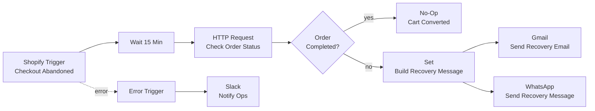
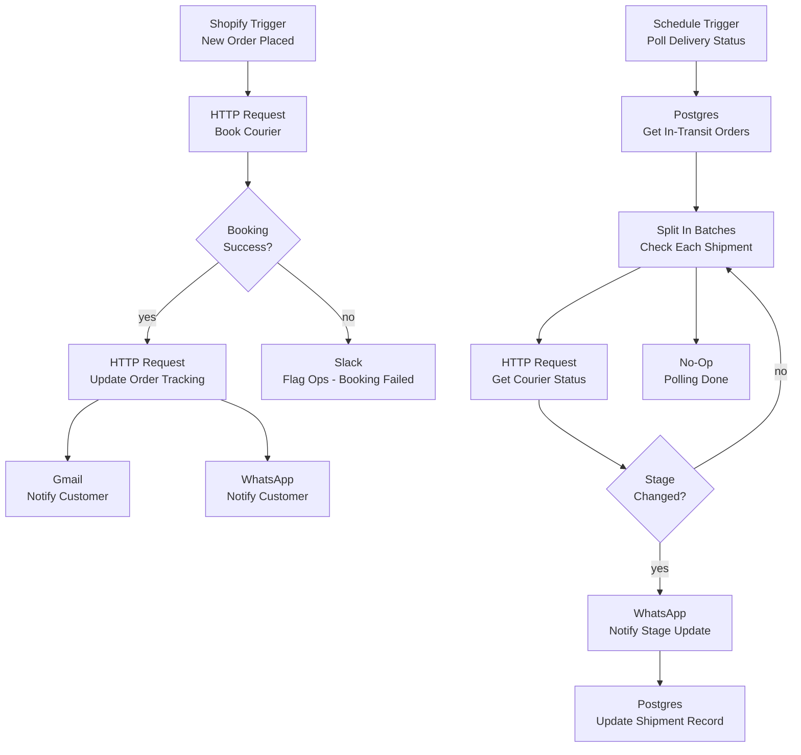
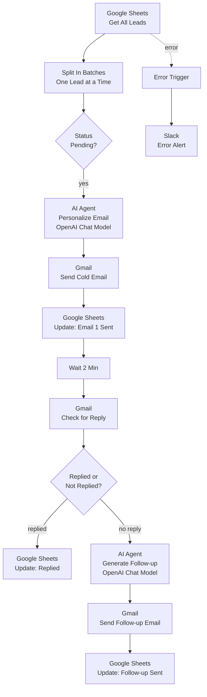
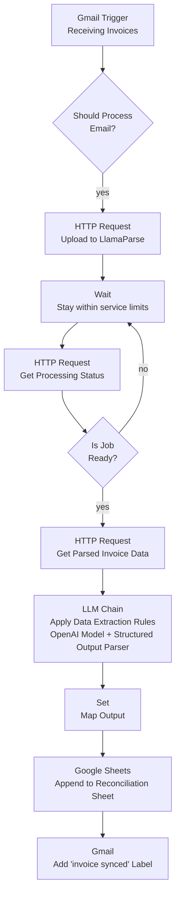
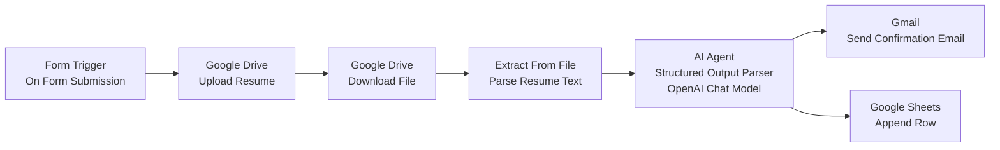
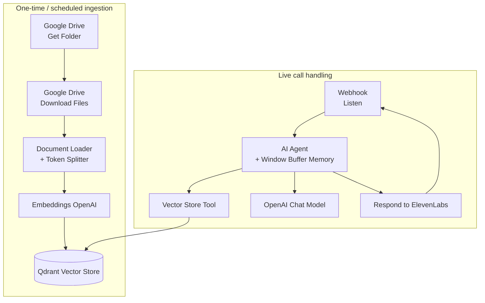

# Architecture Diagrams — Flagship Workflows

Visual reference for the highest-impact workflows in this portfolio. Diagrams are Mermaid
flowcharts — they render natively on GitHub, no images or external tools required.

Each diagram reflects the **actual node graph** of the referenced workflow file, not a
simplified marketing version.

---

## 1. Abandoned Cart Recovery Engine
[`abandoned_cart_recovery_engine/03_abandoned_cart_recovery_engine.json`](abandoned_cart_recovery_engine)

**What it does:** Waits 15 minutes after a Shopify checkout is abandoned, re-checks order status,
and if still incomplete, fires a recovery message on both email and WhatsApp. Converted carts are
left alone — no message sent to someone who already bought. Errors alert ops directly in Slack
instead of failing silently.

---

## 2. Order & Fulfillment Sync
[`order_fulfillment_sync_automation/07_order_fulfillment_sync_automation.json`](order_fulfillment_sync_automation)

**What it does:** Two loops in one workflow. Loop 1 books a courier the moment a Shopify order
lands and notifies the customer on success (or flags ops on failure). Loop 2 runs on a schedule,
polls every in-transit shipment's courier status from Postgres, and pushes a WhatsApp update only
when the delivery stage actually changes — no spam on every poll.

---

## 3. Cold Email Outreach Automation
[`cold_email_outreach_automation/26_cold_email_outreach_automation.json`](cold_email_outreach_automation)

**What it does:** Pulls leads from Sheets one at a time, has an AI agent write a personalized
first-touch email, sends it, then checks for a reply after a wait window. No reply → a second AI
agent drafts a follow-up automatically. Every state change is logged back to Sheets so the lead
list itself is always the source of truth.

---

## 4. Invoice Extraction (LlamaParse + OpenAI)
[`invoice_extraction_llamaparse/71_invoice_extraction_llamaparse.json`](invoice_extraction_llamaparse)

**What it does:** Watches a Gmail inbox, filters which emails are actually invoices, sends the PDF
to LlamaParse for structured extraction, polls until parsing completes, then runs the result
through an LLM chain with a **structured output parser** — guaranteed-shape JSON, not free text.
Clean data lands in a reconciliation sheet; the source email gets labeled so nothing double-processes.

This is the reference build behind the invoice-automation testimonial — same pipeline shape as
the version that took a client's month-end close from three days of manual entry to near zero.

---

## 5. CV / Applicant Screening Pipeline
[`cv_processing_workflow/33_cv_processing_workflow.json`](cv_processing_workflow)

**What it does:** A candidate submits a resume via form, it's stored in Drive, text is extracted
from the file, and an AI agent scores/evaluates it against a **structured output schema** — so
results are consistent, sortable fields in a sheet, not paragraphs a recruiter has to re-read.
Candidate gets an automatic confirmation the moment they apply.

---

## 6. AI Voice Chatbot (ElevenLabs, RAG-grounded)
[`voice_chatbot_elevenlabs_restaurants/75_voice_chatbot_elevenlabs_restaurants.json`](voice_chatbot_elevenlabs_restaurants)

**What it does:** Two halves. The ingestion half indexes source documents into Qdrant as
embeddings. The live half is the actual voice loop: ElevenLabs sends the transcribed caller
input to a webhook, an AI agent with conversation memory retrieves grounded context from the
vector store tool, generates a response, and hands it back to ElevenLabs for speech synthesis.

Full strategy write-up, reliability guardrails, and results for the production version of this
build: **[AI Voice Agent case study →](https://github.com/Redsf/Redsf/blob/main/case-studies/ai-voice-agent-homeware.md)**

---

*Diagrams are generated from each workflow's actual node graph and updated as workflows change.*
