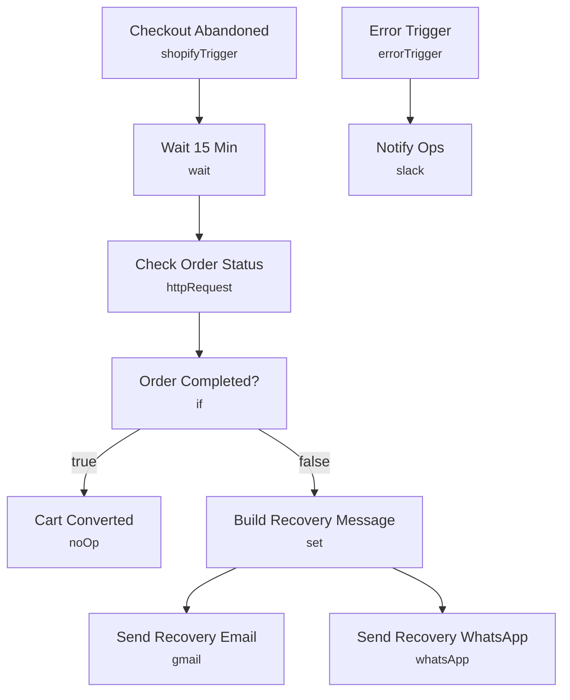

# Abandoned Cart Recovery Engine

Fires the moment a Shopify checkout is abandoned, waits 15 minutes, checks whether the order completed, and if not sends a personalized recovery message over email and WhatsApp with a discount code.

Built for ecommerce brands running Shopify that want to win back abandoned checkouts without a marketer manually chasing every cart.

## What it does

1. **Checkout Abandoned** (Shopify Trigger, `checkouts/create`) fires as soon as a shopper starts checkout without completing it.
2. **Wait 15 Min** pauses the run to give the shopper a chance to finish on their own.
3. **Check Order Status** calls the Shopify Admin API for orders matching the checkout token.
4. **Order Completed?** branches on whether a matching order now exists.
   - If yes, **Cart Converted** ends the run — no message is sent.
   - If no, **Build Recovery Message** assembles the customer's email, phone, a cart summary, a discount code (`COMEBACK10`), and the abandoned checkout URL.
5. **Send Recovery Email** and **Send Recovery WhatsApp** both fire from that message, delivering the same offer on two channels in parallel.

## Setup (about 15 minutes)

1. **Shopify Admin API** — connect your credential on the **Checkout Abandoned** trigger (topic stays `checkouts/create`).
2. **Shopify Admin Header Auth** — add a header-auth credential on **Check Order Status**; it calls `https://YOUR_STORE.myshopify.com/admin/api/2024-01/orders.json`, so replace `YOUR_STORE` or make sure the incoming payload's `body.domain` resolves correctly.
3. **Gmail** — connect an account on **Send Recovery Email**.
4. **WhatsApp Business Cloud** — connect your credential on **Send Recovery WhatsApp** and replace the `REPLACE_WITH_PHONE_NUMBER_ID` placeholder with your WhatsApp phone number ID.
5. **Slack** — connect an account on **Notify Ops** and replace `REPLACE_WITH_CHANNEL_ID` with your alerts channel.
6. Adjust the discount code and wait duration in **Build Recovery Message** / **Wait 15 Min** to match your offer.

## Error handling

**Check Order Status** retries up to 3 times before failing; **Send Recovery Email** retries up to 2 times; **Send Recovery WhatsApp** retries up to 2 times and is set to continue on failure so a WhatsApp delivery issue doesn't block the email leg. A dedicated **Error Trigger** posts the failing node and message to an ops Slack channel via **Notify Ops**.

---

<!-- ARCHITECTURE:START -->
## Architecture

<!-- ARCHITECTURE:END -->
