# Advanced AI Agent Demo

A single-canvas showcase workflow bundling four independent n8n patterns: a webhook that routes on query content, an AI-powered email labeler, a PDF-backed RAG chatbot over Pinecone, and a calendar-aware appointment-booking agent. Each example is self-contained and disconnected from the others, meant to be studied, copied, and rewired individually rather than run end-to-end as one pipeline.

Built as a conference/talk demo (originally presented by an n8n developer advocate) illustrating several AI agent patterns side by side — useful as a reference architecture when scoping what's possible with n8n's LangChain nodes rather than as a single production workflow.

## What it does

**Webhook query router:**
1. **Webhook** receives a `GET`/`POST` request with an `email` query parameter.
2. **Whether email contains n8n** (if) checks whether `query.email` contains `@n8n`.
3. True branch runs **Execute JavaScript** (adds a `myNewField: 1` field — a placeholder/demo transform) and **Send message**, which posts the received email value to a fixed Slack channel (`#general`).

**Example 1 — Email auto-labeler:**
4. **On new email to nathan's inbox** (Gmail Trigger) polls every minute for new mail.
5. **Assign label with AI** (LangChain Text Classifier, using **OpenAI Chat Model1**) classifies each email into one of two categories — `automation` (workflow/automation-related, including newsletters) or `music` (from an artist or about music) — and branches accordingly to **Add automation label** or **Add music label**, each applying a specific hardcoded Gmail label ID via the Gmail node.

**Example 2 — RAG chatbot over a PDF (Bitcoin whitepaper):**
6. **PDFs to download** (manual trigger placeholder) → **Download PDF** fetches a file from a `file_url` field → **Insert into Pinecone vector store** (insert mode, clears the `whitepaper` namespace first) embeds the document using **Embeddings OpenAI**, **Default Data Loader**, and **Recursive Character Text Splitter**.
7. **When chat message received** (chat trigger) feeds **Question and Answer Chain** (LangChain Retrieval QA), which uses **OpenAI Chat Model** and **Vector Store Retriever** (backed by **Read Pinecone Vector Store** / **Embeddings OpenAI2**) to answer questions strictly from the indexed PDF, refusing to speculate beyond retrieved content.

**Example 3 — Appointment booking agent:**
8. A second **When chat message received** trigger (public, titled "Book an appointment with Max") starts a conversation with a scripted greeting, feeding **Appointment booking agent** (LangChain Agent), which uses **Anthropic Chat Model** as its LLM and **Window Buffer Memory** (10-message window) for context. It has two tools:
   - **Get calendar availability** — an HTTP tool calling Google Calendar's `freeBusy` API for a given time window.
   - **Book appointment** — an HTTP tool that creates a 30-minute Google Calendar event with placeholder-driven fields (`userName`, `startTime`, `endTime`, `userEmail`) that the agent fills in from conversation.
   The agent's system prompt hardcodes the calendar owner as "Max Tkacz" and enforces 30-minute appointment slots.

## Sample request

For the webhook router:

```
GET /webhook/74facfd7-0f51-4605-9724-2c300594fcf9?email=someone@n8n.io
```

For the appointment-booking chat, a typical opening turn (via the chat trigger's UI) is simply:

```
I'd like to book a meeting with Max next Tuesday afternoon.
```

For the PDF chatbot:

```
What consensus mechanism does the whitepaper describe?
```

## Setup (~40 minutes, per example you want to use)

This workflow is four unrelated demos glued into one canvas — pick the example(s) relevant to you rather than deploying all of it.

1. **Webhook/Slack example** — add a Slack OAuth2 credential to **Send message** and replace the hardcoded channel ID (`C079GL6K3U6`, "general") with your own.
2. **Email labeler** — add a Gmail OAuth2 credential to **On new email to nathan's inbox**, **Add automation label**, and **Add music label**; add an OpenAI credential to **OpenAI Chat Model1**. Replace the hardcoded Gmail label IDs (`Label_4763053241338138112`, `Label_6822395192337188416`) with label IDs that exist in your own Gmail account — these are specific to the original demo account and won't resolve elsewhere.
3. **PDF RAG chatbot** — add OpenAI credentials to **Embeddings OpenAI**, **Embeddings OpenAI2**, and **OpenAI Chat Model**; add a Pinecone credential to **Insert into Pinecone vector store** and **Read Pinecone Vector Store**, and create a Pinecone index named `whitepapers` with a `whitepaper` namespace (or update these values). Trigger **PDFs to download** manually once with a `file_url` in scope before using the chat trigger — there's no scheduled re-ingestion, and **Insert into Pinecone vector store** clears the namespace on every run.
4. **Appointment booking agent** — add an Anthropic credential to **Anthropic Chat Model**, and a Google Calendar OAuth2 credential to **Get calendar availability** and **Book appointment**. Both tools hardcode the calendar owner's email (`max@n8n.io`) and the `Europe/Berlin` timezone — update both to your own calendar and timezone before use.
5. None of the four examples are wired together; treat this repo entry as a pattern reference, not a deployable pipeline, and copy out only the nodes for the pattern you need.

---

<!-- ARCHITECTURE:START -->
## Architecture

```mermaid
flowchart TD
    N0["Send message<br/><small>slack</small>"]
    N1["Execute JavaScript<br/><small>code</small>"]
    N2["Recursive Character Text Splitter<br/><small>textSplitterRecursiveCharacterTextSplitter</small>"]
    N3["Embeddings OpenAI<br/><small>embeddingsOpenAi</small>"]
    N4["Default Data Loader<br/><small>documentDefaultDataLoader</small>"]
    N5["OpenAI Chat Model<br/><small>lmChatOpenAi</small>"]
    N6["Embeddings OpenAI2<br/><small>embeddingsOpenAi</small>"]
    N7["Vector Store Retriever<br/><small>retrieverVectorStore</small>"]
    N8["Download PDF<br/><small>httpRequest</small>"]
    N9["PDFs to download<br/><small>noOp</small>"]
    N10["Read Pinecone Vector Store<br/><small>vectorStorePinecone</small>"]
    N11["Question and Answer Chain<br/><small>chainRetrievalQa</small>"]
    N12["Anthropic Chat Model<br/><small>lmChatAnthropic</small>"]
    N13["Get calendar availability<br/><small>toolHttpRequest</small>"]
    N14["Appointment booking agent<br/><small>agent</small>"]
    N15["Window Buffer Memory<br/><small>memoryBufferWindow</small>"]
    N16["Insert into Pinecone vector store<br/><small>vectorStorePinecone</small>"]
    N17["Book appointment<br/><small>toolHttpRequest</small>"]
    N18["When chat message received<br/><small>chatTrigger</small>"]
    N19["OpenAI Chat Model1<br/><small>lmChatOpenAi</small>"]
    N20["Add automation label<br/><small>gmail</small>"]
    N21["On new email to nathan's inbox<br/><small>gmailTrigger</small>"]
    N22["Add music label<br/><small>gmail</small>"]
    N23["Assign label with AI<br/><small>textClassifier</small>"]
    N24["Webhook<br/><small>webhook</small>"]
    N25["Whether email contains n8n<br/><small>if</small>"]
    N24 --> N25
    N8 --> N16
    N17 -.tool.-> N14
    N9 --> N8
    N3 -.embedding.-> N16
    N5 -.languageModel.-> N11
    N6 -.embedding.-> N10
    N19 -.languageModel.-> N23
    N4 -.document.-> N16
    N12 -.languageModel.-> N14
    N23 -->|0| N20
    N23 -->|1| N22
    N15 -.memory.-> N14
    N7 -.retriever.-> N11
    N13 -.tool.-> N14
    N10 -.vectorStore.-> N7
    N18 --> N11
    N25 --> N1
    N25 --> N0
    N21 --> N23
    N2 -.textSplitter.-> N4
```


<!-- ARCHITECTURE:END -->
