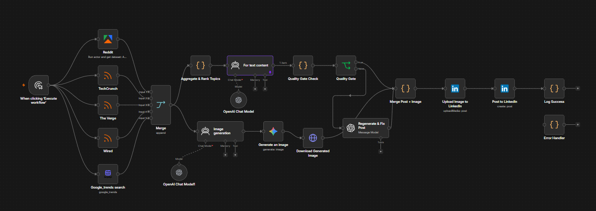
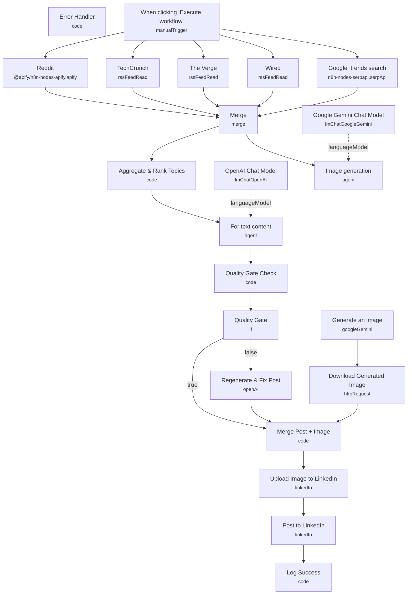

# AI LinkedIn Content Machine

<!-- CANVAS:START -->

<!-- CANVAS:END -->

An end-to-end content pipeline that researches trending AI and tech topics across Reddit, RSS news feeds and Google Trends, writes a fully-formatted LinkedIn post with a matching AI-generated image, runs the draft through an automated quality gate, and publishes it straight to LinkedIn.

Built for founders, consultants and thought leaders in the AI/tech space who want a steady stream of on-brand LinkedIn content without spending an hour a day writing and formatting posts.

## What it does

1. **When clicking 'Execute workflow'** starts the run manually and fans out to five research sources in parallel.
2. **Reddit** (Apify actor) scrapes hot posts from r/technology, r/artificial and r/MachineLearning.
3. **TechCrunch**, **The Verge** and **Wired** RSS nodes pull the latest articles from each outlet.
4. **Google_trends search** (SerpApi) fetches current search-interest data for AI/automation/n8n keywords.
5. **Merge** combines all five sources into one item.
6. **Aggregate & Rank Topics** (Code) normalizes every item, removes duplicates by title fingerprint, scores each topic for relevance using keyword weighting, recency and engagement, and picks the single top-ranked topic.
7. **For text content** (LangChain Agent, backed by **OpenAI Chat Model** on GPT-5-mini) writes the LinkedIn post — hook, body, closing question and hashtags — following a strict ghostwriting system prompt (no weak openers, no buzzwords, 150–300 words).
8. In parallel, **Image generation** (LangChain Agent, backed by **Google Gemini Chat Model**) and **Generate an image** (Gemini 2.5 Flash "Nano Banana" image model) produce a matching visual for the post.
9. **Download Generated Image** fetches the generated image binary via HTTP.
10. **Quality Gate Check** (Code) runs the drafted post through 10 automated checks — word count, hook strength, hashtag count/placement, paragraph length, buzzword usage, closing question quality, character count — and computes a pass/fail verdict plus a fix list.
11. **Quality Gate** (IF) branches on `approved`: passing posts go straight to merging; failing posts are sent to **Regenerate & Fix Post** (OpenAI GPT-4.1-mini), which rewrites the post using the itemized fix instructions before continuing.
12. **Merge Post + Image** (Code) combines the final post text with the downloaded image binary.
13. **Upload Image to LinkedIn** uploads the image as LinkedIn media.
14. **Post to LinkedIn** publishes the post with the attached image to the configured LinkedIn person profile.
15. **Log Success** (Code) logs the published post ID, topic, source and stats to the execution log.
16. **Error Handler** (Code) — parallel branch off the Quality Gate path — captures failures and logs the topic and error details.

## Setup (about 20 minutes)

1. **Apify** — add your Apify OAuth2 credentials in the **Reddit** node (uses the "Reddit Posts Scraper" actor).
2. **SerpApi** — add your SerpApi key in **Google_trends search** for Google Trends data.
3. **OpenAI** — add your API key in **OpenAI Chat Model** (used by the post-writing agent, GPT-5-mini) and in **Regenerate & Fix Post** (GPT-4.1-mini fallback).
4. **Google Gemini** — add your Google Gemini (PaLM) API key in **Google Gemini Chat Model** and **Generate an image** (Nano Banana image model).
5. **LinkedIn** — connect LinkedIn OAuth2 in **Upload Image to LinkedIn** and **Post to LinkedIn**; replace the hardcoded `urn:li:person:{{ $credentials.linkedInPersonId }}` reference in **Post to LinkedIn** with your own LinkedIn person URN.
6. No webhook or external trigger is required — this workflow runs on demand or can be wired to a Schedule Trigger for daily automated posting.

## Error handling

The Quality Gate enforces a minimum 7/10 score plus three critical checks (word count, hashtag count, closing question) before a post is allowed to publish; anything that fails is automatically rewritten by **Regenerate & Fix Post** using the specific list of failed checks. A separate **Error Handler** branch catches and logs any failure with the topic and error payload for troubleshooting, though it is not wired to a live alert channel (e.g. Slack/email) — logging is console/execution-log only.

---

<!-- ARCHITECTURE:START -->
## Architecture

<!-- ARCHITECTURE:END -->
