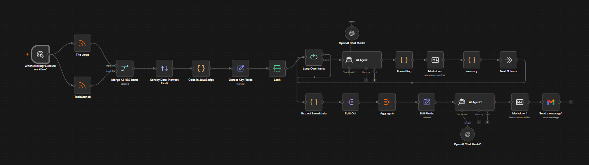
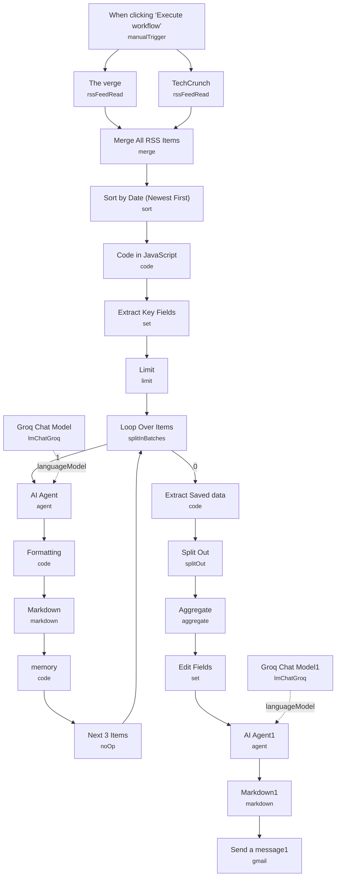

# AI Newsletter Generator (RSS to Email)

<!-- CANVAS:START -->

<!-- CANVAS:END -->

A workflow that pulls the latest AI news from The Verge and TechCrunch, filters it down to the last 24 hours, summarizes it into a clean numbered digest with an LLM, and emails the finished newsletter to a subscriber list.

Built for solo creators or small teams running a niche AI/tech newsletter who want the research-and-drafting grunt work automated, while still reviewing the final send.

## What it does

1. **When clicking 'Execute workflow'** triggers both RSS reads in parallel.
2. **The verge** and **TechCrunch** RSS nodes fetch the latest items from The Verge's AI feed and TechCrunch's AI category feed.
3. **Merge All RSS Items** combines both feeds into a single item list.
4. **Sort by Date (Newest First)** orders all articles by `pubDate` descending.
5. **Code in JavaScript** filters out anything older than 24 hours based on `isoDate`/`pubDate`/`date`, and short-circuits with a "no articles" message if nothing qualifies.
6. **Extract Key Fields** (Set) keeps just the `contentSnippet` field for each article.
7. **Limit** caps the list to the 6 most recent qualifying articles.
8. **Loop Over Items** (Split In Batches, batch size 2) processes articles two at a time.
9. **AI Agent** (LangChain Agent, backed by **Groq Chat Model** on `llama-3.3-70b-versatile`) summarizes each batch into a numbered, professional email-body summary.
10. **Formatting** (Code) cleans the raw AI output — converts literal `\n` to real line breaks, strips dashed separators, normalizes paragraph spacing.
11. **Markdown** converts the formatted markdown summary to HTML.
12. **memory** (Code) appends each batch's summary into workflow static data (`collectedSummaries`) so results accumulate across loop iterations, then returns control to the loop.
13. **Next 3 Items** (NoOp) feeds back into **Loop Over Items** to continue the batch loop until all articles are processed.
14. Once the loop completes, **Extract Saved data** (Code) reads all accumulated summaries back out of static data.
15. **Split Out** flattens the `all_summaries` array into individual items.
16. **Aggregate** recombines the `data` field from each item into a single list.
17. **Edit Fields** (Set) maps the aggregated data into a `Data` field.
18. **AI Agent1** (LangChain Agent, backed by **Groq Chat Model1**) does a final cleanup pass — removing repetitive headlines and gaps — to produce presentable newsletter copy.
19. **Markdown1** converts that final output to HTML.
20. **Send a message1** (Gmail) emails the finished HTML newsletter to the subscriber address.

## Setup (about 10 minutes)

1. **Groq** — add your Groq API key in **Groq Chat Model** and **Groq Chat Model1** (both use `llama-3.3-70b-versatile`).
2. **Gmail** — connect your Gmail OAuth2 account in **Send a message1**.
3. Replace the hardcoded recipient `subscriber@example.com` in **Send a message1** with your real subscriber list or mailing address, and update the subject line ("NEW AI") to match your newsletter's branding.
4. No webhook or credential is needed for the RSS reads (**The verge**, **TechCrunch**) — they are public feeds.

## Notes on workflow design

This workflow duplicates the same summarize-and-format pipeline twice in sequence (once per batch inside the loop via **AI Agent** → **Formatting** → **Markdown**, then again as a final pass via **AI Agent1** → **Markdown1**). This is intentional but adds latency and Groq API calls; teams optimizing for cost may want to collapse the two summarization passes into one.

---

<!-- ARCHITECTURE:START -->
## Architecture

<!-- ARCHITECTURE:END -->
