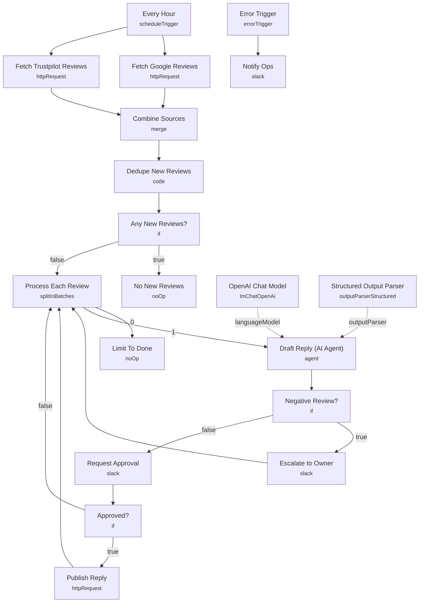

# AI Review & Reputation Manager

Polls Google Business Profile and Trustpilot every hour, drafts an on-brand reply for every new review with an LLM, and routes each one by sentiment: negative reviews escalate straight to the owner in Slack, positive ones wait for a one-tap approval before the reply gets published back to the platform.

Built for local businesses and multi-location brands that want every review answered quickly without a person drafting each response from scratch.

## What it does

1. **Every Hour** (Schedule Trigger) kicks off the run.
2. **Fetch Google Reviews** and **Fetch Trustpilot Reviews** call both platforms in parallel, and **Combine Sources** merges the two result sets.
3. **Dedupe New Reviews** (Code node) tracks previously seen review IDs in workflow static data so the same review is never processed twice.
4. **Any New Reviews?** (IF) stops the run with **No New Reviews** if nothing new came in.
5. **Process Each Review** (Split In Batches) loops through the new reviews one at a time.
6. **Draft Reply (AI Agent)**, backed by **OpenAI Chat Model** (gpt-5-mini) and a **Structured Output Parser**, reads each review and returns a sentiment classification, a draft reply, and a suggested resolution for negative cases.
7. **Negative Review?** (IF) branches on that sentiment:
   - Negative reviews go to **Escalate to Owner**, which posts the review and the suggested resolution to an owner-alerts Slack channel, then loops back for the next review.
   - Positive reviews go to **Request Approval**, a Slack `sendAndWait` prompt (24 hour timeout) asking a teammate to approve the drafted reply.
8. **Approved?** (IF) checks the approval response: if approved, **Publish Reply** posts the AI-drafted reply back to Trustpilot; if not, the loop moves on without publishing.
9. The batch loop (**Process Each Review**) continues until every review in the batch has been handled.

## Setup (about 20 minutes)

1. **Google Business Profile API** — add a header-auth credential on **Fetch Google Reviews** and replace `YOUR_ACCOUNT`/`YOUR_LOCATION` in the URL.
2. **Trustpilot API** — add a header-auth credential on **Fetch Trustpilot Reviews** (replace `YOUR_UNIT_ID`) and on **Publish Reply**.
3. **OpenAI** — connect your API key on **OpenAI Chat Model**.
4. **Slack** — connect an account on **Escalate to Owner** (replace the `owner-alerts` channel ID), **Request Approval** (replace the `review-replies` channel ID), and **Notify Ops** (replace the `ops-alerts` channel ID).
5. All `REPLACE_WITH_CREDENTIAL_ID` and `REPLACE_WITH_CHANNEL_ID` placeholders need to be swapped for real credential and channel IDs before activating.

## Error handling

**Fetch Google Reviews**, **Fetch Trustpilot Reviews**, and **Publish Reply** all retry up to 3 times on failure. A dedicated **Error Trigger** posts the failing node and message to an ops Slack channel via **Notify Ops**.

---

<!-- ARCHITECTURE:START -->
## Architecture

<!-- ARCHITECTURE:END -->
