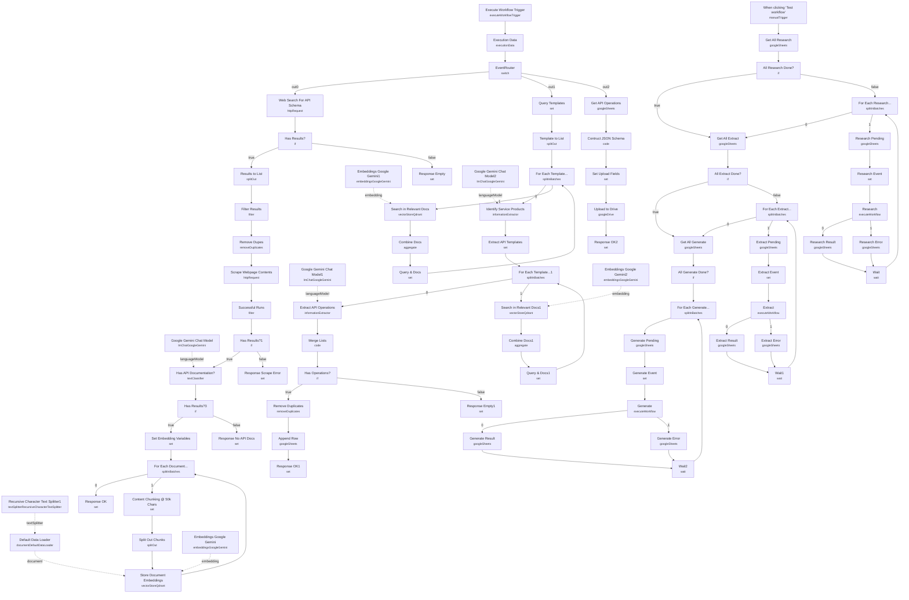

# API Schema Extractor Agent

A self-driving research pipeline that takes a list of software/service names in a Google Sheet and produces a structured JSON API schema file for each one — no manual digging through vendor documentation required. It works through three stages (research, extraction, generation), tracks progress per row in the sheet as a lightweight state machine, and calls itself as a sub-workflow to process each stage's queue.

Built for teams building integrations or AI agents who need a fast, repeatable way to turn "here's a list of SaaS tools we use" into machine-readable API schemas they can feed into other automations.

## What it does

The workflow is triggered by **When clicking 'Test workflow'**, which reads the shared control sheet and walks all three stages in sequence during a single run:

1. **Get All Research** pulls rows where "Stage 1 - Research" is blank; **All Research Done?** loops via **For Each Research...** until empty. **Research Event** builds a per-row payload and **Research** invokes this same workflow (`$workflow.id`) as a sub-workflow, routed by **EventRouter** to the "research" branch.
2. Research branch: **Web Search For API Schema** (Apify Google-search actor) finds candidate pages, **Results to List** / **Remove Dupes** / **Filter Results** clean the SERP, **Scrape Webpage Contents** (Apify web-scraper) pulls page bodies, and **Has API Documentation?** (a **Google Gemini Chat Model** text classifier) keeps only real API docs. **Set Embedding Variables** → **For Each Document...** → **Content Chunking @ 50k Chars** → **Recursive Character Text Splitter1** / **Default Data Loader** chunk the text, and **Store Document Embeddings** (Qdrant, via **Embeddings Google Gemini**) saves it to the `api_schema_crawler_and_extractor` collection. **Research Result** / **Research Error** write "ok"/"error" back to the sheet.
3. **Get All Extract** pulls rows where research is "ok" but extraction is blank; **For Each Extract...** loops, and **Extract Event** + **Extract** re-enter the sub-workflow's "extract" branch.
4. Extract branch: **Identify Service Products** (LLM via **Google Gemini Chat Model2**) names the service's products from vector search results, **Extract API Templates** turns each into an API-specific question, **Search in Relevant Docs1** (Qdrant, top 20) retrieves matching chunks, and **Extract API Operations** (an Information Extractor backed by **Google Gemini Chat Model1**) pulls structured `{resource, operation, method, url, description}` records. **Append Row** writes them to the "Extracted API Operations" tab; **Extract Result** / **Extract Error** update row status.
5. **Get All Generate** pulls rows where both prior stages are "ok" and output is blank; **For Each Generate...** loops, and **Generate Event** + **Generate** re-enter the "generate" branch: **Get API Operations** reads all extracted rows for the service, **Contruct JSON Schema** (Code node) groups them by resource into one schema object, and **Upload to Drive** saves it to Google Drive. **Generate Result** / **Generate Error** record the outcome.

Sticky notes in the workflow label the three stages and their sub-workflow sections directly (e.g. "Stage 1 - Research for API Documentation", "Stage 2 - Extract API Operations From Documentation", "Stage 3 - Generate Custom Schema From API Operations").

## Sample input

There's no external trigger — the workflow reads its queue from a Google Sheet named "API Schema Crawler & Extractor" (tab `Sheet1`) with columns `Service`, `Website`, `Stage 1 - Research`, `Stage 2 - Extraction`, `Stage 3 - Output File`, `Output Destination`. A new row to process looks like:

```
Service: Formstack
Website: https://www.formstack.com/
Stage 1 - Research: (blank)
Stage 2 - Extraction: (blank)
Stage 3 - Output File: (blank)
```

The repo ships pinned test data on **Execute Workflow Trigger** matching this shape: `{"data": {"url": "https://www.formstack.com/", "service": "Formstack", "collection": "api_schema_crawler_and_extractor", "row_number": 2}, "eventType": "research"}`.

## Setup (about 30 minutes)

1. **Apify** — add generic HTTP auth credentials to **Web Search For API Schema** (Google search actor) and **Scrape Webpage Contents** (web-scraper actor).
2. **Google Gemini** — add API credentials to **Google Gemini Chat Model / 1 / 2** and **Embeddings Google Gemini / 1 / 2**.
3. **Qdrant** — add credentials to **Store Document Embeddings** and **Search in Relevant Docs / 1**, and create the `api_schema_crawler_and_extractor` collection in advance.
4. **Google Sheets** — add credentials to every Sheets node (**Get All Research/Extract/Generate**, the **Pending/Result/Error** nodes per stage, **Get API Operations**, **Append Row**). All point at a hardcoded spreadsheet ID — swap it for your own sheet with matching column names (`Service`, `Website`, `Stage 1 - Research`, `Stage 2 - Extraction`, `Stage 3 - Output File`) and an `Extracted API Operations` tab.
5. **Google Drive** — add credentials to **Upload to Drive**, which targets a hardcoded folder ID; point it at your own destination.
6. **Self-referencing sub-workflow** — **Research**, **Extract**, and **Generate** all call `{{ $workflow.id }}` (this same workflow), routed by **EventRouter** on `eventType`. Don't rename or duplicate the workflow without checking these references. Each call runs in "each" mode with `waitForSubWorkflow: true`, so large queues process serially and can take a while.
7. **Seed the sheet** — add rows with `Service` and `Website` before running; only rows with empty stage columns are processed, so re-running is safe and idempotent per stage.

---

<!-- ARCHITECTURE:START -->
## Architecture


<!-- ARCHITECTURE:END -->
