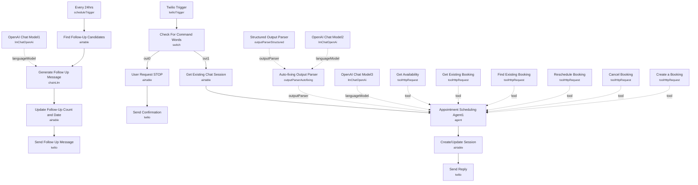

# Appointment Leads & Follow-up (Twilio + Cal.com)

An SMS-based booking assistant for a PC/laptop repair business: customers text in, an AI agent handles the conversation and books, reschedules, or cancels appointments directly against Cal.com, and any lead that goes cold gets an automated follow-up text a few days later.

Built for local service businesses that want appointment scheduling to happen entirely over SMS, with lead nurture built in rather than bolted on.

## What it does

**Inbound conversation flow:**

1. **Twilio Trigger** receives an inbound SMS.
2. **Check For Command Words** (Switch) checks if the message body contains "STOP" — if so, **User Request STOP** marks the Airtable record's `status` as `STOP` and **Send Confirmation** texts back an opt-out confirmation; otherwise the message proceeds.
3. **Get Existing Chat Session** searches Airtable's `Lead Tracker` table for a record matching the sender's phone number (`session_id`), returning any prior chat history, customer name, and appointment status.
4. **Appointment Scheduling Agent1** is an AI agent (LLM: **OpenAI Chat Model3**) with a detailed system prompt establishing scope (PC Parts Ltd, repairs only, no competitor or troubleshooting help) and five Cal.com tools: **Get Availability**, **Create a Booking**, **Get Existing Booking**, **Find Existing Booking**, **Reschedule Booking**, and **Cancel Booking** — all HTTP Request tool nodes hitting the Cal.com v2 API. Its output is validated by **Auto-fixing Output Parser** (backed by **OpenAI Chat Model2**) against **Structured Output Parser**'s schema (`reply`, `customer_name`, `enquiry_summary`, `has_appointment_scheduled`, `appointment.appointment_id`, `appointment.scheduled_at`).
5. **Create/Update Session** writes the updated conversation state back to Airtable — merging new chat messages, customer name, appointment ID, and summary with whatever already existed for that session.
6. **Send Reply** texts the agent's `reply` back to the customer via Twilio.

**Follow-up flow (separate schedule):**

7. **Every 24hrs** (schedule trigger) runs **Find Follow-Up Candidates**, an Airtable search filtering for leads with no appointment, no STOP request, fewer than 3 prior follow-ups, and at least 3 days since the last follow-up.
8. **Generate Follow Up Message** (an LLM chain on **OpenAI Chat Model1**) drafts a re-engagement text referencing the customer's name, enquiry summary, and full chat history.
9. **Update Follow-Up Count and Date** increments `followup_count` and stamps `last_followup_at` in Airtable, then **Send Follow Up Message** texts it via Twilio, appending a "Reply STOP to stop receiving these messages" line.

## Sample request

This workflow is driven entirely by inbound SMS through **Twilio Trigger** — there's no form or webhook payload to construct by hand. To test, text your configured Twilio number something like:

```
Hi, my laptop won't turn on. Can I book a repair slot this Thursday afternoon?
```

The agent will ask for your email, full name, and confirm a time slot before checking **Get Availability** and calling **Create a Booking**.

## Setup (~25 minutes)

1. **Twilio** — add credentials to **Twilio Trigger**, **Send Reply**, **Send Confirmation**, and **Send Follow Up Message**.
2. **Airtable** — add a Personal Access Token credential to **Get Existing Chat Session**, **Create/Update Session**, **User Request STOP**, **Find Follow-Up Candidates**, and **Update Follow-Up Count and Date**. All point at the `Twilio-Scheduling-Agent` base and `Lead Tracker` table — recreate this schema (`session_id`, `status`, `customer_name`, `customer_summary`, `chat_messages`, `scheduled_at`, `appointment_id`, `last_message_at`, `last_followup_at`, `followup_count`, `twilio_service_number`) or repoint the nodes at your own base.
3. **OpenAI** — add API credentials to **OpenAI Chat Model1**, **OpenAI Chat Model2**, and **OpenAI Chat Model3**.
4. **Cal.com** — create a Cal.com API v2 Header Auth credential and attach it to **Get Availability**, **Get Existing Booking**, **Find Existing Booking**, **Reschedule Booking**, **Cancel Booking**, and **Create a Booking**.
5. **Hardcoded event type ID** — every Cal.com tool node references `eventTypeId: 648297`. Replace this with your own Cal.com event type ID, and confirm its configured duration matches what the agent is instructed to book (30 minutes, per the system prompt).
6. **System prompt customization** — the agent's system message in **Appointment Scheduling Agent1** hardcodes the business name ("PC Parts Ltd"), location, and service scope; rewrite it for your own business before deploying.
7. Enable both the Twilio-triggered flow and the **Every 24hrs** schedule trigger for the follow-up sequence to run.

---

<!-- ARCHITECTURE:START -->
## Architecture


<!-- ARCHITECTURE:END -->
