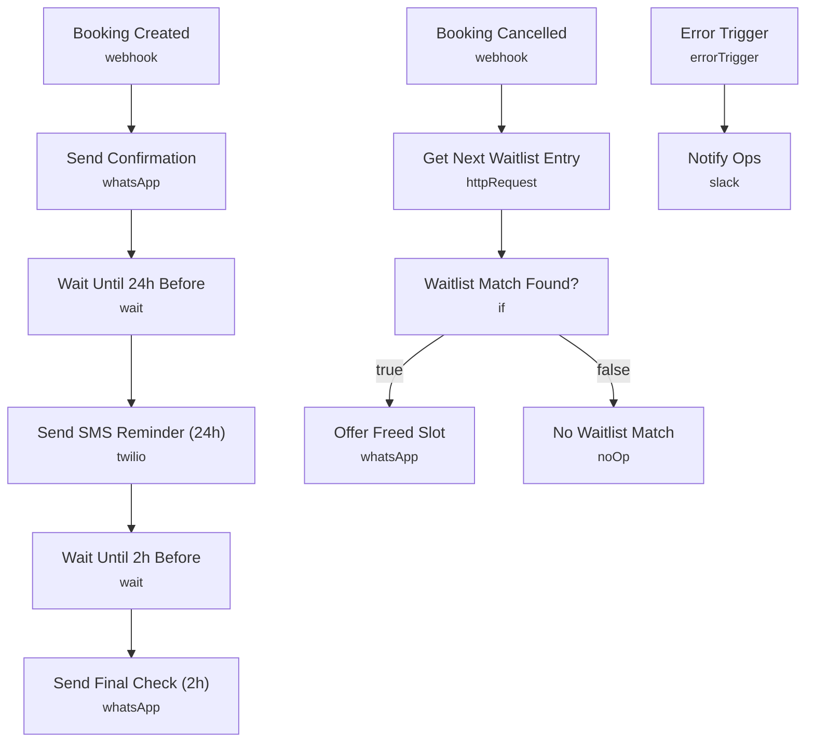

# Appointment Reminder & No-Show Killer

Runs a three-step reminder sequence for every booking — confirmation on booking, a nudge 24 hours out, and a final check-in 2 hours before — over WhatsApp and SMS. When a booking is cancelled, it automatically pulls the next person off the waitlist and offers them the freed slot.

Built for salons, clinics and service businesses that lose revenue to no-shows and want cancelled slots refilled automatically instead of sitting empty.

## What it does

This workflow has two independent webhook triggers.

**Booking reminder sequence:**
1. **Booking Created** (Webhook, POST) fires when a new booking comes in.
2. **Send Confirmation** sends an immediate WhatsApp confirmation with the appointment time.
3. **Wait Until 24h Before** pauses until 24 hours before the appointment, then **Send SMS Reminder (24h)** sends a Twilio SMS nudge with a reschedule option.
4. **Wait Until 2h Before** pauses again until 2 hours before, then **Send Final Check (2h)** sends a final WhatsApp check-in with a reschedule link.

**Waitlist backfill:**
1. **Booking Cancelled** (Webhook, POST) fires when a booking is cancelled.
2. **Get Next Waitlist Entry** calls the booking platform's waitlist endpoint for the freed time slot.
3. **Waitlist Match Found?** (IF) checks whether a matching waitlisted customer was returned.
   - If yes, **Offer Freed Slot** sends them a WhatsApp message offering the newly opened slot.
   - If no, **No Waitlist Match** ends the run with no action taken.

## Sample request

Send a POST to the **Booking Created** webhook (`/booking-created`) with a body like this:

```json
{
  "customerName": "Jordan Lee",
  "phone": "+15550123456",
  "appointmentTime": "2026-07-10T15:00:00.000Z",
  "rescheduleUrl": "https://yourbookingsystem.com/reschedule/abc123"
}
```

Send a POST to the **Booking Cancelled** webhook (`/booking-cancelled`) with a body like this:

```json
{
  "appointmentTime": "2026-07-10T15:00:00.000Z"
}
```

## Setup (about 15 minutes)

1. **Webhook** — point your booking platform's webhooks at **Booking Created** (`/booking-created`) and **Booking Cancelled** (`/booking-cancelled`).
2. **WhatsApp Business Cloud** — connect your credential on **Send Confirmation**, **Send Final Check (2h)**, and **Offer Freed Slot**, and replace `REPLACE_WITH_PHONE_NUMBER_ID` with your WhatsApp phone number ID in each.
3. **Twilio** — connect your account on **Send SMS Reminder (24h)** and replace `REPLACE_WITH_TWILIO_NUMBER` with your sending number.
4. **Booking Platform API** — add a header-auth credential on **Get Next Waitlist Entry** pointing at your booking system's real waitlist endpoint (currently `https://api.yourbookingsystem.com`).
5. **Slack** — connect an account on **Notify Ops** and replace `REPLACE_WITH_CHANNEL_ID` with your alerts channel.

## Error handling

**Send Confirmation**, **Send Final Check (2h)**, and **Offer Freed Slot** are all set to continue on failure so a WhatsApp delivery issue doesn't stop the reminder chain or waitlist flow. **Send SMS Reminder (24h)** retries up to 2 times and also continues on failure. **Get Next Waitlist Entry** retries up to 3 times. A dedicated **Error Trigger** posts the failing node and message to a Slack ops channel via **Notify Ops**.

---

<!-- ARCHITECTURE:START -->
## Architecture


<!-- ARCHITECTURE:END -->
