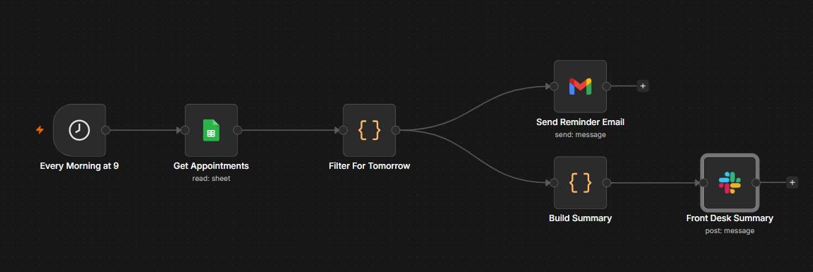
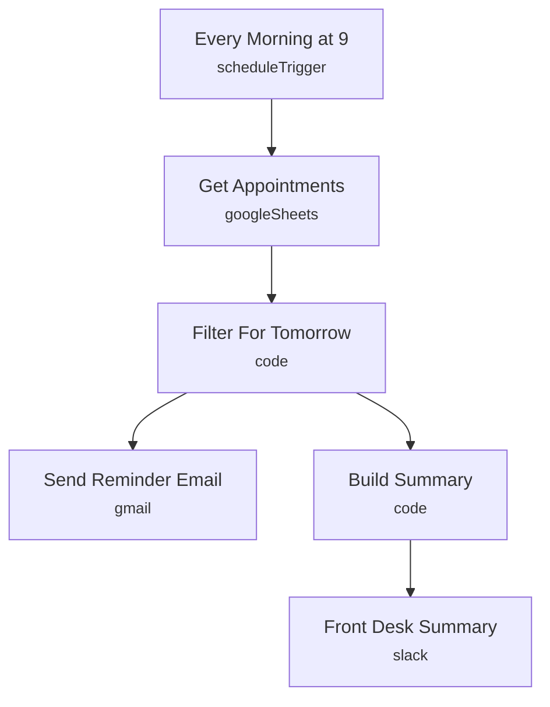

# Appointment Reminder Sender

<!-- CANVAS:START -->

<!-- CANVAS:END -->

Every morning it reads an appointment sheet, finds tomorrow's bookings, emails each patient a reminder, and posts a same-day summary to the front desk's Slack channel.

Built for clinics, dental practices and small healthcare offices that want reminders to go out reliably without front-desk staff doing it by hand every day.

## What it does

1. **Every Morning at 9** (Schedule Trigger) runs once a day.
2. **Get Appointments** reads every row from the Google Sheets appointment tracker.
3. **Filter For Tomorrow** (Code node) keeps only the rows whose `Date` matches tomorrow's date.
4. From there the flow splits two ways:
   - **Send Reminder Email** sends a personalized reminder to each matching patient.
   - **Build Summary** (Code node) counts how many reminders are going out, then **Front Desk Summary** posts that count and the date to a Slack channel.

## Sample request

Not applicable — this workflow runs on a daily schedule (9am) and reads from a Google Sheet rather than an inbound request.

## Setup (about 10 minutes)

1. **Google Sheets** — connect your account on **Get Appointments** and point the document ID at your own appointment sheet (currently set to a specific sheet ID — replace it). The sheet needs `Patient`, `Email`, `Date` and `Time` columns, with `Date` in a format **Filter For Tomorrow** can parse (e.g. `YYYY-MM-DD`).
2. **Gmail** — connect an account on **Send Reminder Email** and adjust the subject/body wording as needed.
3. **Slack** — connect an account on **Front Desk Summary** and point it at your own team channel (currently set to `new_ai-updates`).

---

<!-- ARCHITECTURE:START -->
## Architecture

<!-- ARCHITECTURE:END -->
