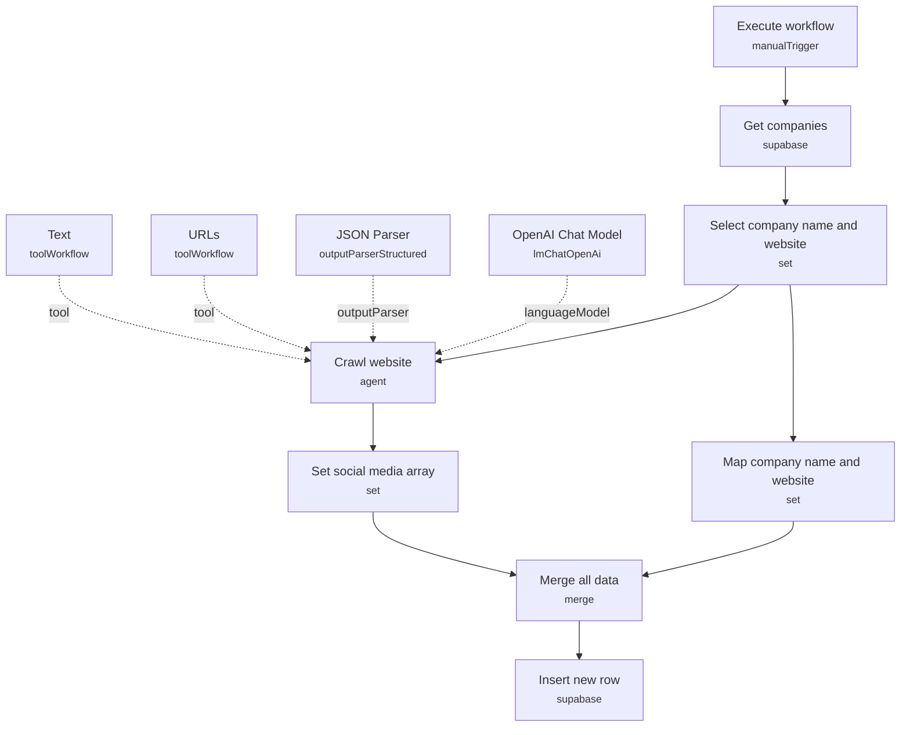

# Autonomous AI Crawler

An AI agent autonomously visits each company's website, follows internal links across multiple pages, and extracts every social media profile URL it can find into a clean, structured JSON record — then writes the enriched result back to a database.

Built for growth, sales-ops, and lead-enrichment teams who need to enrich a list of companies with social profile links at scale, without hand-writing a scraper for every site's markup.

## What it does

1. **Execute workflow** (manual trigger) starts the run.
2. **Get companies** pulls all rows from a Supabase table (`companies_input`) containing company names and websites.
3. **Select company name and website** trims each record down to just the `name` and `website` fields, then fans out to two parallel paths:
   - **Crawl website** (AI agent) and **Map company name and website** (Set node) both run per row.
4. **Crawl website**, powered by **OpenAI Chat Model** (GPT-4o, temperature 0, JSON response mode), is instructed to extract social media URLs from the given site. It has two tools available:
   - **Text** (`text_retrieval_tool`) — a sub-workflow that fetches a page and converts its HTML to clean Markdown text (via **Get website** and **Convert HTML to Markdown**).
   - **URLs** (`url_retrieval_tool`) — a sub-workflow that fetches a page, extracts every `<a>` href, resolves relative paths to absolute URLs, deduplicates them, filters out invalid/empty links, and returns the aggregated list so the agent can navigate further.
   The agent's output is forced into a fixed schema (platform + URLs array) by **JSON Parser**.
5. **Set social media array** reshapes the agent's parsed output into a `social_media` array field.
6. **Merge all data** combines the preserved company name/website (from step 3's parallel branch) with the extracted social media array, matched by position.
7. **Insert new row** writes the enriched record into a Supabase table (`companies_output`).

## Setup (about 10 minutes)

1. **Supabase**: add your credential in *Get companies* and *Insert new row*, and point them at your own `companies_input` / `companies_output` tables (or rename to match your schema).
2. **OpenAI**: add your API key in *OpenAI Chat Model* (used for the crawling agent, GPT-4o).
3. **Field names**: if your Supabase table doesn't use `name` and `website` columns, update *Select company name and website* to match.
4. Consider adding a proxy to the *Get website* nodes inside the **Text** and **URLs** tool sub-workflows if you plan to crawl sites that rate-limit or block automated requests. OpenAI usage is billed per token, and the agent may make several tool calls per company.

## Note

The workflow ships with pinned test data on *Get companies* (`n8n` / `https://n8n.io`) — this is sample data for development only and should be unpinned before running against real input.

---

<!-- ARCHITECTURE:START -->
## Architecture

<!-- ARCHITECTURE:END -->
