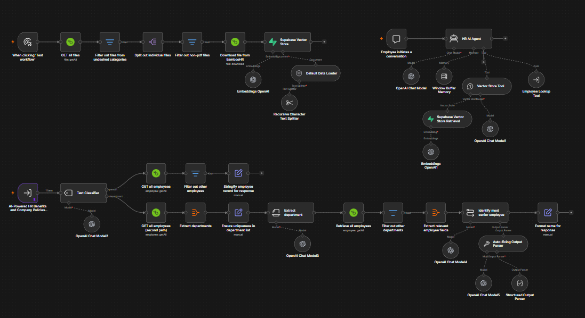
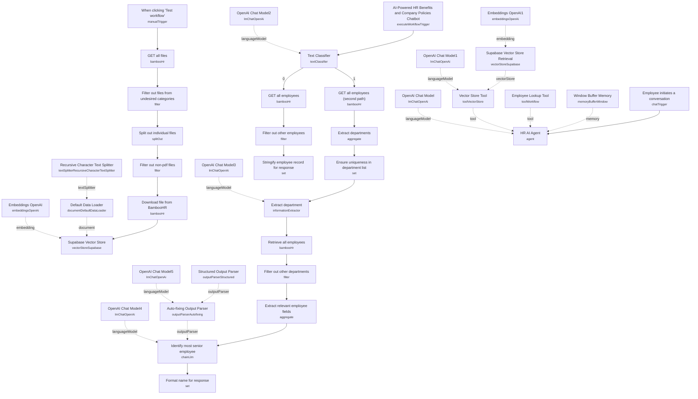

# BambooHR Policies & Benefits Chatbot

<!-- CANVAS:START -->

<!-- CANVAS:END -->

An internal HR chatbot that answers employee questions about company policies and benefits by embedding BambooHR documents into a vector store, and that can also look up a specific employee or find the most senior contact in a department. Two flows share one workflow: a manual ingestion run that indexes policy PDFs from BambooHR, and a chat-driven agent that answers questions and delegates people lookups to itself as a sub-workflow.

Built for HR teams who want a single self-serve assistant that covers both "what does our 401k policy say" and "who do I contact in Finance" without a human touching either question.

## What it does

**Policy ingestion (manual trigger):**

1. **When clicking 'Test workflow'** starts the ingestion run.
2. **GET all files** pulls the full company file list from BambooHR.
3. **Filter out files from undesired categories** keeps only files in the "Company Files" category.
4. **Split out individual files** turns the file list into one item per file.
5. **Filter out non-pdf files** drops anything that isn't a PDF.
6. **Download file from BambooHR** fetches each policy PDF's binary content.
7. **Supabase Vector Store** (insert mode) embeds and stores each document, using **Embeddings OpenAI** for vectors, the **Default Data Loader** to read the binary, and the **Recursive Character Text Splitter** to chunk text before embedding.

**Chat agent (chat trigger):**

1. **Employee initiates a conversation** starts a chat session.
2. **HR AI Agent** answers using **OpenAI Chat Model** and **Window Buffer Memory** for short-term context, and has two tools available:
   - **Vector Store Tool** ("company_files") retrieves policy content from **Supabase Vector Store Retrieval**, backed by **Embeddings OpenAI1** and summarized by **OpenAI Chat Model1**.
   - **Employee Lookup Tool** calls back into this same workflow via its **AI-Powered HR Benefits and Company Policies Chatbot** execute-workflow trigger, passing either a person's name or a department name.
3. Inside the lookup sub-workflow, **Text Classifier** (powered by **OpenAI Chat Model2**) decides whether the query names a person or a department, then branches:
   - **Person path:** **GET all employees** → **Filter out other employees** (exact name match) → **Stringify employee record for response**.
   - **Department path:** **GET all employees (second path)** → **Extract departments** → **Ensure uniqueness in department list** → **Extract department** (via **OpenAI Chat Model3**, picking the closest matching department name) → **Retrieve all employees** → **Filter out other departments** → **Extract relevant employee fields** → **Identify most senior employee** (an LLM call via **OpenAI Chat Model4**, validated by the **Auto-fixing Output Parser** / **OpenAI Chat Model5** / **Structured Output Parser** chain) → **Format name for response**.
4. The agent's system prompt instructs it to try the knowledge base first for a named contact, then fall back to the department lookup, and finally to the requester's own supervisor chain if nothing else resolves.

## Sample request

This workflow uses n8n's built-in chat trigger, not a raw webhook. Open the chat panel on the **Employee initiates a conversation** node and send a message such as:

```
What's our policy on 401k matching, and who should I contact with questions?
```

or, for a people lookup:

```
Who is the most senior person in Engineering?
```

The sub-workflow trigger (**AI-Powered HR Benefits and Company Policies Chatbot**) expects `{"query": {"name": "<person or department>"}}` when called directly; the repo ships pinned test data of `{"query": {"name": "HR"}}` for this node.

## Setup (about 25 minutes)

1. **OpenAI** — add your API key to every OpenAI node: **OpenAI Chat Model** through **OpenAI Chat Model5**, **Embeddings OpenAI**, and **Embeddings OpenAI1**.
2. **BambooHR** — add API credentials to **GET all files**, **Download file from BambooHR**, **GET all employees**, **GET all employees (second path)**, and **Retrieve all employees**.
3. **Supabase** — add credentials to **Supabase Vector Store** and **Supabase Vector Store Retrieval**, and confirm the `company_files` table (with a `match_files` query function) exists in your project.
4. **Self-referencing sub-workflow** — the **Employee Lookup Tool** node calls `{{ $workflow.id }}`, i.e. this same workflow. No extra wiring needed, but don't rename or duplicate the workflow without checking that reference.
5. **Run ingestion first** — trigger **When clicking 'Test workflow'** once before going live so the vector store has content to answer from. Re-run it whenever policy PDFs change, since there's no scheduled re-sync.

Only files in the BambooHR "Company Files" category are ingested — confirm that category name matches your BambooHR account, or adjust the filter in **Filter out files from undesired categories**.

---

<!-- ARCHITECTURE:START -->
## Architecture


<!-- ARCHITECTURE:END -->
