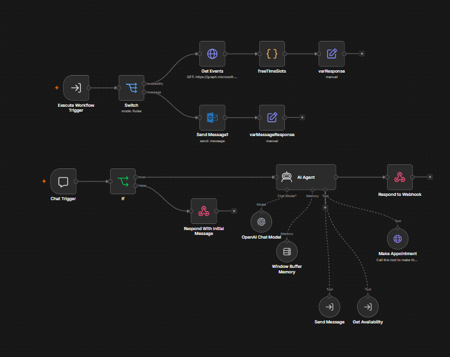
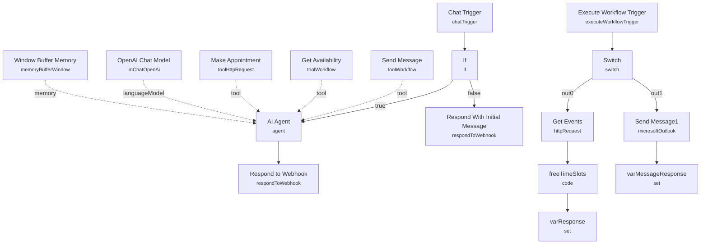

# Branded AI Website Chatbot

<!-- CANVAS:START -->

<!-- CANVAS:END -->

A white-labeled chat widget for a business website that qualifies leads, checks the founder's Outlook calendar for real availability, books meetings directly onto the calendar, and — for enquiries that aren't ready to book — emails a detailed summary to a human. The whole thing runs as one workflow that calls itself as a sub-workflow to keep the calendar/email logic separate from the conversational agent.

Built for consultancies, agencies, or solo founders who want a website chatbot that can actually schedule a meeting, not just collect a "contact us" form submission.

## What it does

1. **Chat Trigger** (public webhook chat) receives the visitor's message.
2. **If** checks whether `chatInput` exists. If the payload has no `chatInput` (i.e. the widget just opened), **Respond With Initial Message** immediately returns a canned greeting (`"Hi, how can I help you today?"`) without invoking the agent.
3. Otherwise, **AI Agent** takes over, using **OpenAI Chat Model** for reasoning and **Window Buffer Memory** for conversation history. Its system prompt instructs it to act as a personal assistant coordinating appointments: ask for availability, check the calendar, gather name/company/email, confirm timezone (Europe/London), and either book a meeting or send an enquiry email if the visitor isn't ready to book. It has two tools:
   - **Get Availability** — a **Tool Workflow** node that calls this same workflow (by workflow ID) with `route: "availability"`.
   - **Send Message** — a **Tool Workflow** node that calls this same workflow with `route: "message"`, passing email, subject, message, name, and company.
   - **Make Appointment** — a **Tool HTTP Request** node that calls the Microsoft Graph API directly (`POST /me/events`) to create a Teams meeting on the calendar.
4. **AI Agent** streams its reply back through **Respond to Webhook**.
5. Inside the self-referenced sub-workflow path: **Execute Workflow Trigger** receives the `route` parameter and **Switch** branches on it:
   - `availability` → **Get Events** (Microsoft Graph `calendarView`, next 2–16 days) → **freeTimeSlots** (code node computing open slots within 08:00–17:30 UTC business hours) → **varResponse** formats the result for the calling agent.
   - `message` → **Send Message1** (Microsoft Outlook node) emails the founder an HTML-formatted enquiry notification, then **varMessageResponse** confirms back to the agent.

## Sample request

This uses n8n's public chat trigger, not a raw webhook payload you construct by hand. Embed the chat widget or open the chat panel on **Chat Trigger** and send:

```
I'd like to book a call sometime next week to discuss a new project.
```

The agent will ask for your name, company, email, and preferred times, check the calendar via the `Get Availability` tool, and either propose slots or (if you say you're not ready) collect enough detail to send a founder notification via the `Send Message` tool.

## Setup (~25 minutes)

1. **OpenAI** — add your API key to **OpenAI Chat Model**.
2. **Microsoft Outlook** — add OAuth2 credentials to **Make Appointment**, **Get Events**, and **Send Message1**. These call Microsoft Graph endpoints directly, so the credential needs calendar and mail send scopes.
3. **Self-referencing sub-workflow** — **Get Availability** and **Send Message** both point at `workflowId: KD21RG8VeXYDS2Vf` ("Website Chatbot"), i.e. this same workflow. After importing, re-select this workflow in both Tool Workflow nodes so the ID matches your instance; don't duplicate the workflow without updating these references.
4. **Personalize the prompts** — the **AI Agent** system prompt and the **Make Appointment** tool description reference "Wayne" and "nocodecreative.io" by name, and the appointment JSON body has a placeholder subject line (`"Meetings with <name> at <company>"`). Replace these with your own name, company, and email template before deploying.
5. **Business hours and timezone** — **freeTimeSlots** hardcodes `08:00:00Z`–`17:30:00Z` as business hours and the calendar nodes assume `Europe/London`. Adjust both if your business operates in a different timezone or schedule.
6. **Chat widget embed** — set the Chat Trigger to public/webhook mode (already configured) and point your website's chat widget at its production webhook URL.

---

<!-- ARCHITECTURE:START -->
## Architecture


<!-- ARCHITECTURE:END -->
