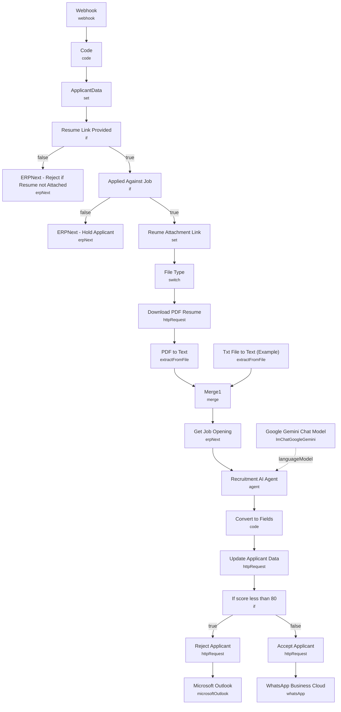

# AI Candidate Shortlisting (ERPNext)

An end-to-end recruitment automation that reacts to new ERPNext Job Applicant records, downloads and reads the candidate's resume, scores their fit against the job description with an AI agent, and updates ERPNext plus notifies the candidate — all without a recruiter touching the applicant record.

Built for HR teams running ERPNext who want AI-driven, consistent first-pass screening instead of manually reading every resume.

## What it does

1. **Webhook** receives ERPNext's "on insert" event for the `Job Applicant` doctype.
2. **Code** stamps a placeholder field on the payload, and **ApplicantData** extracts the webhook `body` into its own object for easier downstream references.
3. **Resume Link Provided** checks whether `body.resume_link` starts with `http`. If not, **ERPNext - Reject if Resume not Attached** updates the applicant's status to `Rejected` via the ERPNext node and the run ends there.
4. **Applied Against Job** checks whether `body.Job_opening` is not `"None"`. If the applicant wasn't tied to a specific opening, **ERPNext - Hold Applicant** sets status to `Hold` and stops.
5. **Reume Attachment Link** copies the resume URL into `body.resume_attachment`, and **File Type** (a Switch) branches on file extension — `.pdf`, `.doc`, or `.jpg` — with only the PDF path fully wired to **Download PDF Resume** (HTTP Request) → **PDF to Text** (`extractFromFile`, PDF operation). A parallel **Txt File to Text (Example)** branch is left as a template for plain-text resumes, feeding into the same **Merge1** node.
6. **Get Job Opening** (ERPNext node) fetches the full Job Opening record — including its description — matched by the applicant's `Job_opening` field.
7. **Recruitment AI Agent** (`reActAgent`, backed by **Google Gemini Chat Model**, `gemini-2.0-flash-exp`) receives a system+user prompt combining the job title, job description, and the extracted resume text, and returns a structured text block: `FitLevel`, `Score` (0-100), `Rating` (0-5), and `Justification`.
8. **Convert to Fields** (Code node) regex-parses that text block into `fit_level`, `score`, `applicant_rating`, and `justification_by_ai` fields.
9. **Update Applicant Data** (HTTP Request, PUT to ERPNext's REST API) writes those four fields back onto the Job Applicant record.
10. **If score less than 80** branches: scores under 80 go to **Reject Applicant** (HTTP PUT, status → `Rejected`) → **Microsoft Outlook** (sends a rejection email); scores 80+ go to **Accept Applicant** (HTTP PUT, status → `Accepted`) → **WhatsApp Business Cloud** (sends an acceptance notification).

## Sample request

This is an ERPNext-native webhook, not a generic HTTP call — it must be configured in ERPNext under **Settings → Webhooks**, triggered on `Job Applicant` insert. ERPNext's outbound payload lands in `body` and needs at least:

```json
{
  "body": {
    "name": "HR-APP-2024-00042",
    "resume_link": "https://your-site.example.com/files/resume.pdf",
    "Job_opening": "HR-OPN-2024-00007"
  }
}
```

## Setup (~25 minutes)

1. **ERPNext** — add an ERPNext API credential to **ERPNext - Reject if Resume not Attached**, **ERPNext - Hold Applicant**, **Get Job Opening**, **Reject Applicant**, **Update Applicant Data**, and **Accept Applicant**. The last three use raw HTTP Request nodes with a hardcoded base URL (`https://erpnext.syncbricks.com/api/resource/...`) — replace this with your own ERPNext instance's URL in all three nodes.
2. **Custom ERPNext fields** — the workflow writes to `custom_score`, `custom_fit_level`, `custom_justification_by_ai`, and the built-in `applicant_rating` field on Job Applicant. These custom fields must exist in your ERPNext instance before this runs, or the update calls will fail.
3. **Google Gemini** — add a Google PaLM/Gemini API credential to **Google Gemini Chat Model**.
4. **Microsoft Outlook** — add an OAuth2 credential to the **Microsoft Outlook** node for rejection emails (recipient/body fields are currently empty — populate `additionalFields` with the candidate's email and message).
5. **WhatsApp Business Cloud** — add a WhatsApp API credential to the **WhatsApp Business Cloud** node for acceptance messages (same caveat: `additionalFields` needs the recipient number and message filled in).
6. **Webhook registration** — you must create the actual webhook inside ERPNext pointing at this workflow's **Webhook** node URL (path `syncbricks-com-tutorial-candidate-shortlist`), triggered on Job Applicant insert, and pin a test payload before going live.
7. **Score threshold** — the accept/reject cutoff (80) is hardcoded in **If score less than 80**; adjust to fit your hiring bar.
8. **File type coverage** — only PDF resumes are fully processed end-to-end; `.doc` and `.jpg` branches in **File Type** have no nodes attached and will need custom handling if you expect those formats.

---

<!-- ARCHITECTURE:START -->
## Architecture


<!-- ARCHITECTURE:END -->
