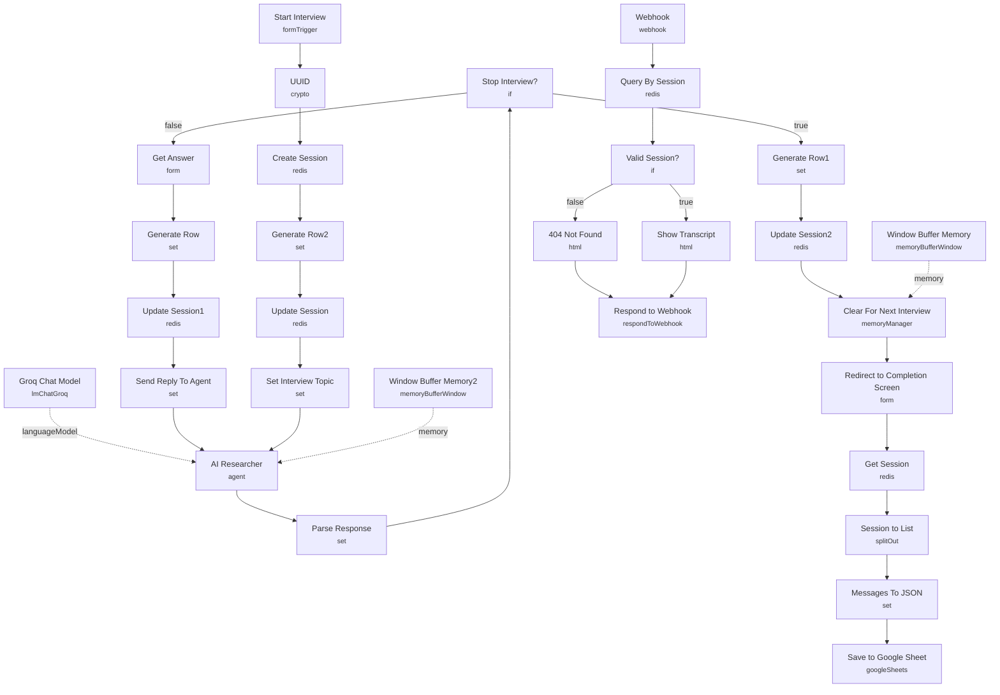

# Conversational AI Interview Agent

An open-ended, form-driven interview bot that lets an LLM conduct a live qualitative interview instead of a human researcher. A respondent starts a session, the AI asks a question, the respondent answers through a form, and the loop repeats indefinitely until the AI detects a request to stop — at which point the transcript is saved to Google Sheets and the respondent is shown a completion page with their own answers.

Built for researchers, product teams, or CX groups who need to run open-ended interviews (satisfaction surveys, UX research, exit interviews) at scale without scheduling a human interviewer for every session.

## What it does

1. **Start Interview** (form trigger) collects the respondent's name and kicks off a session.
2. **UUID** generates a session identifier, then **Create Session** initializes an empty session list in Redis (via the Upstash credential) with a 24-hour TTL.
3. **Generate Row2** builds the first transcript entry ("start_interview") and **Update Session** pushes it into the Redis list.
4. **Set Interview Topic** seeds the conversation with a hardcoded interview topic and the respondent's opening line ("Hello, my name is ...").
5. **AI Researcher** (LangChain agent, backed by **Groq Chat Model** and **Window Buffer Memory2** for short-term context) asks one open-ended question at a time and returns strict JSON (`stop_interview`, `question`) per its system prompt.
6. **Parse Response** strips markdown fences and parses that JSON, then **Stop Interview?** branches on `output.stop_interview`:
   - **False path:** **Get Answer** (form node) collects the respondent's reply. **Generate Row** builds a "next_question" transcript row, **Update Session1** appends it to Redis, **Send Reply To Agent** feeds the answer back, and the loop returns to **AI Researcher**.
   - **True path:** **Generate Row1** builds a "stop_interview" row, **Update Session2** appends it to Redis, and **Clear For Next Interview** (Memory Manager, delete mode) wipes the agent's buffer memory (**Window Buffer Memory**) so the next session starts clean.
7. **Redirect to Completion Screen** sends the respondent to a webhook URL that will render their transcript, then **Get Session** pulls the full Redis list and **Session to List** splits it into individual messages.
8. **Messages To JSON** reshapes each message and attaches `session_id` and `name`, and **Save to Google Sheet** appends every message as a row in a "transcripts" sheet for later analysis.
9. Separately, the **Webhook** node (path `ai-interview-transcripts/:session_id`) is the target of the redirect above: **Query By Session** fetches the session from Redis, **Valid Session?** checks whether it exists, and routes to either **Show Transcript** (renders an HTML page with the Q&A history) or **404 Not Found**, both of which return through **Respond to Webhook**.

## Sample request

This workflow starts from an n8n form, not a raw webhook. Open **Start Interview**'s form URL and submit:

```
What is your name? -> Jane Doe
```

The interview then proceeds through the **Get Answer** form, where each prompt is dynamically generated by the AI Researcher agent. To end the interview, answer with something like:

```
stop interview
```

The completion redirect calls the internal transcript webhook with a payload shape of:

```
GET /webhook/ai-interview-transcripts/<session-uuid>
```

## Setup (about 20 minutes)

1. **Groq** — add API credentials to **Groq Chat Model** (used as the interview agent's LLM).
2. **Redis / Upstash** — add credentials to **Create Session**, **Update Session**, **Update Session1**, **Update Session2**, **Query By Session**, and **Get Session**. The template uses Upstash's free tier, but any Redis-compatible instance works.
3. **Google Sheets** — add OAuth2 credentials to **Save to Google Sheet** and point `documentId`/`sheetName` at your own spreadsheet with columns `session_id, timestamp, name, type, question, answer`.
4. **Hardcoded interview topic** — **Set Interview Topic** currently hardcodes `"Your experience preparing for and taking the UK practical driving test"` and the form title/description in **Start Interview** matches that same demo topic. Change both to fit your actual interview subject.
5. **Webhook redirect URL** — **Redirect to Completion Screen** hardcodes a placeholder redirect (`https://<host>/webhook/<uuid-if-using-n8n-cloud>/ai-interview-transcripts/{{ session_id }}`). Replace `<host>` and the UUID segment with your actual n8n instance's production webhook URL for the **Webhook** node, or the completion screen link will 404.
6. **Session TTL** — sessions expire from Redis after 24 hours (`Create Session` sets `ttl: 60 * 60 * 24`). Anyone completing an interview after that window will hit **404 Not Found** when viewing their transcript.
7. Optional: swap **Groq Chat Model** for any other LangChain chat model node if you'd prefer OpenAI, Anthropic, etc. — the agent's structured-output parsing in **Parse Response** is model-agnostic as long as the model returns the expected JSON.

---

<!-- ARCHITECTURE:START -->
## Architecture


<!-- ARCHITECTURE:END -->
