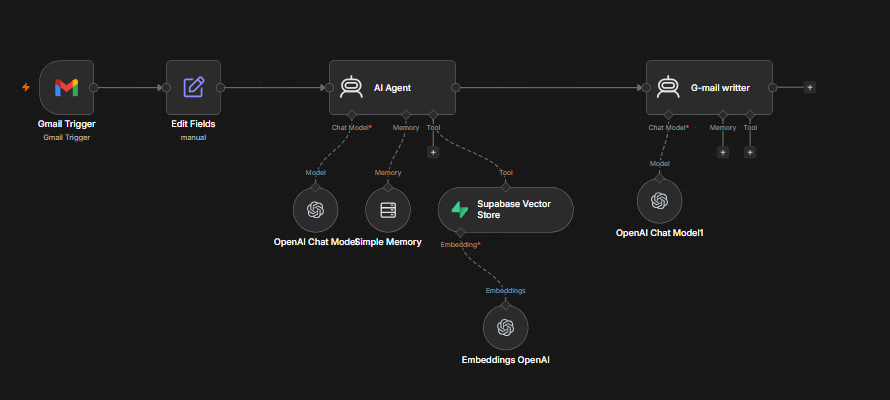
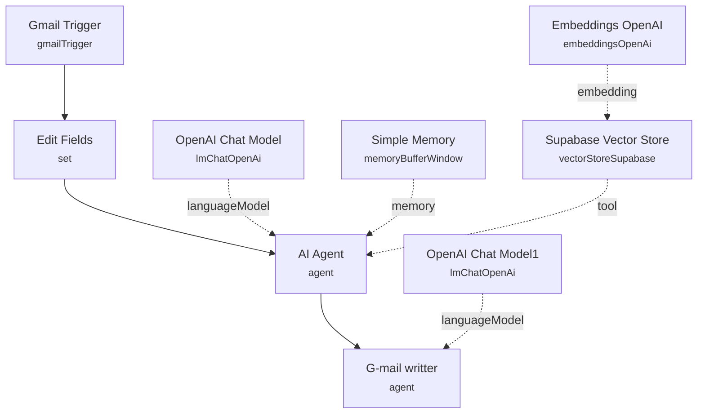

# Customer Service Agent with RAG

<!-- CANVAS:START -->

<!-- CANVAS:END -->

An email-based support agent that watches a Gmail inbox for incoming customer questions, answers them by retrieving relevant knowledge from a Supabase vector store, and rewrites the raw answer into a polished, professional email reply.

Built for small support teams who want first-line email responses grounded in their own knowledge base (policies, FAQs, product docs) without hiring a dedicated support agent for routine questions.

## What it does

1. **Gmail Trigger** polls the connected inbox every minute for new messages.
2. **Edit Fields** (Set) extracts the customer's `Message` (from the email snippet) and their first `Name` (parsed from the `From` header).
3. **AI Agent** (LangChain Agent, backed by **OpenAI Chat Model** on GPT-5-mini) answers the customer's message. It is instructed to always consult the connected vector store tool first and reply short, precise and formal.
   - **Supabase Vector Store** is wired in as a retrieval tool (`documents` table), giving the agent RAG access to a knowledge base.
   - **Embeddings OpenAI** generates the embeddings used for vector similarity search.
   - **Simple Memory** (buffer window, keyed on the incoming message text, 50-message context window) gives the agent short-term conversational memory.
4. **G-mail writter** (LangChain Agent, backed by **OpenAI Chat Model1**) takes the AI Agent's raw answer and rewrites it into a structured, professional email — proper greeting using the customer's name, clean paragraphs, polite sign-off — without adding or omitting information.

Note: the final formatted reply produced by **G-mail writter** is not currently connected to a Gmail "send" node, so this workflow drafts the response but does not yet send it automatically — see below.

## Setup (about 15 minutes)

1. **Gmail** — connect Gmail OAuth2 in **Gmail Trigger** to watch your support inbox.
2. **OpenAI** — add your API key in **OpenAI Chat Model**, **OpenAI Chat Model1** and **Embeddings OpenAI**.
3. **Supabase** — add your Supabase credentials in **Supabase Vector Store**, and make sure a `documents` table with embedded knowledge-base content exists in your Supabase project.
4. **Complete the send step** — add a Gmail "Send" or "Reply" node after **G-mail writter** (wired to the original thread ID) to actually deliver the drafted response to the customer; currently the workflow stops at drafting.

## Notes

The workflow includes pinned sample data on **Gmail Trigger** (a sample refund-policy question from `support@example.com` to `customer@example.com`) used for testing — these are placeholder addresses, not real credentials or contacts.

---

<!-- ARCHITECTURE:START -->
## Architecture

<!-- ARCHITECTURE:END -->
