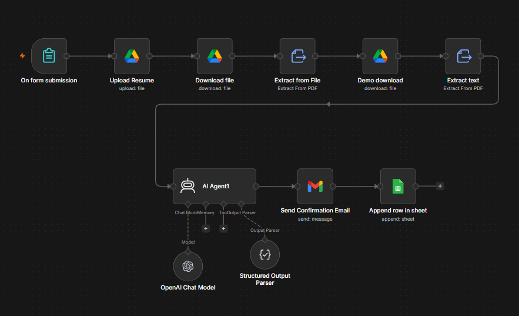
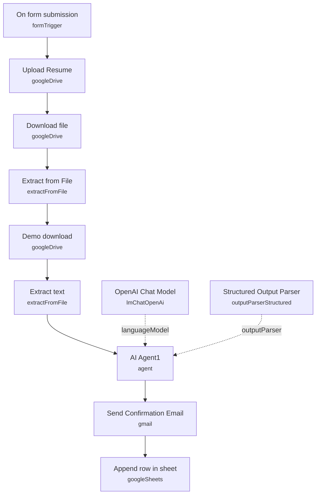

# AI-Screened CV Intake Pipeline

<!-- CANVAS:START -->

<!-- CANVAS:END -->

An AI recruiting assistant that takes job applications through a public form, stores the submitted resume in Google Drive, screens the candidate against a job description with GPT-4.1 mini, emails the applicant a confirmation, and logs a structured fit assessment to a tracking spreadsheet.

Built for HR and recruiting teams who want every application automatically triaged with a consistent, evidence-based screening report instead of a human reading each resume cold.

## What it does

1. **On form submission** collects the applicant's full name, email, and resume (PDF only) from a public job application form.
2. **Upload Resume** saves the uploaded PDF to a designated Google Drive folder, named after the applicant.
3. **Download file** re-downloads the just-uploaded resume from Drive to get it into binary form for text extraction.
4. **Extract from File** pulls the raw text out of the resume PDF.
5. **Demo download** downloads a fixed job description PDF from Google Drive (see note below).
6. **Extract text** pulls the raw text out of that job description PDF.
7. **AI Agent1** compares the extracted resume text against the extracted job description text and produces a structured screening report: candidate strengths, weaknesses, a risk score with worst-case scenario, a reward score with best-case scenario and fit duration, an overall fit rating (0-10), and a written justification. Output is validated against a JSON schema by the **Structured Output Parser**, using **OpenAI Chat Model** (`gpt-4.1-mini`) as the underlying LLM.
8. **Send Confirmation Email** emails the applicant a "we received your application" acknowledgment via Gmail.
9. **Append row in sheet** writes the applicant's details and the full AI screening report (strengths, weaknesses, risk/reward scores, overall fit, justification) as a new row in a Google Sheets applicant tracker.

**Note on the job description step:** the **Demo download** node has a hardcoded `fileId` pointing at a single demo PDF ("marketing officer _ DEMO.pdf") rather than reading a job-description field from the form or matching it to the role being applied for. Every submission is currently screened against that one fixed job description. In a production version this should be replaced with a dynamic lookup (e.g., a form field for job ID, or a folder keyed by role) so each applicant is screened against the correct posting.

## Sample request

The trigger is a form, not a raw webhook, so applicants fill out these fields directly:

- **Full Name** (text, required)
- **Email** (email, required)
- **Resume** (file upload, `.pdf` only, required)

## Setup (about 15 minutes)

1. **Google Drive** — connect your OAuth2 account in **Upload Resume**, **Download file**, and **Demo download**. Replace the hardcoded folder ID in **Upload Resume** (`1ATRcn9obXka2jDJB1NR5YktPnjIOev_s`) with your own resume storage folder, and replace the hardcoded file ID in **Demo download** (`1f7F_N_SQLTCGkFw9gwpZekiVWb6GTr3O`) with the job description you actually want candidates screened against — or better, make this dynamic per posting.
2. **OpenAI** — add your API key in **OpenAI Chat Model** (used by **AI Agent1**, model `gpt-4.1-mini`).
3. **Gmail** — connect your OAuth2 account in **Send Confirmation Email**.
4. **Google Sheets** — connect your OAuth2 account in **Append row in sheet**, and point `documentId` at your own applicant-tracking spreadsheet (currently hardcoded to a specific sheet ID).

## Error handling

No dedicated error-handling nodes are present. A failure in any step (Drive upload, PDF extraction, the AI screening call, or the sheet write) will fail the execution with no retry or alerting.

---

<!-- ARCHITECTURE:START -->
## Architecture

<!-- ARCHITECTURE:END -->
