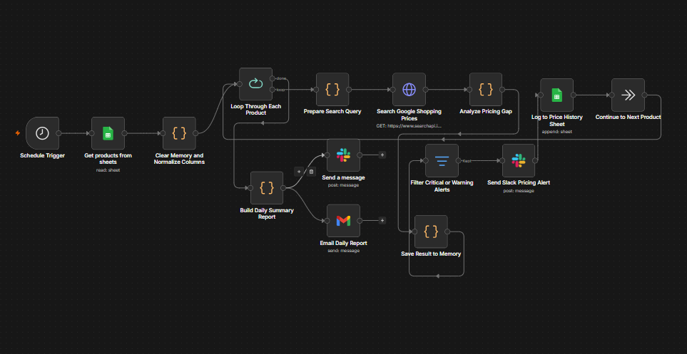
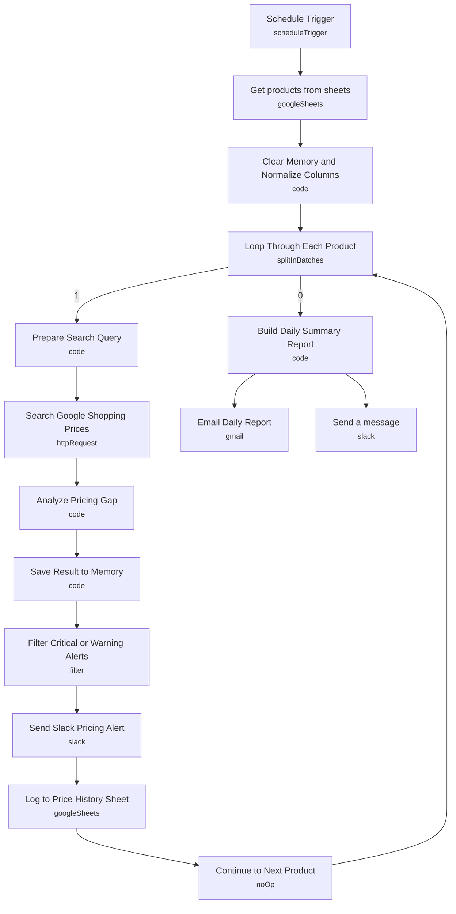

# Daily Product Pricing Monitor

<!-- CANVAS:START -->

<!-- CANVAS:END -->

A scheduled competitive-pricing watchdog that reads a product catalog from Google Sheets, looks up live competitor prices for each item via Google Shopping, flags products that are priced too high or too low against the market, and sends a daily summary report by Slack and email.

Built for e-commerce and retail teams who need to catch pricing drift against competitors every morning without manually shopping around for every SKU.

## What it does

1. **Schedule Trigger** runs daily at 8 AM.
2. **Get products from sheets** (Google Sheets) reads the full product catalog.
3. **Clear Memory and Normalize Columns** (Code) resets the workflow's accumulated pricing results and normalizes inconsistent column names (`product_name`/`Product Name`/`name`, etc.) into a consistent shape: `productName`, `yourPrice`, `sku`, `category`, `brand`.
4. **Loop Through Each Product** (Split In Batches) processes the catalog one product at a time, looping back after each product is logged, and routing to the summary step once the batch is exhausted.
5. **Prepare Search Query** (Code) builds a search string from brand, product name and SKU.
6. **Search Google Shopping Prices** (HTTP Request to SearchAPI.io's `google_shopping` engine) fetches live competitor listings for that query.
7. **Analyze Pricing Gap** (Code) parses the shopping results, computes the lowest and average competitor price, calculates the percentage gap against `yourPrice`, classifies severity (`ok` / `warning` at ±10% / `critical` at ±20%), and suggests a price 3% below the lowest competitor.
8. **Save Result to Memory** (Code) appends each product's analysis to workflow static data so results accumulate across the loop.
9. **Filter Critical or Warning Alerts** only passes through products where `severity != "ok"`.
10. **Send Slack Pricing Alert** posts a per-product alert (your price, lowest competitor, gap %, suggested price) to a Slack channel.
11. **Log to Price History Sheet** (Google Sheets append) records every analyzed product — including ones marked "ok" — to a historical pricing log.
12. **Continue to Next Product** (NoOp) loops back to **Loop Through Each Product** for the next item.
13. Once all products are processed, **Build Daily Summary Report** (Code) reads the full accumulated results from static data and builds both an HTML report table (color-coded by severity) and a condensed Slack summary message.
14. **Email Daily Report** (Gmail) sends the HTML report.
15. **Send a message** (Slack) posts the condensed summary to a general channel.

## Setup (about 15 minutes)

1. **Google Sheets** — connect Google Sheets OAuth2 in **Get products from sheets** (catalog, ID `1axRTQelNLar_LC2m3Mul9wKJVHYhqEtie9lC4FR1w2c`) and **Log to Price History Sheet** (history log, ID `1zMSlJ3YHlkffZ_V0m1pS_HG12jhxNMRInG7QioQxgNQ`). Replace both spreadsheet IDs with your own sheets.
2. **SearchAPI.io** — replace the `YOUR_SEARCHAPI_KEY` placeholder in **Search Google Shopping Prices** with your own key. Move it into an n8n credential rather than a hardcoded query parameter if you plan to share this workflow further.
3. **Slack** — connect Slack OAuth2 in **Send Slack Pricing Alert** (channel `pricing-alerts`, ID `C0AK5VBUE1Z`) and **Send a message** (channel `all-general-all-department`, ID `C0AK1R8LT3M`). Update both channel IDs to your own workspace.
4. **Gmail** — connect Gmail OAuth2 in **Email Daily Report** and replace the hardcoded recipient `alerts@example.com` with your real distribution address.

## Error handling

There is no dedicated error-handling branch (no Error Trigger or retry/notify-on-failure logic) in this workflow — a failed HTTP call to SearchAPI or a malformed sheet row will fail the run rather than degrade gracefully. Consider adding continue-on-fail to **Search Google Shopping Prices** so one bad product doesn't stop the whole batch.

---

<!-- ARCHITECTURE:START -->
## Architecture

<!-- ARCHITECTURE:END -->
