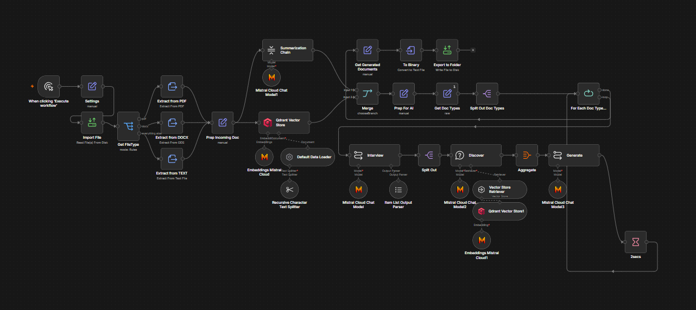
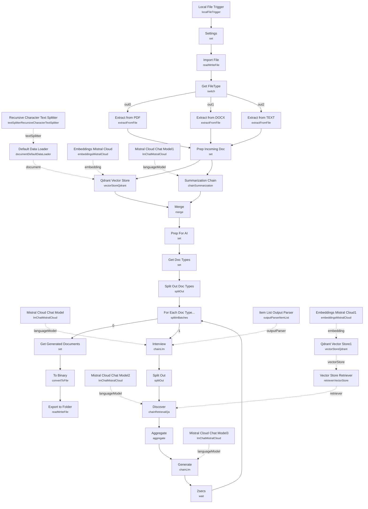

# Document to Study Notes (Mistral + Qdrant)

<!-- CANVAS:START -->

<!-- CANVAS:END -->

A folder-watching pipeline that turns any dropped-in document (PDF, DOCX, or plain text) into a set of study aids — a study guide, a briefing document, and a timeline — using retrieval-augmented generation. Files land in a watched directory, get summarized and embedded into a Qdrant vector store, then get interviewed by an LLM chain that generates each note type from the source material, writing finished Markdown files back next to the original.

Built for anyone processing recurring source material (course readings, meeting transcripts, research papers) who wants consistent, structured study notes generated automatically instead of summarizing by hand.

## What it does

1. **Local File Trigger** fires whenever a new file is added under `/home/node/storynotes/context`, using polling with symlink support.
2. **Settings** derives `project` (the subfolder name), `path`, and `filename` from the trigger's file path.
3. **Import File** loads the file's binary content, then **Get FileType** (Switch) branches to the matching extractor — **Extract from PDF**, **Extract from DOCX**, or **Extract from TEXT** — all converging on **Prep Incoming Doc**, which copies the extracted text into a `data` field.
4. Two things happen in parallel from there:
   - **Qdrant Vector Store** (insert mode, collection `storynotes`) embeds and stores the document, using **Embeddings Mistral Cloud** for vectors, **Default Data Loader** to read `data` (tagged with `project`/`filename` metadata), and **Recursive Character Text Splitter** (2000-char chunks) to split it first.
   - **Summarization Chain** (backed by **Mistral Cloud Chat Model1**, 4000-char chunks) produces a condensed summary of the same document.
5. **Merge** (chooseBranch) waits for both paths into **Prep For AI**, which assembles a record with `id` (a hash of the filename), `project`, `path`, `name`, and the generated `summary`.
6. **Get Doc Types** (raw JSON) defines the three note templates — Study Guide, Timeline, Briefing Doc — each with a `filename` and instructional `description`. **Split Out Doc Types** turns this into one item per template, and **For Each Doc Type...** (Split In Batches) loops over them.
7. Per template, on the loop's "generate" output:
   - **Interview** (LLM chain on **Mistral Cloud Chat Model**, with **Item List Output Parser**) generates 5 questions worth asking of the summary to build that note type.
   - **Split Out** breaks the questions into items, and **Discover** (**Question & Answer Retrieval Chain**, using **Vector Store Retriever** over **Qdrant Vector Store1**/**Embeddings Mistral Cloud1**, powered by **Mistral Cloud Chat Model2**) answers each against the embedded document.
   - **Aggregate** collects the answers, and **Generate** (LLM chain on **Mistral Cloud Chat Model3**) writes the final Markdown note from the template's title/description plus the aggregated answers.
   - **2secs** (Wait) pauses briefly before **For Each Doc Type...** loops to the next template — a rate-limit buffer for the Mistral API.
8. On the loop's other output, **Get Generated Documents** captures `data`, `path`, and `filename`, **To Binary** converts the Markdown text to a file, and **Export to Folder** saves it next to the source document, named as a truncated filename plus template title.

## Sample input

This workflow is triggered by a filesystem event, not a webhook or chat message. To trigger it, drop a file into the watched folder structure:

```
/home/node/storynotes/context/<project-name>/lecture-notes.pdf
```

The `project` field comes from the path segment (`path.split('/').slice(0,4)[3]`), and `filename` from the final segment — so the folder layout under the watched root matters, not just the trigger config. Supported inputs are PDF, DOCX (via the `ods` extraction operation), and plain text; anything else falls through unextracted.

## Setup (about 15 minutes)

1. **Mistral Cloud API** — add credentials to every Mistral node: **Embeddings Mistral Cloud**, **Embeddings Mistral Cloud1**, **Mistral Cloud Chat Model** through **Mistral Cloud Chat Model3** (currently reference a shared "Mistral Cloud account" credential — replace with your own key).
2. **Qdrant** — add API credentials to **Qdrant Vector Store** and **Qdrant Vector Store1**, and create a collection named `storynotes` in your Qdrant instance (both nodes reference it by name).
3. **Local File Trigger path** — update the hardcoded watch path `/home/node/storynotes/context` to a directory that exists and is readable inside your n8n container/host; if running in Docker, it must be a mounted volume.
4. **Export destination** — **Export to Folder** writes generated notes into the same folder as the source file, so that directory must also be writable by the n8n process.
5. **Note templates** — the three study-aid types are hardcoded in **Get Doc Types**'s raw JSON. Add, remove, or edit entries there to change what gets generated.
6. **Model choice** — several Chat Model nodes pin `open-mixtral-8x7b` explicitly while **Mistral Cloud Chat Model2** uses the credential's default; align these for consistent behavior.
7. **Rate limiting** — the **2secs** Wait node is a fixed delay between template generations; increase it if you hit Mistral API rate limits with larger document sets or more templates.

---

<!-- ARCHITECTURE:START -->
## Architecture


<!-- ARCHITECTURE:END -->
