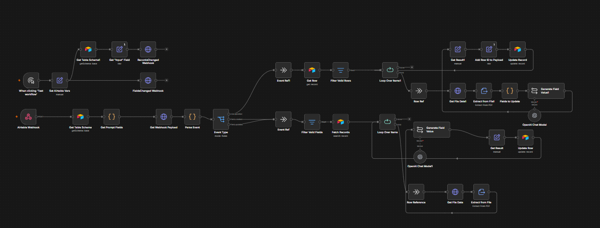
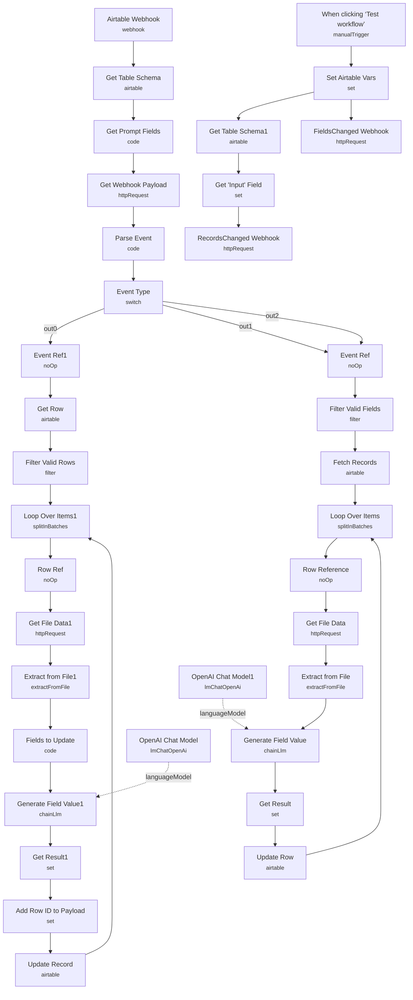

# Dynamic Prompt Data Extraction (Airtable)

<!-- CANVAS:START -->

<!-- CANVAS:END -->

A workflow that turns Airtable column descriptions into live, user-editable LLM prompts: upload a PDF into a designated "File" column, and every other column whose description contains an extraction instruction gets auto-filled by an LLM reading that PDF — no code or template changes needed to add a new field, just add a column and describe what it should contain.

Built for teams who want non-technical users to define what data gets extracted from documents (by editing an Airtable column description) without touching the underlying n8n workflow.

## What it does

**Main flow (triggered by Airtable webhook events):**

1. **Airtable Webhook** receives Airtable's webhook ping (no payload details — just a signal that something changed) and **Get Webhook Payload** calls Airtable's Webhooks API to fetch the actual payload list for that base/webhook ID.
2. **Get Table Schema** (Airtable, `getSchema`) pulls the base's field schema, and **Get Prompt Fields** (code) filters it down to fields that have a non-empty `description` — these descriptions are the "dynamic prompts."
3. **Parse Event** (code) inspects the fetched payload to classify the event as `row.updated`, `field.created`, or `field.updated`, and extracts the relevant `baseId`, `tableId`, `rowId` and/or changed `field`.
4. **Event Type** (switch) branches on that classification:
   - **row.updated** → **Event Ref1** → **Get Row** fetches the full updated record → **Filter Valid Rows** keeps it only if its `File` attachment is populated → **Loop Over Items1** (split in batches, one row at a time) → **Row Ref** → **Get File Data1** downloads the PDF → **Extract from File1** pulls its text → **Fields to Update** (code) determines which columns still need values → **Generate Field Value1** (LLM chain, **OpenAI Chat Model**) extracts each missing field's value per its column description and type → **Get Result1** → **Add Row ID to Payload** → **Update Record** writes the values back to Airtable, then the loop continues to the next row.
   - **field.created** or **field.updated** → **Event Ref** → **Filter Valid Fields** ensures the field actually has a description → **Fetch Records** (Airtable `search`, filtered to rows where `File` is non-empty) → **Loop Over Items** (split in batches, one row at a time) → **Row Reference** → **Get File Data** downloads that row's PDF → **Extract from File** → **Generate Field Value** (LLM chain, **OpenAI Chat Model1**) generates just the one new/changed field's value → **Get Result** → **Update Row** writes it back, then the loop continues to the next row.

**Webhook setup flow (run once per Airtable base, manually):**

5. **When clicking 'Test workflow'** → **Set Airtable Vars** sets `appId` (base ID), `tableId`, `notificationUrl`, and `inputField` (defaults to `"File"`) as placeholders.
6. **Get Table Schema1** → **Get "Input" Field** fans out to two Airtable Webhooks API calls: **RecordsChanged Webhook** (subscribes to record `update` events scoped to the input field) and **FieldsChanged Webhook** (subscribes to field `add`/`update` events) — these register this workflow's webhook URL with Airtable so the main flow actually receives events.

## Sample input

There's no user-constructed request — the real trigger is Airtable's own webhook ping to **Airtable Webhook**, which carries only a `base.id` and `webhook.id`; the actual change payload is fetched separately. A representative parsed event (output of **Parse Event**) looks like:

```json
{
  "baseId": "appAyH3GCBJ56cfXl",
  "tableId": "tblXXXXXXXXXXXXXX",
  "event_type": "row.updated",
  "fieldId": null,
  "field": null,
  "rowId": "recXXXXXXXXXXXXXX"
}
```

For the field-created/updated path, `field` carries the schema entry driving the prompt, e.g. `{"id": "fldXXXX", "name": "Contract End Date", "type": "singleLineText", "description": "Extract the contract's end date in YYYY-MM-DD format"}`.

## Setup (~35 minutes)

1. **Airtable Personal Access Token** — add an `airtableTokenApi` credential to every Airtable node: **Get Webhook Payload**, **Get Table Schema**, **Get Table Schema1**, **Fetch Records**, **Update Row**, **Get Row**, **Update Record**, **RecordsChanged Webhook**, **FieldsChanged Webhook**.
2. **OpenAI** — add an `openAiApi` credential to **OpenAI Chat Model** (feeds **Generate Field Value1**, the row-updated path) and **OpenAI Chat Model1** (feeds **Generate Field Value**, the field-created/updated path).
3. **Publish the workflow and grab its production webhook URL** — needed before you can register Airtable webhooks against it.
4. **Run the webhook setup flow once per base** — trigger **When clicking 'Test workflow'**, first replacing the placeholders in **Set Airtable Vars**: `<MY_BASE_ID>`, `<MY_TABLE_ID>`, and `<MY_WEBHOOK_URL>` (your published workflow's webhook URL). This registers **RecordsChanged Webhook** and **FieldsChanged Webhook** against your base — Airtable webhooks expire after 7 days of inactivity and must be re-created if they lapse.
5. **Table schema requirements** — your Airtable table needs an attachment column named `File` (matching `Filter Valid Rows`' check on `$json.File[0].url` and `Fetch Records`' `filterByFormula: NOT({File} = "")`) that holds the source PDF, plus any number of additional columns whose **description** field contains the extraction instruction for that column. Update the hardcoded `"File"` references throughout (**Filter Valid Rows**, **Fetch Records**, **Set Airtable Vars**'s `inputField`) if your input column is named differently.
6. **Update Row / Update Record schema mapping** — both nodes ship with a column schema snapshot (`Name`, `File`, `Full Name`, `Created`, `Last Modified`, `Address`) matching the example base; if your table's columns differ, n8n will need you to refresh the schema mapping in these nodes after connecting your own base.
7. This template is reusable across bases, but the webhook registration step (step 4) must be repeated for each new Airtable base/table you want to wire up.

---

<!-- ARCHITECTURE:START -->
## Architecture


<!-- ARCHITECTURE:END -->
