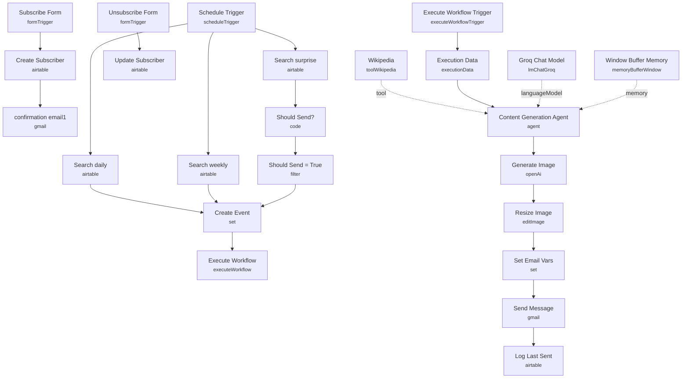

# Email Subscription Service (Forms + Airtable + AI)

A self-contained "learn something every day" subscription service: users sign up through an n8n form, choose a topic and a daily/weekly/surprise cadence, and receive AI-generated factoids with an accompanying illustration by email — all without any external backend, using Airtable as the subscriber database.

Built for anyone who wants to demonstrate a full subscribe/send/unsubscribe email product using only n8n forms, a scheduled trigger, and an AI content pipeline.

## What it does

**Subscribe flow:**

1. **Subscribe Form** collects `topic`, `email`, and `frequency` (daily/weekly/surprise me).
2. **Create Subscriber** upserts the row into Airtable (matched on `Email`) with `Status: active`, the chosen `Interval`, and a `Start Day` derived from the submission timestamp.
3. **confirmation email1** sends a Gmail confirmation summarizing the topic and schedule.

**Unsubscribe flow:**

4. **Unsubscribe Form** takes an `ID` (not an email address, to prevent unsubscribing someone else) plus an optional reason.
5. **Update Subscriber** sets that record's `Status` to `inactive` in Airtable.

**Scheduled send flow:**

6. **Schedule Trigger** fires daily at 9am and fans out to three Airtable searches in parallel: **Search daily** (active + daily interval), **Search weekly** (active + weekly interval + `Last Sent` at least 7 days ago), and **Search surprise** (active + surprise interval).
7. The surprise branch passes through **Should Send?** (a Code node picking a random number 1–10 and flagging `should_send` true on an 8) and **Should Send = True** (a Filter node that only continues when that flag is true) — giving roughly a 1-in-10 chance per day.
8. All three branches converge on **Create Event**, which normalizes the Airtable row into `email`, `topic`, `interval`, `id`, and `created_at`.
9. **Execute Workflow** calls this same workflow's own **Execute Workflow Trigger** in `each` mode (one sub-execution per subscriber, running concurrently, so one failure doesn't block the rest).
10. Inside the sub-execution: **Execution Data** logs the email for filterable execution history, then **Content Generation Agent** (an AI agent with **Groq Chat Model** as its LLM and **Wikipedia** as a tool, plus **Window Buffer Memory** keyed per-subscriber to avoid repeating facts) generates a fresh factoid on the requested topic.
11. **Generate Image** (OpenAI image generation) creates a complementary illustration, and **Resize Image** scales it to 480x360.
12. **Set Email Vars** builds the `to`, `subject`, and HTML `message` fields (including an unsubscribe link built from the subscriber's Airtable `id`), and **Send Message** emails it via Gmail with the resized image attached.
13. **Log Last Sent** updates the subscriber's `Last Sent` timestamp in Airtable so the weekly filter works correctly on the next run.

## Sample input

The **Subscribe Form** (path `free-factoids-subscribe`) expects:

- `topic` (textarea, required) — e.g. `Roman history`
- `email` (email, required) — e.g. `jim@example.com`
- `frequency` (dropdown, required) — one of `daily`, `weekly`, `surprise me`

The **Unsubscribe Form** (path `free-factoids-unsubscribe`) expects:

- `ID` (required) — the subscriber's Airtable record ID, normally pre-filled via a link rather than typed by hand
- `Reason For Unsubscribe` (multi-select dropdown) — any combination of "Emails not relevant", "Too many Emails", "I did not sign up to this service"

## Setup (~20 minutes)

1. **Airtable** — copy the [sample base](https://airtable.com/appL3dptT6ZTSzY9v/shrLukHafy5bwDRfD) and point every Airtable node (**Create Subscriber**, **Update Subscriber**, **Search daily**, **Search weekly**, **Search surprise**, **Log Last Sent**) at your copy's base ID and `Table 1`.
2. **Gmail** — add OAuth2 credentials to **confirmation email1** and **Send Message**.
3. **Groq** — add an API key to **Groq Chat Model** (used by the Content Generation Agent for factoid generation).
4. **OpenAI** — add an API key to **Generate Image** (used only for illustration generation, not text).
5. **Self-referencing sub-workflow** — **Execute Workflow** targets `{{ $workflow.id }}`, i.e. itself, entering through **Execute Workflow Trigger**. No extra wiring needed, but don't duplicate the workflow without checking that reference still points at the right copy.
6. **Hardcoded host placeholder** — `Set Email Vars` builds the unsubscribe link against `https://<MY_HOST>/form/inspiration-unsubscribe?ID=...`; replace `<MY_HOST>` with your n8n instance's public URL and confirm the path matches your unsubscribe form's webhook path.
7. **Activate the workflow** so both forms are reachable and the schedule trigger runs; the surprise-topic send rate is roughly 10% per day per active surprise subscriber by design.

---

<!-- ARCHITECTURE:START -->
## Architecture

<!-- ARCHITECTURE:END -->
