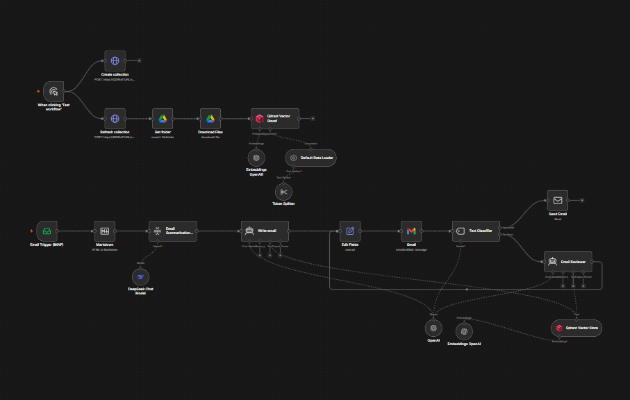
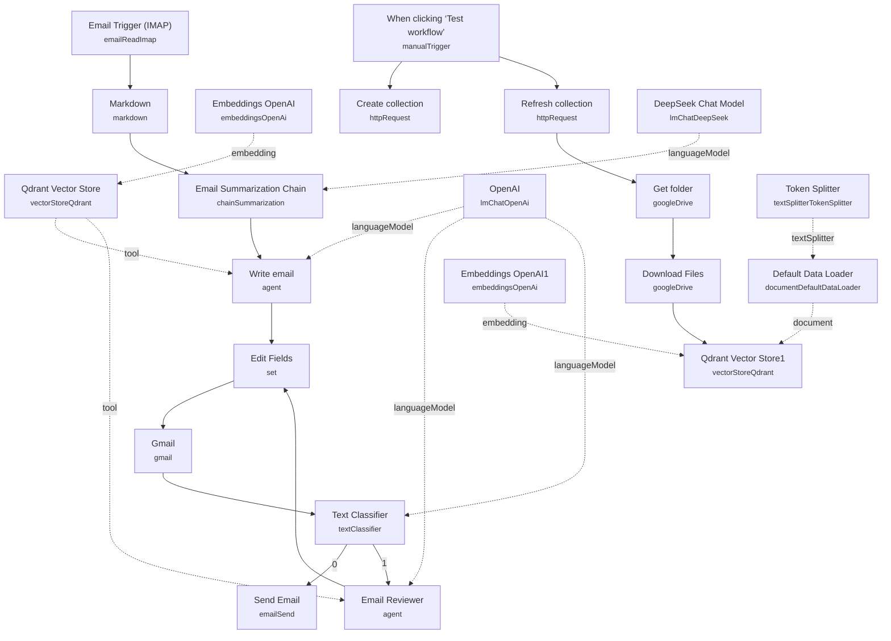

# Email Summarization & Review Queue

<!-- CANVAS:START -->

<!-- CANVAS:END -->

An inbox-to-draft pipeline that reads incoming emails via IMAP, summarizes them, drafts a reply using a company knowledge base, and routes the draft to a human for approval before anything is sent — with reviewer feedback looping back into a rewrite if the draft isn't good enough.

Built for support or business inboxes where AI-drafted replies are useful but a human should always have final sign-off before a message goes out.

## What it does

1. **Email Trigger (IMAP)** polls a mailbox for new mail.
2. **Markdown** converts the email's HTML body to Markdown for cleaner LLM input.
3. **Email Summarization Chain** (a LangChain summarization chain backed by **DeepSeek Chat Model**) condenses the email to under 100 words.
4. **Write email** (an AI agent, no dedicated chat model attached in this branch — see setup note) drafts a reply, with the **Qdrant Vector Store** exposed to it as a retrieval tool (`company_knowladge_base`) so it can ground the reply in your own documentation.
5. **Edit Fields** copies the agent's `output` into an `email` field for downstream nodes.
6. **Gmail** sends the draft to an internal reviewer's inbox using `sendAndWait` with free-text response — the workflow pauses here until a human replies with approval or feedback.
7. **Text Classifier** reads the reviewer's reply and classifies it as `Approved` (send as-is) or `Declined` (needs changes).
8. If **Approved**, **Send Email** (SMTP) sends the drafted reply to the original sender.
9. If **Declined**, **Email Reviewer** (another AI agent, with the same **Qdrant Vector Store** tool available) rewrites the email using the reviewer's feedback as input, formatting it in HTML with only minimal inline tags, then loops back to **Edit Fields** → **Gmail** for another round of review.

**Knowledge base ingestion (manual trigger, run separately):**

10. **When clicking 'Test workflow'** kicks off **Create collection** and **Refresh collection** (HTTP requests against the Qdrant REST API to create/clear the collection).
11. **Get folder** and **Download Files** pull documents from a specified Google Drive folder (converting Google Docs to plain text on download).
12. **Qdrant Vector Store1** (insert mode) embeds and stores the documents, using **Embeddings OpenAI1**, **Default Data Loader**, and **Token Splitter** (300-token chunks, 30-token overlap) to prepare them.

## Setup (~25 minutes)

1. **IMAP** — add mailbox credentials to **Email Trigger (IMAP)**.
2. **SMTP** — add credentials to **Send Email** for the final outbound reply. Update the hardcoded `fromEmail`/`toEmail` expressions if your mailbox naming differs.
3. **DeepSeek** — add an API key to **DeepSeek Chat Model** (summarization only).
4. **OpenAI** — add API keys to **OpenAI** (chat model for both the **Write email** and **Email Reviewer** agents, and for the **Text Classifier**) and to **Embeddings OpenAI** / **Embeddings OpenAI1** (vector embeddings for retrieval and ingestion respectively).
5. **Qdrant** — add a Qdrant API credential to **Qdrant Vector Store**, **Qdrant Vector Store1**, **Create collection**, and **Refresh collection**. Replace the `QDRANTURL` and `COLLECTION` placeholders in the two HTTP Request nodes and the two vector store nodes' collection fields with your real Qdrant host and collection name.
6. **Google Drive** — add OAuth2 credentials to **Get folder** and **Download Files**, and point the folder filter at the Drive folder containing your source documents (currently set to a placeholder `test-whatsapp` folder ID — replace with your real folder).
7. **Gmail (reviewer inbox)** — add OAuth2 credentials to **Gmail**. The reviewer's address is hardcoded (`info@n3w.it`) in the node's `sendTo` field; change it to your actual reviewer/approver address. Gmail is required specifically because it's the only supported provider for n8n's "send and wait for response" pattern.
8. **Run ingestion first** — trigger **When clicking 'Test workflow'** once (or whenever your source documents change) before relying on the agents' knowledge base answers, since there's no scheduled re-sync of the Qdrant collection.

---

<!-- ARCHITECTURE:START -->
## Architecture

<!-- ARCHITECTURE:END -->
