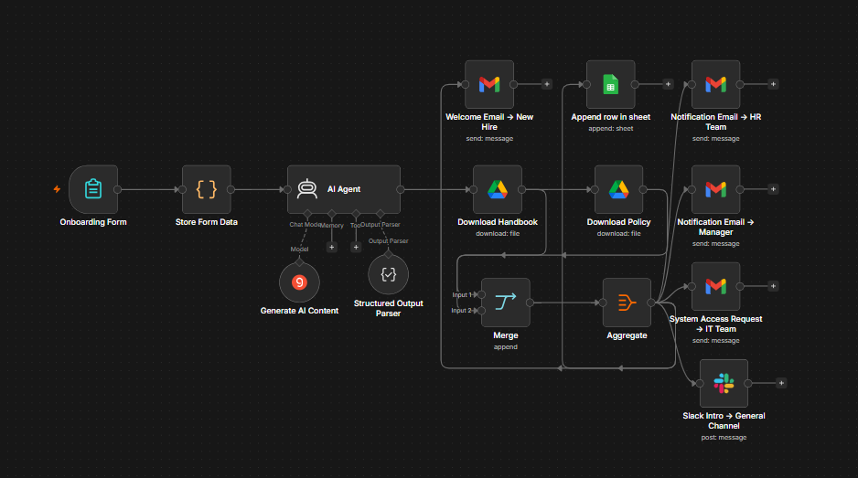
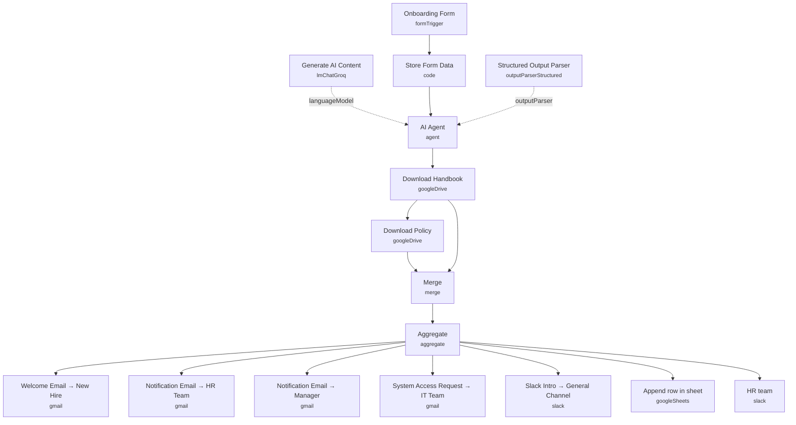

# AI Employee Onboarding Automation

<!-- CANVAS:START -->

<!-- CANVAS:END -->

A form-triggered onboarding workflow that takes new-hire details, generates a full set of personalized onboarding communications with an LLM (welcome email, manager notice, HR notice, IT access request, Slack announcements), attaches the company handbook and policy documents, and fans everything out to the new hire, their manager, HR, IT and the team Slack channels — while logging the hire to a tracking spreadsheet.

Built for HR teams who want new-hire day-one communications handled automatically and consistently, without a person manually copy-pasting the same onboarding checklist into six different messages.

## What it does

1. **Onboarding Form** (n8n Form Trigger) collects Full Name, Email Address, Role/Position, Department, Start Date, Direct Manager Name and Direct Manager Email.
2. **Store Form Data** (Code) passes the submitted form data through unchanged.
3. **AI Agent** (LangChain Agent, backed by **Generate AI Content** on Groq's `llama-3.3-70b-versatile`, with a **Structured Output Parser** enforcing a fixed JSON schema) generates all onboarding copy in one call: welcome email, manager notification, HR notification, IT access request, and Slack messages for the general and HR channels — each with its own subject/body and tone tailored to its audience.
4. **Download Handbook** and **Download Policy** (Google Drive) fetch the employee handbook and company policy documents by file ID, to be attached to the welcome email.
5. **Merge** combines the two downloaded files with the AI Agent's generated content.
6. **Aggregate** (aggregate all item data, including binaries) consolidates everything into one item carrying both the generated text and the file attachments.
7. From there, the aggregated item fans out to seven parallel actions:
   - **Welcome Email → New Hire** (Gmail) sends the welcome email with handbook/policy attachments to the new hire's own email address.
   - **Notification Email → HR Team** (Gmail) sends the HR summary to `hr@example.com`.
   - **Notification Email → Manager** (Gmail) sends a notification email to the manager's address.
   - **System Access Request → IT Team** (Gmail) sends the IT access request to the IT distribution address.
   - **Slack Intro → General Channel** (Slack) posts the friendly team announcement to the general channel.
   - **Append row in sheet** (Google Sheets) logs the new hire's name, email, role, department, start date and manager to a tracking spreadsheet.
   - **HR team** (Slack) posts a brief internal alert to the HR Slack channel.

## Setup (about 15 minutes)

1. **Groq** — add your Groq API key in **Generate AI Content**.
2. **Google Drive** — connect Google Drive OAuth2 in **Download Handbook** and **Download Policy**, and replace the hardcoded file IDs (`14wjAitDmSwSDRqmrRfFBOkeiDU4MKyFx` and `1IYmfO_XT-Yt6dDOSkFg7HL0Poipx_XoI`) with your own handbook and policy document IDs.
3. **Gmail** — connect Gmail OAuth2 in all four Gmail nodes (**Welcome Email → New Hire**, **Notification Email → HR Team**, **Notification Email → Manager**, **System Access Request → IT Team**).
4. **Slack** — connect Slack OAuth2 in **Slack Intro → General Channel** (channel `all-general-all-department`, ID `C0AK1R8LT3M`) and **HR team** (channel `hr-team`, ID `C0AKM4U1K25`). Update both channel IDs for your workspace.
5. **Google Sheets** — connect Google Sheets OAuth2 in **Append row in sheet** and point it at your own tracking spreadsheet (currently ID `1HwlZ2hRcsd-tq-T4RmzG73d3rfICwTrJbH4QQywKi_Q`).
6. **Recipient addresses** — replace the placeholder addresses `hr@example.com`, `manager@example.com` and `it@example.com` with your real HR, manager and IT distribution addresses. For a fully dynamic setup, point **Notification Email → Manager** at `{{ $('Onboarding Form').item.json['Direct Manager Email'] }}` instead of a fixed address.

---

<!-- ARCHITECTURE:START -->
## Architecture

<!-- ARCHITECTURE:END -->
