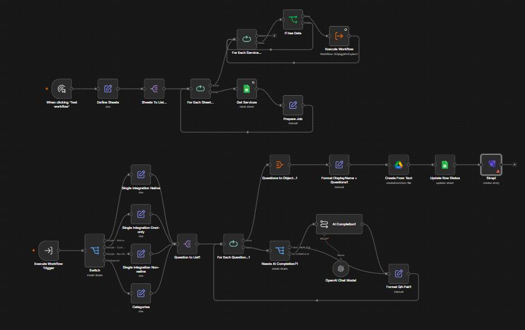
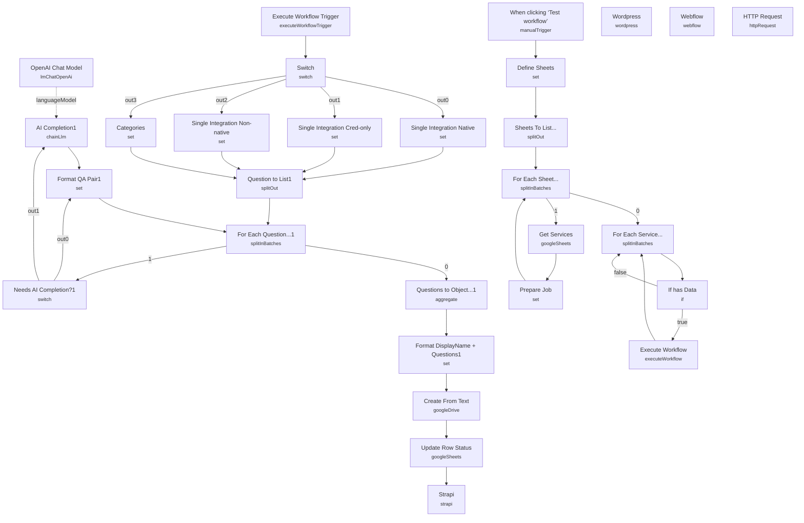

# FAQ Enrichment at Scale

<!-- CANVAS:START -->

<!-- CANVAS:END -->

A batch content-generation workflow that turns a spreadsheet of services and categories into complete, AI-polished FAQ pages. It reads rows from Google Sheets, applies one of four question-and-answer templates depending on the row type (native n8n integration, credential-only integration, non-native/HTTP-only integration, or category), fills in any answer gaps with an LLM, and writes the finished JSON to Google Drive before pushing it to a CMS.

Built for content or marketing teams who need to produce dozens or hundreds of consistent, on-brand FAQ entries without hand-writing each one.

## What it does

1. **When clicking 'Test workflow'** starts the run manually.
2. **Define Sheets** hardcodes the four sheet names to process (`Single Integration Native`, `Single Integration Cred-only`, `Single Integration Non-native`, `Categories`), and **Sheets To List...** splits them into individual items.
3. **For Each Sheet...** (a `splitInBatches` loop) feeds each sheet name into **Get Services**, which pulls all rows from that Google Sheet where `status` matches the lookup filter.
4. **Prepare Job** attaches the sheet name, row data, and an `outdir` (a per-sheet Google Drive folder ID you must configure) to each item, then **For Each Service...** loops over every row.
5. **If has Data** checks whether a row was returned; non-empty rows go through **Execute Workflow** (which calls this same workflow again, `$workflow.id`, once per service via **Execute Workflow Trigger** — used purely for controlled recursion/branching, not a separate sub-workflow file) and back into the loop; empty rows exit.
6. Inside the recursive call, **Switch** routes on `sheet` name to one of four **Set** nodes — **Single Integration Native**, **Single Integration Cred-only**, **Single Integration Non-native**, or **Categories** — each of which generates a fixed array of 5 Q&A objects (covering setup, permissions, integrations, use cases, and n8n's pricing model) with placeholders filled from the row's `displayName` or `Category name`. Some answers are marked `ai_completion: true`, meaning they're intentionally left incomplete for the LLM to finish.
7. **Question to List1** splits the Q&A array into individual items, and **For Each Question...1** loops over them.
8. **Needs AI Completion?1** (a Switch) routes each question: if `ai_completion` is false, it goes straight to **Format QA Pair1**; if true, it goes to **AI Completion1**, an `@n8n/n8n-nodes-langchain.chainLlm` node (backed by **OpenAI Chat Model**, gpt-4o-mini) that completes the answer in plain text, constrained to 3 sentences and matching the existing tone.
9. **Format QA Pair1** stitches the final question/answer text together (predefined answer + AI completion + any `append` text), and the loop continues until all questions for that service are processed.
10. **Questions to Object...1** aggregates all Q&A pairs back into one object, **Format DisplayName + Questions1** attaches the service/category name, and **Create From Text** (Google Drive) writes the finished JSON as a new file named `<name>-<yyyyMMdd>` into the configured output folder.
11. **Update Row Status** marks the source Google Sheets row as `done`, and the result is pushed onward to **Strapi**, **Wordpress**, **Webflow**, or a generic **HTTP Request** node — whichever CMS integration you wire up (only one is meant to be active; the others are left as templates).

## Sample input

This workflow has no webhook or chat trigger — it runs from a manually maintained Google Sheet. A row in the `Single Integration Native` sheet needs at minimum:

```
| displayName | status  |
|-------------|---------|
| Slack       | pending |
```

A row in `Categories` needs:

```
| Category name        | status  |
|-----------------------|---------|
| Marketing Automation  | pending |
```

## Setup (~30 minutes)

1. **Google Sheets** — connect a credential and point **Get Services** at your spreadsheet (the `documentId` and `base` are left blank/`list` mode and must be selected). The sheet needs a `status` column used both as a filter and as the "done" marker written by **Update Row Status**.
2. **Google Drive** — connect a credential to **Create From Text**. Each of the four sheet types needs its own destination folder ID; these are currently placeholder strings (`"Insert the corresponding Google Drive folder ID here"`) in the **Prepare Job** node's `outdir` expression and must be replaced with real folder IDs.
3. **OpenAI** — add an API key to **OpenAI Chat Model** (used only for `ai_completion: true` questions).
4. **CMS destination** — only one of **Strapi**, **Wordpress**, **Webflow**, or **HTTP Request** should be enabled/configured with credentials, matching whichever CMS you actually publish to; the others are unconfigured placeholders.
5. **Self-referencing recursion** — **Execute Workflow** calls `$workflow.id` (this workflow) once per row via **Execute Workflow Trigger**/**Switch**. Don't duplicate or rename the workflow file without checking that reference stays intact.
6. **Sheet names must match exactly** — the routing in **Define Sheets** and the **Switch** node both hardcode the four sheet names; renaming a tab in Google Sheets breaks the routing silently (rows just won't match).

---

<!-- ARCHITECTURE:START -->
## Architecture


<!-- ARCHITECTURE:END -->
