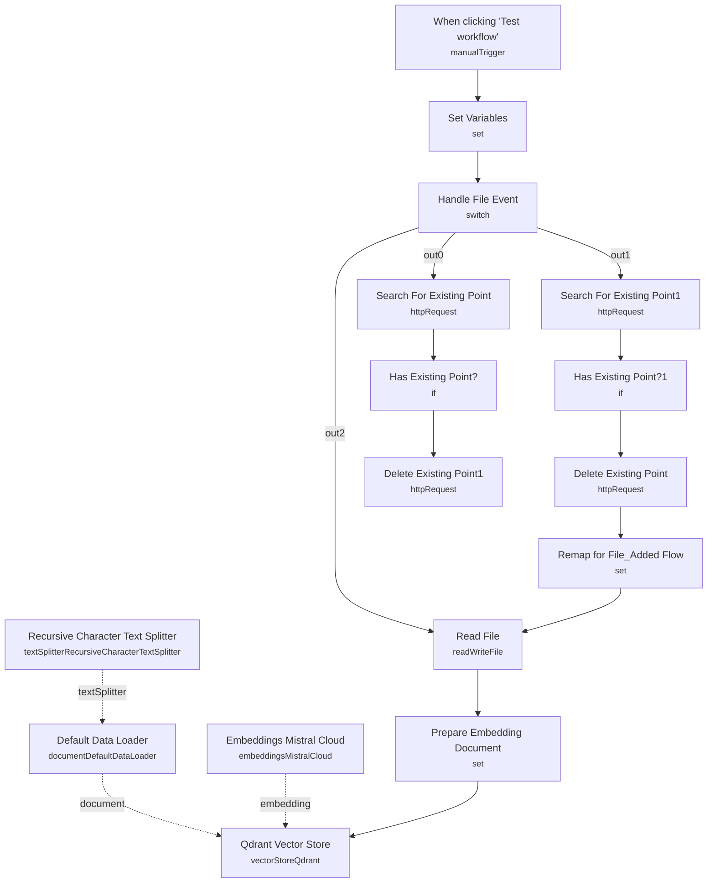

# Financial Documents Assistant (Qdrant + Mistral)

Keeps a Qdrant vector store in sync with a local folder of financial documents. As bank statements and similar files are added, changed, or removed, the workflow re-embeds them with Mistral and updates the vector collection so a downstream chat agent can answer questions grounded in the current document set.

Built for finance teams and analysts who want a private, self-hosted document index over their own bank statements rather than uploading sensitive files to a third-party assistant.

## What it does

1. **When clicking "Test workflow"** is a manual trigger used to run the ingestion path during testing (there is no live folder-watch trigger wired into this exported workflow — see note below).
2. **Set Variables** sets the working folder path, per-event fields (`file_added`, `file_changed`, `file_deleted`), and the target Qdrant collection name (`local_file_search`).
3. **Handle File Event** is a Switch node that routes the run down one of three branches based on which event field is populated:
   - **Deleted branch**: **Search For Existing Point1** queries Qdrant for the file's existing point, **Has Existing Point?1** checks whether one was found, and **Delete Existing Point** purges it.
   - **Changed branch**: **Search For Existing Point** queries Qdrant for the file's existing point, **Has Existing Point?** checks whether one was found, **Delete Existing Point1** removes the stale point, and **Remap for File_Added Flow** funnels the file back into the add/index path.
   - **Added branch**: goes straight to indexing.
4. **Read File** loads the document from disk.
5. **Prepare Embedding Document** builds a text payload combining the file location, a timestamp, and the base64-decoded file contents.
6. **Recursive Character Text Splitter** chunks the document text.
7. **Default Data Loader** wraps the chunks as LangChain documents, attaching metadata (`filter_by_filename`, `filter_by_created_month`, `filter_by_created_week`) for later filtering.
8. **Embeddings Mistral Cloud** generates embeddings for each chunk via the Mistral Cloud API.
9. **Qdrant Vector Store** inserts the embedded chunks into the configured Qdrant collection.

## Setup (about 15 minutes)

1. **Target folder**: this exported workflow does not include a live folder-watch trigger. Add a Local File Trigger (or equivalent) node pointing at your target folder — a Docker volume or mounted host path such as `/home/node/BankStatements` — and wire it into **Set Variables** in place of the manual trigger.
2. **Mistral Cloud**: add your Mistral API key in *Embeddings Mistral Cloud*.
3. **Qdrant**: set your Qdrant URL and API key (`qdrantApi` credential type) in *Qdrant Vector Store* and in the four HTTP Request nodes that search/delete points (*Search For Existing Point*, *Search For Existing Point1*, *Delete Existing Point*, *Delete Existing Point1*), which currently point at `http://qdrant:6333` for a local/Docker Qdrant instance.
4. **Collection name**: confirm the `qdrant_collection` value in *Set Variables* (`local_file_search`) matches the collection you want to use.
5. Requires a self-hosted n8n instance with disk access to the watched folder, and a running Qdrant instance.

## Note

This exported workflow only contains the ingestion/sync half of the system. Sticky notes in the original export also described a Local File Trigger and a chat Q&A path (Chat Trigger, Question and Answer Chain, Mistral Cloud Chat Model, Vector Store Retriever, a second Qdrant Vector Store, and a second Mistral embeddings node) that answer user questions against the indexed documents — none of those nodes are present in the actual workflow JSON. Anyone reusing this template will need to add the folder-watch trigger and the retrieval/chat side before it functions as a full assistant.

---

<!-- ARCHITECTURE:START -->
## Architecture

<!-- ARCHITECTURE:END -->
