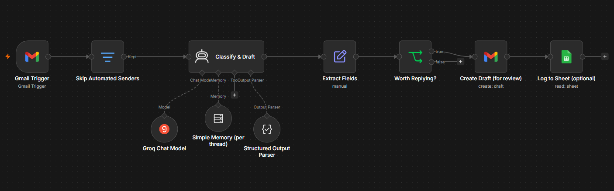
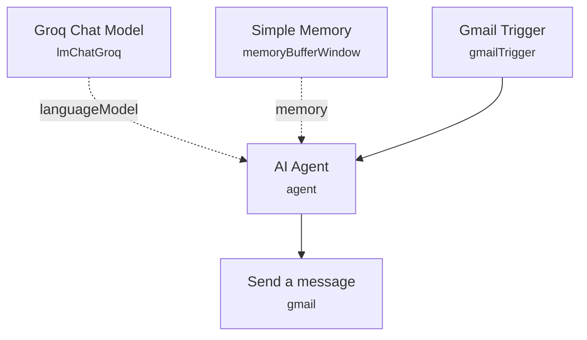

# Gmail AI Auto-Reply Agent

<!-- CANVAS:START -->

<!-- CANVAS:END -->

An AI agent that watches a Gmail inbox and automatically drafts and sends replies to incoming customer emails, applying a fixed set of company policies (delivery area, refund rules) instead of generic canned responses.

Built for small e-commerce or D2C businesses that get repetitive customer emails about delivery and refunds and want first-line responses handled without a human in the loop.

## What it does

1. **Gmail Trigger** polls the connected inbox every minute for new mail.
2. **AI Agent** reads the email snippet and generates a full reply. The agent's system prompt hard-codes the business's delivery policy (Dhaka-only delivery) and refund policy (size-mismatch only, within 3 days), along with formatting rules for a professional, warm email (greeting, empathetic body, signed closing with company name, phone, and website).
3. **Groq Chat Model** (`openai/gpt-oss-120b` via Groq) supplies the language model backing the agent.
4. **Simple Memory** keeps a short conversational buffer keyed on the email snippet, so follow-up context is available if the same thread is processed again.
5. **Send a message** sends the AI-generated reply back to the original sender via Gmail, reusing the subject line from the triggering email.

## Setup (about 10 minutes)

1. **Gmail** — connect your OAuth2 account in both **Gmail Trigger** and **Send a message**. The workflow polls every minute, so use a dedicated support inbox rather than a personal one.
2. **Groq** — add your API key in the **Groq Chat Model** node (model is set to `openai/gpt-oss-120b`).
3. **Company policy prompt** — the **AI Agent** system message hard-codes a placeholder business name, phone number, website, and delivery/refund rules. Replace this text with your own company details and policies before deploying.

## Error handling

No dedicated error-handling nodes are present. The Gmail send step has no retry or failure branch configured, so a failed send will simply fail the execution.

---

<!-- ARCHITECTURE:START -->
## Architecture

<!-- ARCHITECTURE:END -->
