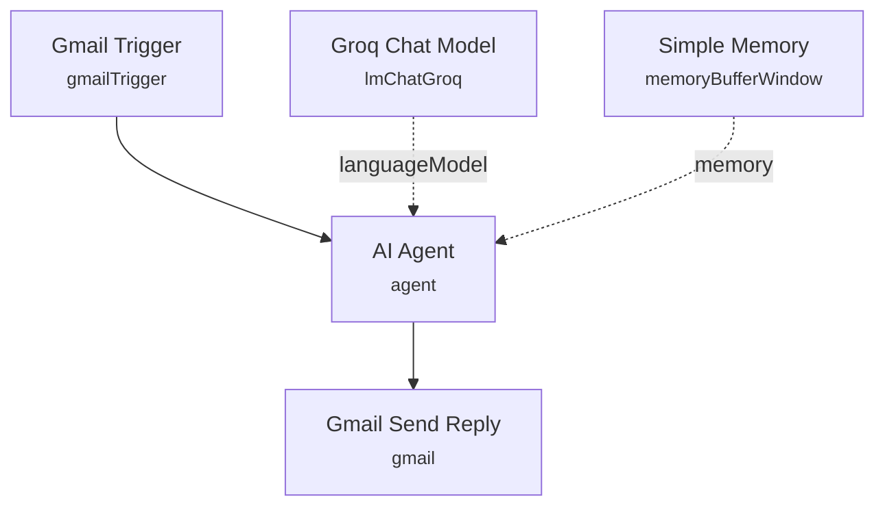

# Gmail Customer Support Agent

An AI support agent that monitors a Gmail inbox, classifies each incoming email as a delivery inquiry, refund request, or general question, and replies in the sender's thread with a policy-accurate, on-brand response signed with their first name.

Built for a Dhaka-based online retailer that wants consistent, policy-compliant replies to order, delivery, and refund emails without a support team manually triaging every message.

## What it does

1. **Gmail Trigger** polls the inbox every minute for new messages.
2. **AI Agent** analyzes the email body against three categories — delivery inquiry, refund request, or general inquiry — and drafts a reply under 50 words. The system prompt encodes the business's delivery policy (Dhaka only, 2-5 business days), refund policy (size-mismatch only, within 3 days of delivery), business hours (Saturday-Thursday, 9am-6pm GMT+6), and instructs the agent to address the customer by the first name parsed from their email address.
3. **Groq Chat Model** (`openai/gpt-oss-120b` via Groq) provides the underlying LLM.
4. **Simple Memory** buffers up to 10 messages of conversation history, keyed by session so repeat threads stay coherent.
5. **Gmail Send Reply** sends the generated response back to the original sender as a reply (`Re: <original subject>`) using the Gmail thread headers captured at trigger time.

## Setup (about 10 minutes)

1. **Gmail** — connect your OAuth2 account in both **Gmail Trigger** and **Gmail Send Reply**.
2. **Groq** — add your API key in the **Groq Chat Model** node (model: `openai/gpt-oss-120b`).
3. **Business policy prompt** — the **AI Agent** system message is written for one specific business (Dhaka-only delivery, size-mismatch-only refunds, fixed business hours). Update these details to match your own policies before reuse.

## Error handling

No dedicated error-handling nodes are present in this workflow. A failed Gmail send or LLM call will fail the execution outright with no retry or alerting.

---

<!-- ARCHITECTURE:START -->
## Architecture

<!-- ARCHITECTURE:END -->
