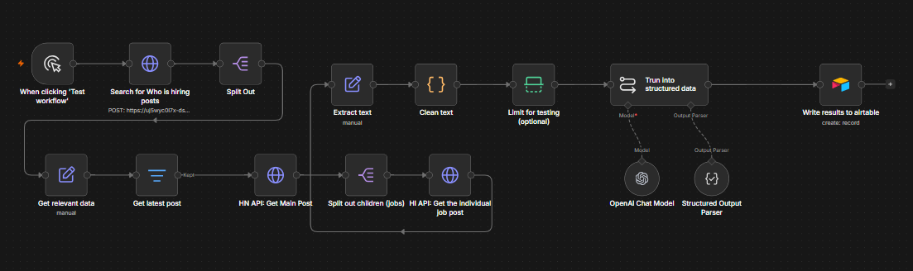
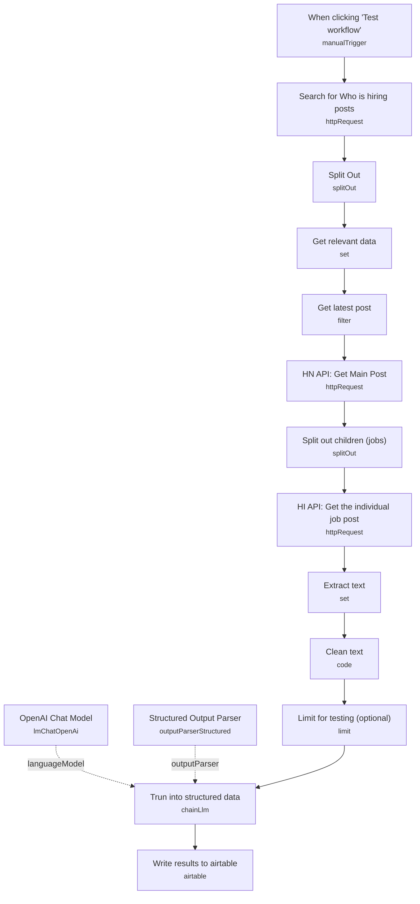

# Hacker News "Who is Hiring" Scraper

<!-- CANVAS:START -->

<!-- CANVAS:END -->

Scrapes the monthly Hacker News "Ask HN: Who is hiring?" thread, pulls every top-level job comment, structures each posting into clean fields with an LLM, and writes the results to Airtable as a queryable job board.

Built for recruiters, job boards, and developers who want a structured, searchable feed of HN's hiring thread instead of scrolling hundreds of raw comments by hand.

## What it does

1. **When clicking 'Test workflow'** manually starts the run.
2. **Search for Who is hiring posts** queries the Algolia Hacker News Search API for `"Ask HN: Who is hiring"` story threads.
3. **Split Out** breaks the Algolia response's `hits` array into individual items.
4. **Get relevant data** keeps only the fields needed to identify the thread: `title`, `createdAt`, `updatedAt`, `storyId`.
5. **Get latest post** filters down to the single thread created within the last 30 days (the current month's post).
6. **HN API: Get Main Post** fetches the full thread from the official Hacker News Firebase API, returning the list of child comment ids (`kids`).
7. **Split out children (jobs)** splits that `kids` array into one item per job posting comment.
8. **HI API: Get the individual job post** fetches each individual comment by id from the HN API.
9. **Extract text** pulls the raw comment body (`text`) out of each response.
10. **Clean text** (Code node) strips HTML entities and tags, collapses whitespace, and puts URLs on their own line.
11. **Limit for testing (optional)** caps processing to 5 items — intended for test runs, should be removed or disabled for full production runs.
12. **Trun into structured data**, an LLM chain backed by **OpenAI Chat Model** (GPT-4o-mini) and **Structured Output Parser**, converts each cleaned posting into a fixed JSON schema: company, title, location, employment type, work location, salary, description, apply URL, and company URL.
13. **Write results to airtable** creates a new row per structured job posting in an Airtable base.

## Setup (about 15 minutes)

1. **HN Algolia API**: *Search for Who is hiring posts* uses header authentication built from an imported cURL request (copied from hn.algolia.com) — reimport your own cURL and set a Header Auth credential for it to keep working.
2. **Hacker News API**: no credentials needed — *HN API: Get Main Post* and *HI API: Get the individual job post* call the public Firebase endpoints directly.
3. **OpenAI**: add your API key in *OpenAI Chat Model*.
4. **Airtable**: connect your account in *Write results to airtable* and point the base/table (currently `HN Who is hiring?` / `Table 1`, ids `appM2JWvA5AstsGdn` / `tblGvcOjqbliwM7AS`) at your own Airtable base.
5. Disable or remove **Limit for testing (optional)** before running against the full thread.

---

<!-- ARCHITECTURE:START -->
## Architecture

<!-- ARCHITECTURE:END -->
