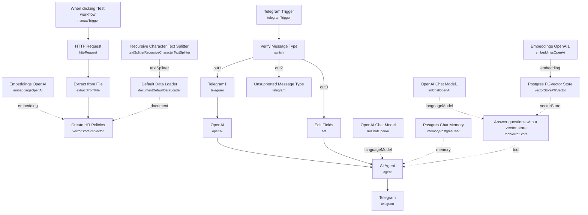

# HR & IT Helpdesk Chatbot with Audio Transcription

A Telegram chatbot that answers employee HR and IT questions from a company policy document, accepting both typed messages and voice notes. Voice messages are transcribed with Whisper before being handed to the same AI agent, and a Postgres vector store grounds every answer in the real policy text rather than letting the model improvise.

Built for HR and IT support teams who want to deflect repetitive policy questions through a self-serve Telegram bot instead of a shared inbox, without losing employees who'd rather send a voice note than type.

## What it does

**Knowledge base ingestion (manual trigger, run once):**

1. **When clicking 'Test workflow'** starts the ingestion run.
2. **HTTP Request** downloads the source policy PDF (an employee handbook).
3. **Extract from File** pulls the raw text out of the PDF.
4. **Create HR Policies** inserts the text into a Postgres PGVector store, chunked by the **Recursive Character Text Splitter** (2000-character chunks), loaded via the **Default Data Loader**, and embedded by **Embeddings OpenAI**.

**Live chat handling:**

1. **Telegram Trigger** listens for incoming messages.
2. **Verify Message Type** (Switch node) routes each message into one of three branches based on which keys are present on the Telegram payload:
   - **Text:** **Edit Fields** copies `message.text` into a `text` field and passes it straight to the agent.
   - **Audio (voice):** **Telegram1** downloads the voice file from Telegram, then **OpenAI** (Whisper, transcribe operation) converts it to text.
   - **Fallback (anything else):** **Unsupported Message Type** replies directly in Telegram that the format isn't supported, without involving the AI agent.
3. **AI Agent** answers the question using **OpenAI Chat Model**, remembers conversation history per Telegram chat via **Postgres Chat Memory** (keyed on chat ID), and can call **Answer questions with a vector store** — a retrieval tool over **Postgres PGVector Store**, using **Embeddings OpenAI1** to embed the query and **OpenAI Chat Model1** to summarize retrieved chunks. The agent's system prompt scopes it to HR and employee policy questions.
4. **Telegram** sends the agent's final answer back to the employee in the same chat.

## Sample request

This workflow is driven entirely by Telegram messages, not an HTTP webhook you call directly — there's no request body to construct. To test it:

1. Open a chat with your configured Telegram bot.
2. Send a typed question, e.g. `How many vacation days do I get in my first year?`
3. Or send a voice note asking the same thing — it will be transcribed automatically before the agent answers.

Anything that isn't text or voice (a sticker, photo, or document) gets the "I'm not able to process this message type" fallback reply.

## Setup (about 15 minutes)

1. **OpenAI** — add your key in **Embeddings OpenAI**, **OpenAI** (Whisper transcription), **OpenAI Chat Model**, **OpenAI Chat Model1**, and **Embeddings OpenAI1**.
2. **Postgres / PGVector** — add database credentials in **Create HR Policies**, **Postgres PGVector Store**, and **Postgres Chat Memory**. All three must point at the same database so ingestion and retrieval share one table.
3. **Telegram** — add your bot token in **Telegram Trigger**, **Telegram1**, **Telegram**, and **Unsupported Message Type**.
4. **Policy source** — set the document URL in **HTTP Request** (currently pointed at a sample public handbook PDF), then run the manual trigger once to build the knowledge base before going live.

Run the ingestion path before activating the Telegram trigger, or the bot will have no policy content to answer from. Voice transcription uses OpenAI Whisper and incurs per-minute API cost on top of the chat completion cost.

---

<!-- ARCHITECTURE:START -->
## Architecture

<!-- ARCHITECTURE:END -->
