# Instagram Trend Content Generator

An automation that watches trending Instagram hashtags, generates new AI artwork inspired by what's currently performing well, and publishes it to an Instagram Business account on a schedule — with Telegram notifications at every failure point along the way.

Built for social media teams who want to keep a themed Instagram account (in this case, 3D/isometric art) active without a human sourcing inspiration, writing captions, or generating images by hand.

## What it does

1. **Schedule Trigger1** fires twice daily (`5 13,19 * * *`, Europe/Istanbul) to kick off a run.
2. **Instagram params**, **Telegram Params**, and **Rapid Api params** are Set nodes holding the credentials/IDs the rest of the workflow references via `$('Node Name')` — they're intentionally left blank for the user to fill in.
3. **get top trends on instagram #blender3d** and **get top trends on instagram #isometric** call the RapidAPI Instagram Scraper API in parallel for each hashtag's top-feed posts.
4. **filter the image content-2** and **filter the image content** (Code nodes) each strip out videos, keeping only image posts, and normalize each into `{id, prompt, content_code, thumbnail_url, tag}`.
5. **merge the array content** combines both hashtag result sets into one list, feeding **Loop Over Items** (Split In Batches) to process posts one at a time.
6. **Check Data on Database Is Exist** (Postgres, `continueErrorOutput` enabled) checks the `top_trends` table for the post's `code` to avoid recreating content already processed. On error it goes to **send error message to telegram**.
7. **If Data is Exist** branches: if the post is already logged, loop back to **Loop Over Items** for the next item; otherwise continue to **insert data on db**, which records the new post (`isposted: false`) before generating content.
8. **Analyze Image and give the content** (OpenAI, GPT-4o-mini, image analysis) describes the physical/visual features of the trending thumbnail.
9. **Analyze Content And Generate Instagram Caption** (OpenAI, GPT-4o-mini) turns that description into a ready-to-post Instagram caption with relevant hashtags.
10. **Generate image on flux** calls the Replicate API (`black-forest-labs/flux-schnell`) with a prompt built from the image analysis, producing a new stylized isometric-toy-style render rather than reposting the original image.
11. **Prepare data on Instagram** (Facebook Graph API) creates an Instagram media container using the generated image URL and caption.
12. **Check Status Of Media Before Uploaded** polls the container's `status_code`; **If media status is finished** branches on `FINISHED` — success continues to **Publish Media on Instagram**, failure notifies via **Telegram**.
13. **Publish Media on Instagram** (Facebook Graph API, `media_publish`) posts the container live.
14. **Check status of post** polls the published post; **If media status is finished1** branches on `PUBLISHED` — success notifies via **Telegram1**, failure notifies via **Telegram2**.

## Setup (about 20 minutes)

1. **RapidAPI (Instagram Scraper API2)** — subscribe to the API and paste the key into **Rapid Api params** (`x-rapid-api-key`). Used by both **get top trends on instagram #blender3d** and **get top trends on instagram #isometric**. Free tier is capped at 500 requests/month.
2. **Replicate** — add your API token to **Replicate params** (`replicate_token`), used by **Generate image on flux**.
3. **Instagram Business Account** — set the account ID in **Instagram params** (`instagram_business_account_id`); required by **Prepare data on Instagram** and **Publish Media on Instagram**.
4. **Facebook Graph API** credential — attach to **Prepare data on Instagram**, **Check Status Of Media Before Uploaded**, **Publish Media on Instagram**, and **Check status of post**.
5. **Telegram** — set the chat ID in **Telegram Params** (`telegram_chat_id`), and attach Telegram API credentials to **Telegram**, **Telegram1**, **Telegram2**, and **send error message to telegram**. You must message the bot first before it can push notifications.
6. **OpenAI** — add API credentials to **Analyze Image and give the content** and **Analyze Content And Generate Instagram Caption** (both GPT-4o-mini).
7. **Postgres** — add credentials to **Check Data on Database Is Exist** and **insert data on db**, and create the `top_trends` table first:
   ```sql
   CREATE TABLE top_trends (
     id SERIAL PRIMARY KEY,
     isposted BOOLEAN DEFAULT false,
     createdat TIMESTAMP WITHOUT TIME ZONE DEFAULT CURRENT_TIMESTAMP,
     updatedat TIMESTAMP WITHOUT TIME ZONE DEFAULT CURRENT_TIMESTAMP,
     deletedat TIMESTAMP WITHOUT TIME ZONE,
     prompt TEXT NOT NULL,
     thumbnail_url TEXT,
     code TEXT,
     tag TEXT
   );
   ```
8. **Hashtags are hardcoded** — the two HTTP Request nodes target `#blender3d` and `#isometric` specifically. Change the `hashtag` query parameter in each to target a different niche, and update the Flux prompt in **Generate image on flux** (currently locked to an "isometric toy" render style) to match.
9. **Image caption prompt is domain-specific** — the prompt in **Analyze Content And Generate Instagram Caption** hardcodes hashtags like `#Blender3D` and `#3DArt`; adjust for a different content vertical.

---

<!-- ARCHITECTURE:START -->
## Architecture

```mermaid
flowchart TD
    N0["If media status is finished<br/><small>if</small>"]
    N1["If media status is finished1<br/><small>if</small>"]
    N2["Telegram<br/><small>telegram</small>"]
    N3["Telegram1<br/><small>telegram</small>"]
    N4["Telegram2<br/><small>telegram</small>"]
    N5["Loop Over Items<br/><small>splitInBatches</small>"]
    N6["Schedule Trigger1<br/><small>scheduleTrigger</small>"]
    N7["Telegram Params<br/><small>set</small>"]
    N8["Instagram params<br/><small>set</small>"]
    N9["Rapid Api params<br/><small>set</small>"]
    N10["filter the image content<br/><small>code</small>"]
    N11["get top trends on instagram #blender3d<br/><small>httpRequest</small>"]
    N12["get top trends on instagram #isometric<br/><small>httpRequest</small>"]
    N13["merge the array content<br/><small>merge</small>"]
    N14["Check Data on Database Is Exist<br/><small>postgres</small>"]
    N15["If Data is Exist<br/><small>if</small>"]
    N16["send error message to telegram<br/><small>telegram</small>"]
    N17["insert data on db<br/><small>postgres</small>"]
    N18["Analyze Image and give the content<br/><small>openAi</small>"]
    N19["Analyze Content And Generate Instagram Caption<br/><small>openAi</small>"]
    N20["Prepare data on Instagram<br/><small>facebookGraphApi</small>"]
    N21["Check Status Of Media Before Uploaded<br/><small>facebookGraphApi</small>"]
    N22["Publish Media on Instagram<br/><small>facebookGraphApi</small>"]
    N23["Check status of post<br/><small>facebookGraphApi</small>"]
    N24["filter the image content-2<br/><small>code</small>"]
    N25["Replicate params<br/><small>set</small>"]
    N26["Generate image on flux<br/><small>httpRequest</small>"]
    N5 --> N14
    N7 --> N9
    N15 -->|true| N5
    N15 -->|false| N17
    N8 --> N7
    N9 --> N12
    N9 --> N11
    N25 --> N8
    N6 --> N25
    N17 --> N18
    N23 --> N1
    N26 --> N20
    N13 --> N5
    N10 --> N13
    N20 --> N21
    N22 --> N23
    N24 --> N13
    N0 -->|true| N22
    N0 -->|false| N2
    N1 -->|true| N3
    N1 -->|false| N4
    N14 -->|0| N15
    N14 -->|1| N16
    N18 --> N19
    N21 --> N0
    N12 --> N10
    N11 --> N24
    N19 --> N26
```


<!-- ARCHITECTURE:END -->
