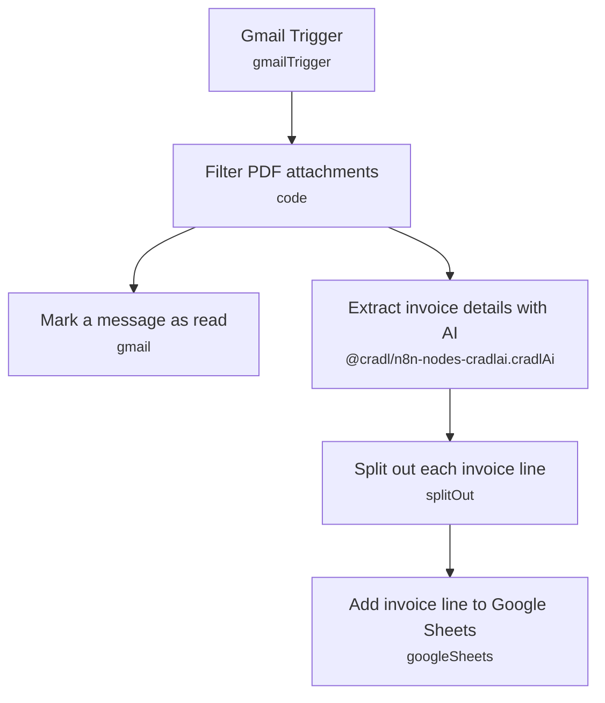

# Invoice Extraction with Human-in-the-Loop (Cradl AI)

A polling workflow that watches a Gmail inbox for invoice attachments, extracts structured line-item data with Cradl AI's document extraction agent, and appends each invoice line to Google Sheets. Cradl AI's own interface provides the human-in-the-loop review step, so accounting staff can approve or correct extracted fields before (or after) they land in the sheet.

Built for finance/accounting teams who receive invoices by email and want structured, line-item-level data in a spreadsheet without manually opening and retyping every PDF.

## What it does

1. **Gmail Trigger** polls every minute for unread messages matching `has:attachment subject:invoice`, downloading attachments.
2. **Filter PDF attachments** (code node) scans each email's binary attachments and keeps only files with a `.pdf` extension, re-emitting one item per PDF with `fileName` in JSON and the file under `binary.data`.
3. From there the workflow forks into two parallel paths:
   - **Mark a message as read** flips the source Gmail message's read state using the message ID captured by the trigger, so it isn't re-processed on the next poll.
   - **Extract invoice details with AI** sends the PDF binary to a specific Cradl AI agent (`agentId: cradl:agent:556e3aa0d2214b6c899c631b78a5cd43`) for extraction. This is also where Cradl AI's built-in human-in-the-loop review/validation happens, configured on the agent itself rather than in n8n.
4. **Split out each invoice line** takes the agent's `body.output.invoice_lines` array and splits it into one n8n item per line item, keeping all other extracted fields alongside each line.
5. **Add invoice line to Google Sheets** appends each line item as a new row in a connected Google Sheet.

## Sample input

There's no webhook here — the trigger is Gmail polling, so the "input" is simply an email with a PDF attachment and "invoice" in the subject line, e.g.:

```
From: vendor@supplier.com
To: invoices@mycompany.com
Subject: Invoice #4471 - March services
Attachment: invoice_4471.pdf
```

The extracted Cradl AI output that feeds the sheet looks roughly like:

```json
{
  "output": {
    "invoice_number": "4471",
    "vendor_name": "Acme Supplier Co.",
    "invoice_date": "2026-03-01",
    "invoice_lines": [
      { "description": "Consulting - March", "quantity": 1, "unit_price": 2500.00, "amount": 2500.00 },
      { "description": "Support retainer", "quantity": 1, "unit_price": 500.00, "amount": 500.00 }
    ]
  }
}
```

## Setup (~20 minutes)

1. **Cradl AI** — [create a free account](https://rc.app.cradl.ai/login?redirect=signup&template=n8n%2Finvoices-gmail-to-sheets.json) (pre-templated for `n8n/invoices-gmail-to-sheets.json`), define an extraction agent for invoices, and set up human-in-the-loop reviewers/validators inside the Cradl AI dashboard. Add the credential to **Extract invoice details with AI** and replace the hardcoded `agentId` with your own agent's ID.
2. **Gmail** — connect an OAuth credential to **Gmail Trigger** and **Mark a message as read**. Adjust the search filter (`has:attachment subject:invoice`) in **Gmail Trigger** to match your inbox conventions — e.g. add `to:invoices@mycompany.com` if invoices land in a shared mailbox.
3. **Google Sheets** — connect credentials to **Add invoice line to Google Sheets** and set the target spreadsheet (`documentId`) and sheet (`sheetName`, currently pointing at `gid=0`). Map the extracted fields to your sheet's columns if your column layout differs from Cradl AI's default output.
4. **Extraction fields** — the fields Cradl AI extracts are defined in your Cradl AI agent, not in n8n; update the agent definition in Cradl AI's dashboard if you need different fields per invoice line.
5. Since the trigger polls every minute, be mindful of Gmail API quota if the mailbox is high-volume.

---

<!-- ARCHITECTURE:START -->
## Architecture


<!-- ARCHITECTURE:END -->
