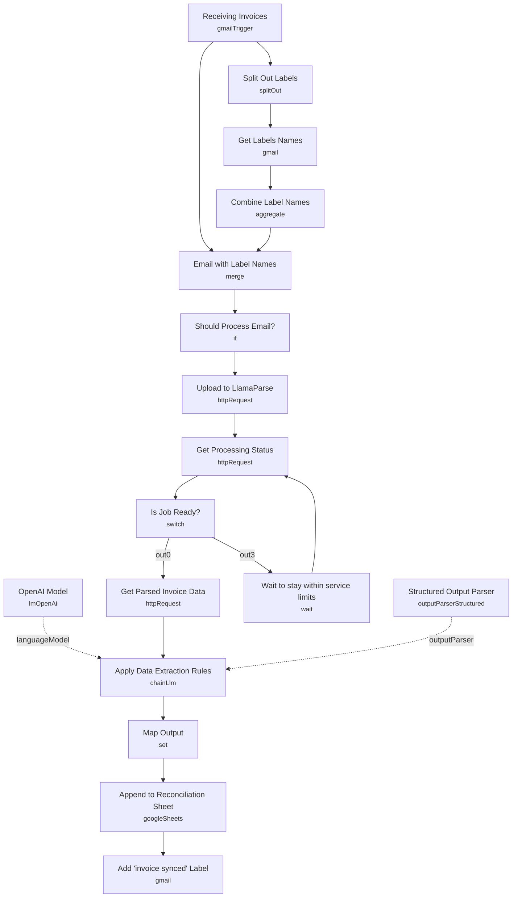

# Invoice Data Extraction (LlamaParse)

An email-triggered pipeline that watches an inbox for incoming invoice PDFs, converts them to structured markdown with LlamaParse (which preserves tables and line items that plain PDF-to-text extractors lose), pulls out the key invoice fields with an LLM, and appends the result to a reconciliation spreadsheet. A Gmail label prevents the same invoice from being processed twice.

Built for finance and ops teams that receive recurring invoices by email and want them landed in a spreadsheet (or downstream accounting system) without manual re-typing.

## What it does

1. **Receiving Invoices** (Gmail Trigger, polling every minute) watches for messages with an attachment from a specific sender.
2. **Split Out Labels** → **Get Labels Names** → **Combine Label Names** reads the message's current Gmail label IDs and resolves them to human-readable label names.
3. **Email with Label Names** (merge, multiplex) recombines the original email with its resolved label list.
4. **Should Process Email?** (IF node) only lets the item through when the attachment's MIME type is `application/pdf` and the resolved labels do **not** already contain `"invoice synced"` — this is the duplicate-processing guard.
5. **Upload to LlamaParse** sends the PDF binary to LlamaCloud's parsing API (`POST /api/parsing/upload`).
6. **Get Processing Status** polls the job; **Is Job Ready?** (switch on `status`) branches to `SUCCESS`, `ERROR`, `CANCELED`, or loops back through **Wait to stay within service limits** while the job is still pending.
7. **Get Parsed Invoice Data** fetches the finished job's result as markdown.
8. **Apply Data Extraction Rules** (an LLM chain via **OpenAI Model**) reads the markdown and extracts invoice date, invoice number, PO number, supplier/customer name and address, VAT numbers, shipping addresses, line items, subtotals, and total price, constrained by the **Structured Output Parser**'s JSON schema.
9. **Map Output** flattens the parser's output object into row-level fields.
10. **Append to Reconciliation Sheet** writes the row to Google Sheets.
11. **Add "invoice synced" Label** tags the original Gmail message so it's skipped on future polls.

## Sample input

There's no webhook here — the trigger is Gmail polling. To test the flow end to end, send yourself (or the configured sender inbox) an email containing a PDF attachment, from the sender address configured in the trigger. The workflow currently ships with:

```
sender: invoices@paypal.com
filter: has:attachment
```

Any email that doesn't match both the sender and the attachment filter is ignored by the trigger itself, before it ever reaches **Should Process Email?**.

## Setup (~20 minutes)

1. **Gmail** — add OAuth2 credentials to **Receiving Invoices**, **Get Labels Names**, and **Add "invoice synced" Label**.
2. **Create the Gmail label first** — the workflow expects a label literally named `invoice synced` to exist in the mailbox, and **Add "invoice synced" Label** references it by a hardcoded label ID (`Label_5511644430826409825`). Create your own label and swap in its ID (or reconfigure the node to look it up by name).
3. **LlamaCloud (LlamaParse)** — add an HTTP Header Auth credential (bearer token) to **Upload to LlamaParse**, **Get Processing Status**, and **Get Parsed Invoice Data**. Free tier covers 1,000 PDFs/day.
4. **OpenAI** — add your API key to **OpenAI Model** (used by **Apply Data Extraction Rules**).
5. **Google Sheets** — add OAuth2 credentials to **Append to Reconciliation Sheet**, and point it at your own spreadsheet — the column schema is pre-mapped to the extraction fields (invoice date, invoice number, PO number, supplier/customer details, VAT numbers, line items, subtotals, total), so keep the header row consistent if you swap sheets.
6. **Adjust the sender filter** — **Receiving Invoices** is hardcoded to only accept mail from `invoices@paypal.com`. Change this to match whichever vendor(s) actually email you invoices, or broaden the query to catch multiple senders.
7. **Watch the LlamaParse rate limit** — **Wait to stay within service limits** adds a delay between status polls; shrink or extend it depending on your plan's rate limits and typical invoice volume.

---

<!-- ARCHITECTURE:START -->
## Architecture


<!-- ARCHITECTURE:END -->
