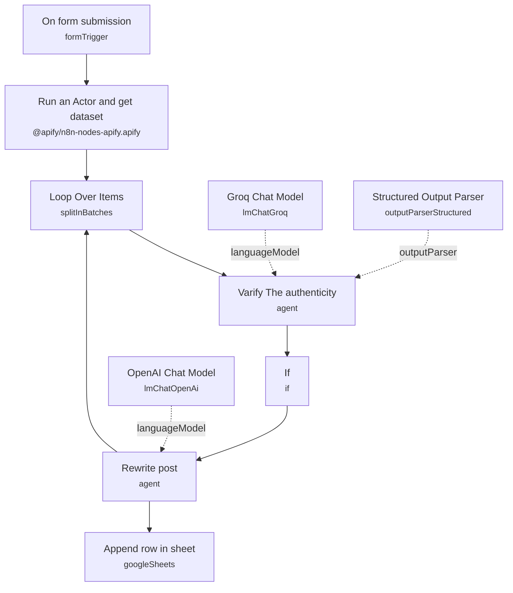

# LinkedIn AI-News Scraper & Rewriter

A content-sourcing pipeline that scrapes recent posts from a given LinkedIn profile, uses an LLM to filter for genuinely newsworthy AI content, rewrites the approved posts in a natural, non-robotic voice, and logs the results to a spreadsheet for reuse.

Built for content marketers, ghostwriters, or social media teams who track a curated list of LinkedIn creators for AI news and want a ready-to-post, de-hyped rewrite of anything worth resharing — without manually reading every post.

## What it does

1. **On form submission** takes a LinkedIn profile URL and a batch size (how many recent posts to scrape) from a simple intake form.
2. **Run an Actor and get dataset** calls the Apify `linkedin-post` actor with the submitted URL and limit, deep-scraping that profile's recent posts (text, comments, engagement metadata) into a dataset.
3. **Loop Over Items** processes the scraped posts in batches of 5, feeding one post at a time into the filtering step and looping until the dataset is exhausted.
4. **Varify The authenticity** (AI Agent) evaluates each post's text against a detailed relevance rubric — genuine AI news, tools, workflows, or agent developments are approved; generic motivational content, pure self-promotion, or recycled old news is rejected. It returns a strict `{"verdict": "relevant" | "not_relevant"}` JSON object, validated by the **Structured Output Parser**, running on **Groq Chat Model** (`llama-3.3-70b-versatile`).
5. **If** checks the verdict. Only posts marked `relevant` continue to the next step; posts that fail this check have no outgoing path back into the loop (see note below).
6. **Rewrite post** (AI Agent) takes the approved post's original text and rewrites it into a polished, conversational LinkedIn post — stripping corporate jargon, hype, and engagement-bait, restructuring around a strong hook/body/takeaway, and keeping it to roughly 100-250 words. Runs on **OpenAI Chat Model** (`gpt-5-mini`).
7. **Append row in sheet** logs the author, date, original post text, and rewritten post to a Google Sheet.
8. The rewritten output is also fed back into **Loop Over Items** to continue processing the remaining batch.

**Known issue — loop stalls on rejected posts:** the **If** node's true branch (relevant) feeds into **Rewrite post**, which loops back into **Loop Over Items** to continue the batch. The false branch (not relevant / rejected posts) has no outgoing connection at all, so a rejected post is a dead end — it does not loop back to process the remaining items in the batch. In practice this means the workflow can stop early on the first post the filter rejects rather than working through the whole scraped set. Wiring the **If** node's false output back into **Loop Over Items** would fix this.

**Known issue — inconsistent verdict values:** the **If** node's conditions check for `$json.output.verdict` equal to `"relevant"` or equal to `"Not relevant"`, but the **Structured Output Parser** schema constrains the model's output to `"relevant"` or `"not_relevant"` (lowercase, underscore). The `"Not relevant"` comparison will never match the actual schema value, so effectively only the `relevant` branch is reachable by design — worth tightening before reuse.

## Sample request

Send a form submission (or POST to the underlying form-trigger webhook) with:

```json
{
  "URL-1": "https://www.linkedin.com/in/example-creator/",
  "Post scrape each time ": 10
}
```

## Setup (about 20 minutes)

1. **Apify** — connect your Apify OAuth2 account in **Run an Actor and get dataset**. The actor is pinned to `Wpp1BZ6yGWjySadk3` (`supreme_coder/linkedin-post`, a cookie-less LinkedIn post scraper billed around $1 per 1,000 results) — confirm you still want this actor and have credits before running.
2. **Groq** — add your API key in **Groq Chat Model** (model `llama-3.3-70b-versatile`), used for the relevance filter.
3. **OpenAI** — add your API key in **OpenAI Chat Model** (model `gpt-5-mini`), used for the rewrite step.
4. **Google Sheets** — connect your OAuth2 account in **Append row in sheet**, and replace the hardcoded spreadsheet ID (`10ocrUuqvgTlTRqQaVL3uB-iTg01vsnwEhA901l2WJ7E`) with your own tracking sheet.

## Error handling

No dedicated error-handling nodes are present. A failed Apify run, LLM call, or sheet write will fail the execution with no retry or alerting. Combined with the loop-stall issue above, a single rejected post partway through a batch can also silently truncate processing of the remaining scraped items.

---

<!-- ARCHITECTURE:START -->
## Architecture


<!-- ARCHITECTURE:END -->
