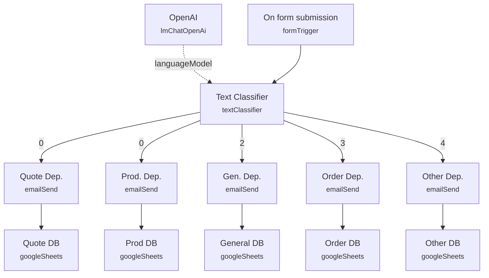

# Modular AI Email Routing Classifier

A contact-form triage system that reads free-text messages, classifies intent with an LLM, and routes each submission to the right department inbox and logging sheet automatically. Instead of a single shared inbox where every message needs a human to read and forward it, submissions are pre-sorted by topic the moment they arrive.

Built for eCommerce or customer support teams who receive high volumes of contact-form traffic (quote requests, product questions, order issues, general problems) and want first-line routing handled without a person triaging every message.

## What it does

1. **On form submission** (form trigger, titled "Contacts") collects three fields: Name, Email, and a free-text Message.
2. **Text Classifier** (LangChain Text Classifier, backed by **OpenAI** as its language model) reads the Message field and sorts it into one of four categories — "Request Quote," "Product info," "General problem," "Order" — with a fallback category of "other" if none match confidently.
3. Each category output branches to its own **email send + Google Sheets log** pair:
   - **Quote Dep.** emails the quote request to the department inbox, then **Quote DB** logs the submission to the "Classified Contact Form" Google Sheet.
   - **Prod. Dep.** / **Prod DB** handle product-info requests the same way.
   - **Gen. Dep.** / **General DB** handle general problems.
   - **Order Dep.** / **Order DB** handle order-status questions.
   - **Other Dep.** / **Other DB** handle anything that falls back to "other."
4. Every email node (**Quote Dep.**, **Prod. Dep.**, **Gen. Dep.**, **Order Dep.**, **Other Dep.**) sends an HTML email built from the original Name/Email/Message fields, with `replyTo` set to the submitter's email so the department can reply directly.
5. Every Google Sheets node appends a row with columns `DATA`, `NOME`, `EMAIL`, `RICHIESTA`, `CATEGORIA`, and `TO`, giving each department a running log of what was routed to them.

## Sample request

This workflow uses n8n's form trigger, not a raw webhook. Submitting the **On form submission** form sends data shaped like:

```json
{
  "Name": "Mario Rossi",
  "Email": "mario.rossi@example.com",
  "Message": "Could you send me a quote for 500 units of your ceramic mugs?"
}
```

The sticky note on the canvas points out that any external form (e.g., Contact Form 7 on WordPress) can feed this same workflow by POSTing to the trigger's webhook URL instead of using the built-in n8n form.

## Setup (about 15 minutes)

1. **OpenAI** — add your API key to the **OpenAI** node (the language model behind **Text Classifier**).
2. **SMTP** — add SMTP credentials to all five email nodes: **Quote Dep.**, **Prod. Dep.**, **Gen. Dep.**, **Order Dep.**, **Other Dep.**. They currently share one SMTP credential ("SMTP info@n3witalia.com") and hardcoded `toEmail`/`fromEmail` values (`to@domain.com` / `from@domain.com`) — replace these with real department addresses, or swap the node type entirely for Gmail/Outlook as the sticky note suggests.
3. **Google Sheets** — add OAuth2 credentials to all five logging nodes: **Quote DB**, **Prod DB**, **General DB**, **Order DB**, **Other DB**. They all point at the same hardcoded spreadsheet (`documentId: 1D6tfsAK81ZE6VA0-sd_syuyI_rloNYjgWOhwgszPIZw`) — point this at your own sheet with matching columns (`DATA`, `NOME`, `EMAIL`, `RICHIESTA`, `CATEGORIA`, `TO`).
4. **Category-to-branch mapping quirk** — in the **Text Classifier** node's output wiring, the first output branch fans out to both **Quote Dep.** and **Prod. Dep.** simultaneously, and the second category output ("Product info") has no connection at all. Before deploying, verify in the n8n canvas that each of the four categories plus the fallback lands on the department you expect, and rewire **Prod. Dep.** to its own dedicated output if you want quote and product-info messages to route separately.
5. **Hardcoded "CATEGORIA" value** — every Google Sheets node writes the literal string `"info prodotti"` into the CATEGORIA column regardless of which branch fired. Replace this with an expression referencing the actual classifier output (e.g. `{{ $('Text Classifier').item.json.output }}`) if you need accurate category labels in your logs.
6. **Language note** — labels and messages are in Italian ("Tipo prodotto," "info prodotti," "Foglio1"). Translate node parameters and sheet headers if deploying for a non-Italian-speaking team.

---

<!-- ARCHITECTURE:START -->
## Architecture


<!-- ARCHITECTURE:END -->
