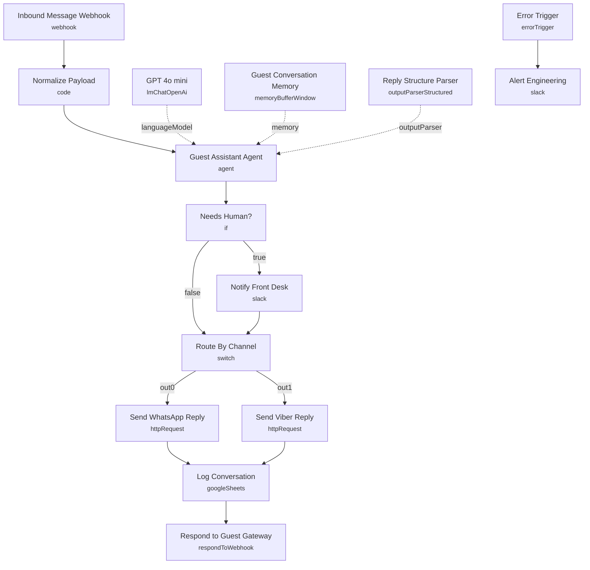

# Multilingual AI Hotel Guest Assistant

An AI guest assistant that answers WhatsApp and Viber messages in the guest's own language (Greek, English, Bulgarian and more), grounds answers in a hotel knowledge base, escalates sensitive requests to the front desk, and logs every exchange to Google Sheets.

Built for hospitality teams running hotels and vacation rentals that want 24/7 guest support without adding headcount.

## What it does

1. **Inbound Message Webhook** receives messages from the WhatsApp or Viber gateway.
2. **Normalize Payload** flattens the raw body into a clean shape (guest id, channel, sender, message).
3. **Guest Assistant Agent** detects the language, answers from the hotel knowledge base, and decides when to escalate.
4. **GPT 4o mini** powers the agent, with **Guest Conversation Memory** keeping per guest context and a **Reply Structure Parser** forcing clean JSON output.
5. **Needs Human?** routes escalations. **Notify Front Desk** posts them to Slack.
6. **Route By Channel** sends the reply back through WhatsApp or Viber, each with retries.
7. **Log Conversation** appends every exchange to Google Sheets.
8. **Error Trigger** plus **Alert Engineering** catch any failure and alert the team.

## Sample request

Send a POST to the webhook with a body like this:

```json
{
  "channel": "whatsapp",
  "from": "+306900000000",
  "profile_name": "Maria",
  "text": "Τι ώρα είναι το check in;"
}
```

The assistant detects Greek and replies in Greek, then logs the exchange.

## Setup (about 15 minutes)

1. **OpenAI** add your key in the GPT 4o mini node.
2. **WhatsApp Cloud API** add header auth in Send WhatsApp Reply and set your phone id in the URL.
3. **Viber** add your bot token in Send Viber Reply.
4. **Slack** connect your account in Notify Front Desk and Alert Engineering.
5. **Google Sheets** connect in Log Conversation and set your sheet id with a tab named Conversations.

Point your WhatsApp and Viber webhooks at the production URL of the Inbound Message Webhook. The payload should include channel, from and text.

## Error handling

Send nodes retry up to three times before failing, and a dedicated Error Trigger posts the failing node and message to an alerts channel so issues are caught fast.

---

<!-- ARCHITECTURE:START -->
## Architecture


<!-- ARCHITECTURE:END -->
