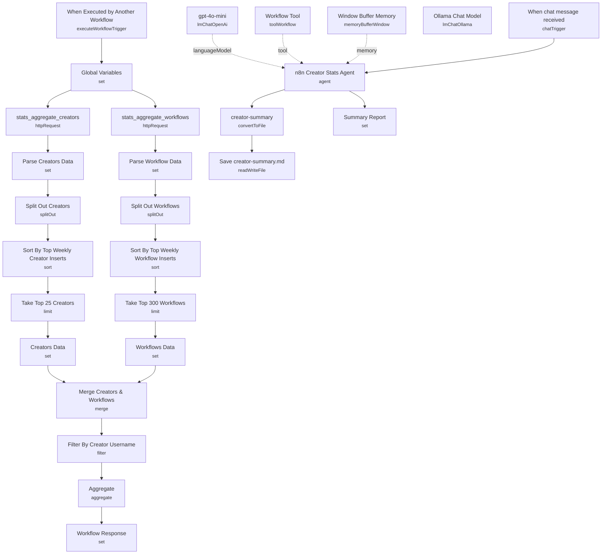

# n8n Creators Leaderboard Agent

A chat agent that answers "show me stats for username X" by pulling the public n8n Creators Leaderboard dataset from GitHub, joining creator and workflow-level metrics, and having an LLM turn the numbers into a Markdown report — a summary, a per-workflow table (weekly/monthly visitors and inserters), and community-trend commentary — optionally saved to a local file.

Built as a demo of the "workflow-as-tool" pattern: the same workflow serves as both the chat-facing agent and the data-fetching tool the agent calls, callable directly, from chat, or as a sub-workflow from another automation.

## What it does

1. **When chat message received** (chat trigger) accepts a free-text query like "show me stats for username joe" and hands `chatInput` straight to the **n8n Creator Stats Agent**.
2. The agent (LangChain Agent, backed by **gpt-4o-mini** as its LLM and **Window Buffer Memory** for conversation history) has one tool available: **Workflow Tool**, which calls this same workflow (`$workflow.id`) by name (`n8n_creator_stats`) with a `{username}` argument whenever it needs data.
3. That self-call re-enters the workflow through **When Executed by Another Workflow**, which expects `{"query": {"username": "joe"}}`.
4. **Global Variables** sets shared config: the GitHub raw-content base path, the two source filenames (`stats_aggregate_creators`, `stats_aggregate_workflows`), a chart filename, today's date, and the requested `username` pulled from the trigger input.
5. **stats_aggregate_creators** and **stats_aggregate_workflows** (HTTP Request) fetch the two JSON stat files from the `teds-tech-talks/n8n-community-leaderboard` GitHub repo, in parallel.
6. **Parse Creators Data** / **Parse Workflow Data** extract the JSON arrays, then **Split Out Creators** / **Split Out Workflows** turn them into individual items.
7. **Sort By Top Weekly Creator Inserts** → **Take Top 25 Creators** → **Creators Data**, and **Sort By Top Weekly Workflow Inserts** → **Take Top 300 Workflows** → **Workflows Data**, cap each dataset before the expensive join.
8. **Merge Creators & Workflows** joins the two datasets on `username` (`enrichInput1` join mode), enriching each creator record with their workflow stats.
9. **Filter By Creator Username** keeps only rows matching the requested username, and **Aggregate** collapses the matching workflow rows back into a single item for the agent to format.
10. Back in the agent (invoked as a tool), the **Workflow Response** node returns the aggregated data to the calling agent turn, which composes the final Markdown report per its system prompt (detailed summary, workflow table with emoji names preserved, community analysis, and error handling if data is missing).
11. **Summary Report** captures the agent's final `output`, and in parallel **creator-summary** (Convert to File) turns that Markdown into a file, saved locally by **Save creator-summary.md** with a timestamped filename.

## Sample request

Via the chat trigger:

```
show me stats for username joe
```

Or, if calling the workflow directly as a sub-workflow / tool (matching **When Executed by Another Workflow**'s expected shape):

```json
{
  "query": {
    "username": "joe"
  }
}
```

## Setup (~15 minutes)

1. **OpenAI** — add an `openAiApi` credential to the **gpt-4o-mini** language model node powering the agent.
2. **Local LLM alternative** — an **Ollama Chat Model** node is present but disconnected (its output isn't wired to the agent); connect it instead of `gpt-4o-mini` if you'd rather run this against a local model.
3. **No external API credentials required for data** — the creator/workflow stats are fetched from public raw GitHub JSON files, so there's nothing to authenticate against there.
4. **Self-referencing workflow tool** — **Workflow Tool** calls `{{ $workflow.id }}`, i.e. this same workflow, so it works out of the box after import, but don't duplicate this workflow without checking that the tool still points at the correct copy.
5. **Local file save (optional)** — **Save creator-summary.md** writes to a hardcoded Windows path (`C:\Users\joe\Downloads\...`). Update this path (or remove the node) if you don't want the report written to a specific local user's Downloads folder, or if running on a server/Docker instance without that filesystem layout.
6. **Data source URL** — if the upstream `teds-tech-talks/n8n-community-leaderboard` GitHub repo's file names or branch change, update the `path` and filename values in **Global Variables** accordingly.

---

<!-- ARCHITECTURE:START -->
## Architecture


<!-- ARCHITECTURE:END -->
