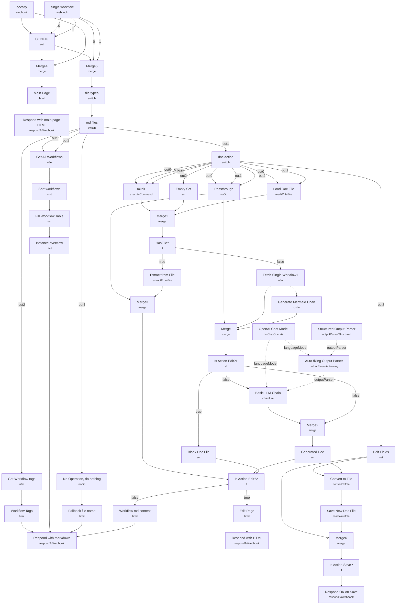

# n8n Workflow Documentation Generator

A self-hosted documentation site for an entire n8n instance, served directly from a workflow. It exposes a browsable Docsify-powered site listing every workflow on the instance, auto-generates a Markdown/Mermaid description for any workflow that doesn't have one yet (using an LLM), and includes a live in-browser Markdown editor so docs can be corrected and saved back to disk without leaving the page.

Built for teams running enough n8n workflows that "what does this one do again" has become a real problem, and who want documentation living a click away from the workflows themselves rather than in a separate wiki.

## What it does

1. **docsify** and **single workflow** are the two webhook entry points (**single workflow** uses path `/:file`). **docsify** serves the app shell; **single workflow** handles page requests, tag filters, and edit/save actions.
2. **CONFIG** holds shared values used downstream: `project_path` (where generated `.md` files live), `instance_url`, and the raw HTML snippets injected into rendered pages.
3. For the root request, **Merge4** joins the trigger with **CONFIG** into **Main Page**, which renders the Docsify shell and returns it via **Respond with main page HTML**.
4. For `/:file` requests, **Merge5** routes through **file types** (Switch: `.md` vs. other) then **md files** (Switch on filename):
   - `README.md` → **Get All Workflows** (n8n API) → **Sort-workflows** (by `updatedAt`) → **Fill Workflow Table** (Markdown row per workflow with view/edit/recreate links) → **Instance overview** → **Respond with markdown**.
   - `summary.md` → **Get Workflow tags** → **Workflow Tags** (left nav pane) → **Respond with markdown**.
   - a `docs_<id>` request → **doc action** (Switch on `?action=view|edit|recreate|save`), covered below.
   - a `tag-<name>.md` request → re-routes to **Get All Workflows**, filtered by tag.
   - anything else → **No Operation, do nothing** → **Fallback file name** → **Respond with markdown**.
5. Inside **doc action**, the **view/edit/recreate** branches run **mkdir** and **Load Doc File**, converging through **Merge3**/**Merge** into **HasFile?**:
   - If a doc already exists (and action isn't `recreate`), **Extract from File** reads it, and **Is Action Edit?1** routes to the **Edit Page** live editor or plain **Workflow md content** view.
   - Otherwise, **Fetch Single Workflow1** pulls the workflow JSON, **Generate Mermaid Chart** (Code node) builds a flowchart from its `nodes`/`connections`, and **Basic LLM Chain** (**OpenAI Chat Model**, with **Auto-fixing Output Parser** wrapping **Structured Output Parser**) writes the description and node settings. **Generated Doc** assembles the Markdown, saved via **Convert to File** → **Save New Doc File**, then served through **Is Action Edit?2**.
   - The **save** branch runs posted content through **Edit Fields**, saves it the same way, and confirms via **Respond OK on Save** (no auth check — see Setup).
6. **Edit Page** renders a two-pane HTML editor (Markdown + live Docsify/Mermaid preview) with Save/Cancel buttons posting back with `?action=save`.

## Sample request

This workflow is driven by webhook GET/POST requests, not a form or chat trigger.

Load the instance overview:
```
GET /<single-workflow-webhook-path>/README.md
```

View or regenerate docs for a specific workflow (the segment after `docs_` is the workflow's n8n ID):
```
GET /<single-workflow-webhook-path>/docs_VY4TXYGmqth57Een.md?action=view
GET /<single-workflow-webhook-path>/docs_VY4TXYGmqth57Een.md?action=recreate
```

Open the live editor, then save:
```
GET  /<single-workflow-webhook-path>/docs_VY4TXYGmqth57Een.md?action=edit
POST /<single-workflow-webhook-path>/docs_VY4TXYGmqth57Een.md?action=save
Content-Type: application/json

{ "content": "# Updated docs\n\nEdited by hand." }
```

## Setup (about 20 minutes)

1. **n8n API credential** — add an n8n API key to **Fetch Single Workflow1**, **Get All Workflows**, and **Get Workflow tags** (currently reference a credential named "Ted n8n account" — replace with your own).
2. **OpenAI** — add your API key to **OpenAI Chat Model** (used for both doc generation and the auto-fixing parser).
3. **CONFIG node** — update `project_path` to a directory n8n can write to (defaults to `./.n8n/test_docs`), and confirm `instance_url` resolves; it's built from `N8N_PROTOCOL`/`N8N_HOST` for self-hosted instances but needs manual adjustment on n8n Cloud.
4. **Filesystem access** — **mkdir**, **Load Doc File**, and **Save New Doc File** assume local filesystem access from the n8n process. This won't work on a filesystem-restricted or containerized deployment without a mounted writable volume.
5. **No authentication on save** — the `?action=save` path (**Respond OK on Save**) writes arbitrary posted content to disk with no auth check. Put this behind a reverse proxy or add a credential/header check before exposing it publicly.
6. **Webhook paths** — **single workflow**'s path is `/:file`, so it catches any single-segment path under its webhook — verify this doesn't collide with other webhooks on the instance.

---

<!-- ARCHITECTURE:START -->
## Architecture


<!-- ARCHITECTURE:END -->
