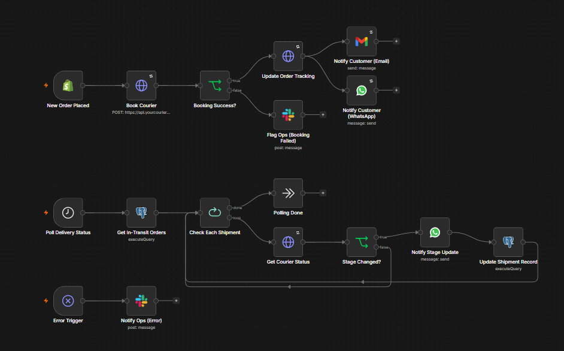
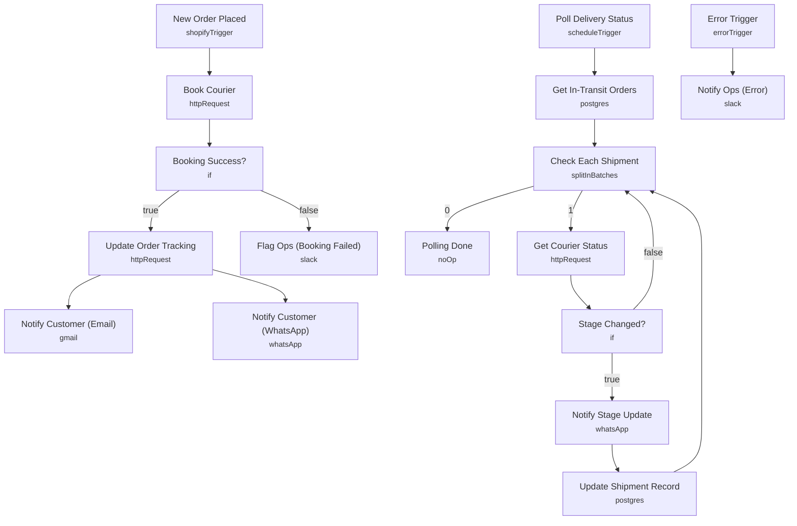

# Order & Fulfillment Sync Automation

<!-- CANVAS:START -->

<!-- CANVAS:END -->

Every new Shopify order flows straight through to a courier's booking API, writes the resulting tracking number back onto the order, and messages the customer over email and WhatsApp. A second, independent loop polls the courier every 30 minutes and notifies customers whenever their shipment's delivery stage changes. Booking failures and stuck shipments route to an ops channel in Slack.

Built for ecommerce operations teams that want shipping bookings and delivery updates handled automatically instead of by manual order entry.

## What it does

This workflow has two independent triggers.

**Order booking path:**
1. **New Order Placed** (Shopify Trigger, `orders/create`) fires for every new order.
2. **Book Courier** posts the order ID, shipping address and customer name to the courier's booking endpoint.
3. **Booking Success?** (IF) checks whether a `tracking_number` came back.
   - On success, **Update Order Tracking** writes the tracking number back onto the Shopify order as a tag, then **Notify Customer (Email)** and **Notify Customer (WhatsApp)** both send the tracking details in parallel.
   - On failure, **Flag Ops (Booking Failed)** posts the order number and shipping address to an ops Slack channel for manual follow-up.

**Delivery polling path:**
1. **Poll Delivery Status** (Schedule Trigger, every 30 minutes) starts the loop.
2. **Get In-Transit Orders** queries a Postgres `shipments` table for every order where `delivered = false`.
3. **Check Each Shipment** (Split In Batches) processes one shipment at a time.
4. **Get Courier Status** calls the courier API for the current delivery stage of that shipment.
5. **Stage Changed?** (IF) compares the fresh stage against the `last_stage` stored in Postgres.
   - If changed, **Notify Stage Update** messages the customer over WhatsApp, then **Update Shipment Record** writes the new stage (and delivered flag) back to Postgres before looping to the next shipment.
   - If unchanged, the loop moves directly to the next shipment.

## Setup (about 20 minutes)

1. **Shopify Admin API** — connect your credential on the **New Order Placed** trigger.
2. **Shopify Admin Header Auth** — add a header-auth credential on **Update Order Tracking**, and replace `YOUR_STORE` in the URL if the order payload's `body.domain` doesn't resolve.
3. **Courier API** — add a header-auth credential on **Book Courier** and **Get Courier Status**, pointing at your courier's real API base URL in place of `https://api.yourcourier.com`.
4. **Gmail** — connect an account on **Notify Customer (Email)**.
5. **WhatsApp Business Cloud** — connect your credential on **Notify Customer (WhatsApp)** and **Notify Stage Update**, and replace `REPLACE_WITH_PHONE_NUMBER_ID` with your WhatsApp phone number ID.
6. **Postgres** — connect your database on **Get In-Transit Orders** and **Update Shipment Record**; both expect a `shipments` table with `order_id`, `tracking_number`, `last_stage`, `delivered` and `phone` columns.
7. **Slack** — connect an account on **Flag Ops (Booking Failed)** and **Notify Ops (Error)**, and replace `REPLACE_WITH_CHANNEL_ID` with your ops-fulfillment channel.

## Error handling

**Book Courier** retries up to 3 times and continues on failure so a booking error routes to **Flag Ops (Booking Failed)** instead of stopping the workflow. **Update Order Tracking** and **Get Courier Status** each retry up to 3 times. **Notify Customer (WhatsApp)** continues on failure so a messaging error doesn't block the email notification. A dedicated **Error Trigger** posts the failing node and message to Slack via **Notify Ops (Error)**.

---

<!-- ARCHITECTURE:START -->
## Architecture

<!-- ARCHITECTURE:END -->
