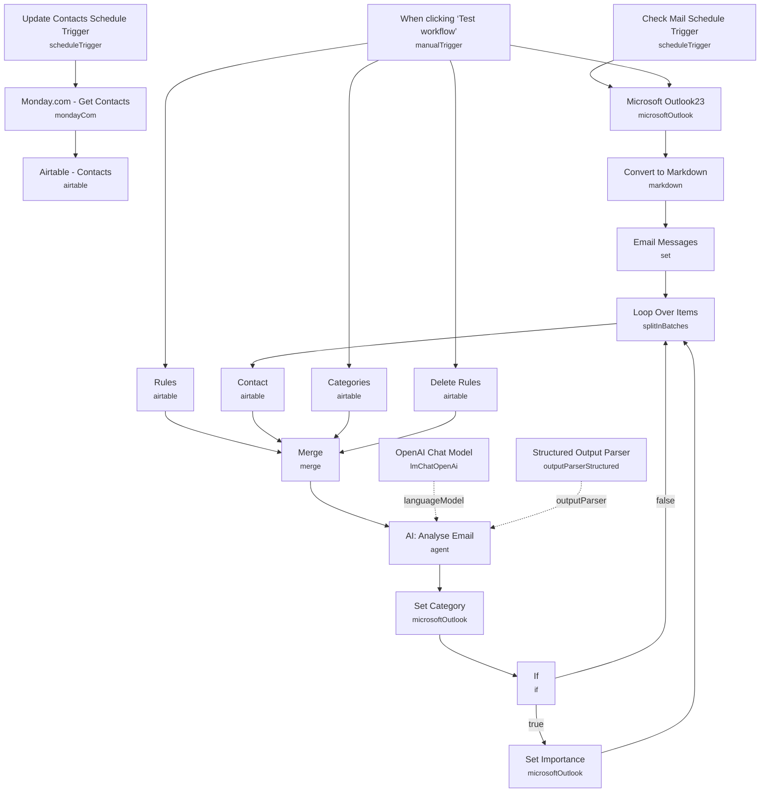

# Outlook AI Email Assistant (Monday + Airtable)

Automatically triages a shared Outlook inbox: pulls unflagged, uncategorized mail, cross-references the sender against a CRM contact list synced from Monday.com, classifies each email against configurable Airtable-defined categories, and writes the category (and importance flag for actionable client/supplier mail) straight back onto the Outlook message.

Built for anyone managing a busy business inbox who wants triage rules to live in a spreadsheet instead of buried in Outlook's rule editor, with an LLM making the actual judgment calls.

## What it does

**Contact sync (separate schedule):**

1. **Update Contacts Schedule Trigger** runs daily and **Monday.com - Get Contacts** pulls all items from a Monday.com board.
2. **Airtable - Contacts** upserts each contact (matched on email) into an Airtable `Contacts` table, splitting the Monday item's name into `First Name` / `Last Name`.

**Email triage (main flow):**

3. **When clicking 'Test workflow'** (or the disabled **Check Mail Schedule Trigger**, on a 15-minute interval, for production) starts the run, firing four parallel branches: fetching mail plus loading the three rule tables.
4. **Microsoft Outlook23** fetches up to 10 messages from a specific folder, filtered to `flag/flagStatus eq 'notFlagged' and not categories/any()` — i.e. only mail nobody has already flagged or categorized.
5. **Convert to Markdown** converts the HTML body to Markdown, and **Email Messages** (Set node) extracts `subject`, `importance`, `sender`, `from`, a heavily sanitized `body` (HTML tags, markdown links/images, table separators, and special characters stripped via regex), and `id`.
6. **Loop Over Items** processes each email individually. For each one, **Contact** searches Airtable for a contact record matching the sender's address.
7. In parallel, **Rules**, **Categories**, and **Delete Rules** (all execute-once Airtable searches) load the full rule/category/delete-rule tables, and **Merge** (choose-branch mode, 4 inputs) combines the per-email contact lookup with these three static tables into one item for the agent.
8. **AI: Analyse Email** is an AI agent (LLM: **OpenAI Chat Model**, GPT-4o at temperature 0.2) that receives the email, matched contact, delete rules, and category list, and returns strict JSON: `id`, `subject`, `category` (must be one of the Airtable-defined category names), `subCategory` (used sparingly, e.g. "Action"), and `analysis` (reasoning). **Structured Output Parser** enforces this schema.
9. **Set Category** writes the agent's chosen category back onto the Outlook message via the Microsoft Graph API.
10. **If** checks whether `subCategory` equals `"Action"` — if so, **Set Importance** flags the Outlook message as `High` importance before looping back; otherwise it loops back to **Loop Over Items** directly to process the next email.

## Setup (~25 minutes)

1. **Microsoft Outlook** — add an OAuth2 credential (`Microsoft365 Email Account`) to **Microsoft Outlook23**, **Set Category**, and **Set Importance**. Replace the hardcoded `foldersToInclude` folder ID in **Microsoft Outlook23** with your own target folder's ID.
2. **OpenAI** — add an API credential to **OpenAI Chat Model** (GPT-4o, temperature 0.2).
3. **Monday.com** — add an API credential to **Monday.com - Get Contacts**, and replace the hardcoded `boardId` (`1840712625`) with your own board's ID. You can swap this node out entirely for a different CRM source if you don't use Monday.com.
4. **Airtable** — add a Personal Access Token credential to **Airtable - Contacts**, **Rules**, **Categories**, **Delete Rules**, and **Contact**. All point at the `AI Email Assistant` base (`appNmgIGA4Fhculsn`) — recreate the `Contacts`, `Rules`, `Categories`, and `Delete Rules` tables in your own base (or repoint the nodes) before running, since the agent's category list and rules come entirely from these tables.
5. **Populate your rule tables first** — the agent's `category` output must exactly match a `Name` value from your `Categories` table; if the table is empty, classification will fail or produce inconsistent categories.
6. **Choose your trigger** — the manual trigger is for testing; enable **Check Mail Schedule Trigger** (currently disabled, 15-minute interval) for production polling, and keep **Update Contacts Schedule Trigger** running so the Airtable contact cache stays fresh.
7. **Loop batch size** — **Microsoft Outlook23** is capped at `limit: 10` per run; raise this if your inbox volume exceeds 10 new emails per polling interval.

---

<!-- ARCHITECTURE:START -->
## Architecture

<!-- ARCHITECTURE:END -->
