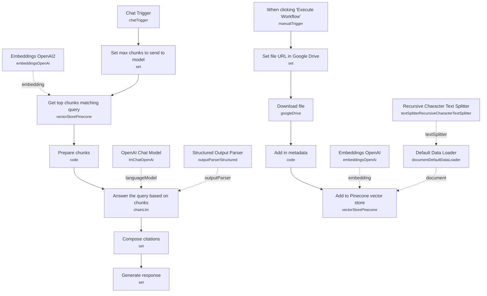

# Chat With PDFs (Cited Sources)

A document Q&A chatbot that answers questions from a PDF's content and tells you exactly which chunk of the source document it used to generate the answer, citing the file name and line range. This closes the "where did that answer come from" gap that plain RAG chatbots leave open.

Built for anyone who needs to trust an LLM's answer over a reference document — legal, financial, or technical text — and wants a verifiable pointer back to the source rather than a confident-sounding but unverifiable summary.

## What it does

**Ingestion (manual trigger, run once per document):**

1. **When clicking "Execute Workflow"** starts ingestion.
2. **Set file URL in Google Drive** holds the source file's Google Drive URL (ships pointed at the Bitcoin whitepaper as a demo).
3. **Download file** fetches the binary from Google Drive.
4. **Add in metadata** (code node) attaches `file_name`, `file_ext`, and `file_url` to the item so citations can reference them later.
5. **Add to Pinecone vector store** (insert mode) embeds and stores the document, using **Embeddings OpenAI** and **Recursive Character Text Splitter** + **Default Data Loader** to chunk and load the content, preserving line-number metadata per chunk.

**Chat (chat trigger, the main flow):**

1. **Chat Trigger** receives the user's question.
2. **Set max chunks to send to model** fixes `chunks = 4`, the number of top matches to retrieve.
3. **Get top chunks matching query** (Pinecone, load mode) retrieves the top-K chunks most relevant to the question.
4. **Prepare chunks** (code node) concatenates the retrieved chunks into a single labeled context block (`--- CHUNK 0 ---`, `--- CHUNK 1 ---`, etc.).
5. **Answer the query based on chunks** (an LLM chain via **OpenAI Chat Model**) is prompted to answer using only the provided context and to report which chunk indexes it used, constrained by the **Structured Output Parser**'s schema (`answer: string`, `citations: number[]`).
6. **Compose citations** (set node) maps each returned chunk index back to its source metadata, building strings like `[whitepaper.pdf, lines 12-18]`.
7. **Generate response** (set node) combines the answer text with the formatted citation list into the final chat reply.

## Sample input

This uses n8n's built-in chat trigger. Send a message through the chat panel on **Chat Trigger**:

```
Which email provider does the creator of Bitcoin use?
```

(This matches the demo question suggested in the workflow's own sticky note, since the ingested document defaults to the Bitcoin whitepaper.) Expect a reply combining a direct answer with a citation like `[bitcoin.pdf, lines 3-5]`.

## Setup (~20 minutes)

1. **OpenAI** — add your API key to **Embeddings OpenAI**, **Embeddings OpenAI2**, and **OpenAI Chat Model**.
2. **Pinecone** — add API credentials to **Add to Pinecone vector store** and **Get top chunks matching query**. Create an index with **1536 dimensions** first (matching OpenAI's embedding size) and select it in both vector store nodes — both currently point at an index named `test-index`.
3. **Google Drive** — add OAuth2 credentials to **Download file**, and replace the hardcoded Google Drive file URL in **Set file URL in Google Drive** (currently the Bitcoin whitepaper demo file) with your own document.
4. **Run ingestion first** — execute **When clicking "Execute Workflow"** once to populate Pinecone before chatting. Running it again on the same document inserts duplicate chunks, since there's no dedupe/clear step — clear the index manually between re-runs if you're testing with the same file.
5. **Tune retrieval depth** — **Set max chunks to send to model** hardcodes 4 chunks per query; increase it for documents where answers might span more context, at the cost of a larger prompt.

---

<!-- ARCHITECTURE:START -->
## Architecture


<!-- ARCHITECTURE:END -->
