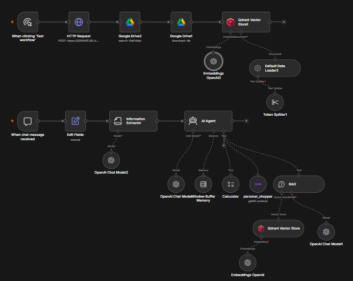
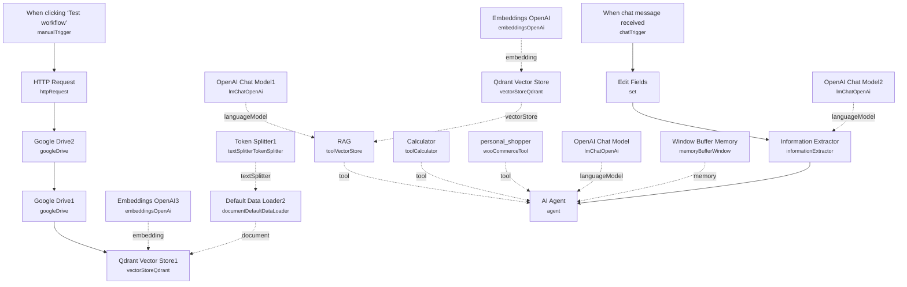

# Personal Shopper RAG Chatbot (WooCommerce)

<!-- CANVAS:START -->

<!-- CANVAS:END -->

A conversational shopping assistant that sits in front of a WooCommerce store, answering both general store questions (hours, address, policies) and product-specific queries (search by keyword, price range, SKU, or category) from the same chat window. It routes each message to the right tool automatically instead of forcing the shopper through a separate search form.

Built for e-commerce brands that want a single chat widget to replace both a FAQ page and a product search bar, without maintaining two separate systems.

## What it does

1. **When chat message received** starts the conversation from n8n's chat trigger.
2. **Edit Fields** normalizes the incoming payload down to `sessionId` and `chatInput`.
3. **Information Extractor** (backed by **OpenAI Chat Model2**) reads the message and decides whether it's a product search. If so, it pulls out keyword, min/max price, SKU, and category into a structured JSON object.
4. **AI Agent** receives that structured output plus the original message and decides which tool to call:
   - **personal_shopper** — a **WooCommerce Tool** node (`getAll` operation) that searches live store inventory using the extracted SKU, keyword, min/max price, filtered to `stockStatus: instock`.
   - **RAG** — a **Vector Store Tool** ("informazioni_negozio") backed by **Qdrant Vector Store** (retrieval mode), **Embeddings OpenAI**, and **OpenAI Chat Model1**, used for general store questions like opening hours or address.
   - **Calculator** — a generic math tool for price/quantity calculations.
   - **Window Buffer Memory** keeps short-term conversational context, and **OpenAI Chat Model** powers the agent's own reasoning.
5. The agent's system prompt explicitly tells it to call `personal_shopper` when the extractor's `search` flag is true, and to fall back to `RAG` for store-related questions.

**Ingestion (separate manual-trigger branch, run before going live):**

1. **When clicking 'Test workflow'** kicks off ingestion.
2. **HTTP Request** clears any existing points from the Qdrant collection (`points/delete`).
3. **Google Drive2** → **Google Drive1** list and fetch the source documents (store policy/info files).
4. **Qdrant Vector Store1** (insert mode) embeds and stores them, using **Embeddings OpenAI3** for vectors, **Default Data Loader2** to read the binary, and **Token Splitter1** to chunk text.

## Sample request

This workflow uses n8n's built-in chat trigger. Send a message through the chat panel on **When chat message received**:

```
Do you have any black leather bags under 80 euros?
```

or a general question:

```
What time do you close on Saturdays?
```

The Information Extractor turns the first message into something like:

```json
{
  "search_intent": true,
  "search_params": [
    { "type": "keyword", "value": "bags" },
    { "type": "max_price", "value": "80" }
  ]
}
```

which the agent then forwards to the `personal_shopper` WooCommerce tool.

## Setup (~20 minutes)

1. **OpenAI** — add your API key to **OpenAI Chat Model**, **OpenAI Chat Model1**, **OpenAI Chat Model2**, **Embeddings OpenAI**, and **Embeddings OpenAI3**.
2. **WooCommerce** — add store API credentials (consumer key/secret) to the **personal_shopper** node.
3. **Qdrant** — add API credentials to **Qdrant Vector Store** and **Qdrant Vector Store1**, and to the **HTTP Request** node used to clear the collection. Create the collection in Qdrant first, and replace the placeholder `QDRANTURL`/collection-name values used across the ingestion branch.
4. **Google Drive** — add OAuth2 credentials to **Google Drive1** and **Google Drive2** for pulling the store-info documents to embed.
5. **Run ingestion first** — trigger **When clicking 'Test workflow'** once so the Qdrant collection has content before the chat agent goes live. Re-run it whenever the source documents change; there's no scheduled re-sync.
6. **Adjust the store persona** — the system prompts on **Information Extractor** and **AI Agent** are written for a shoe/bag/clothing retailer (and partly in Italian). Rewrite them to match your actual product catalog and language before deploying.

---

<!-- ARCHITECTURE:START -->
## Architecture


<!-- ARCHITECTURE:END -->
