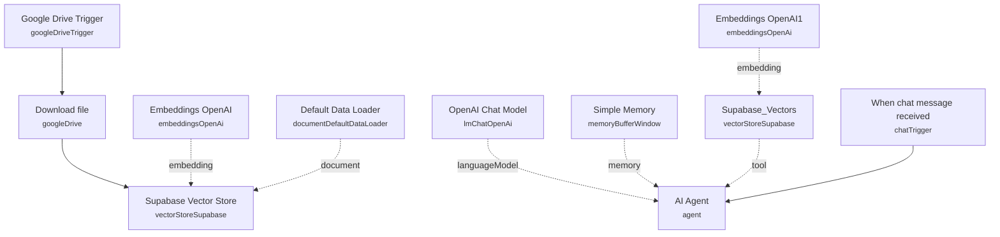

# RAG Knowledge Assistant with Supabase

A retrieval-augmented chat assistant that automatically ingests documents dropped into a Google Drive folder into a Supabase vector store, then answers chat questions by retrieving relevant chunks from that store instead of relying on the model's general knowledge.

Built for teams that want an internal Q&A assistant grounded strictly in their own documents — policy manuals, product docs, internal wikis — where new files just need to be dropped in a folder to become searchable.

## What it does

**Ingestion path**
1. **Google Drive Trigger** polls a specific Drive folder every minute for newly created files.
2. **Download file** pulls the new file's binary content.
3. **Supabase Vector Store** (insert mode) chunks and embeds the document, using **Default Data Loader** to parse the binary data and **Embeddings OpenAI** to generate embeddings, then writes the vectors into the Supabase `documents` table (`match_documents` query).

**Chat path**
4. **When chat message received** starts a conversation via n8n's built-in chat interface.
5. **AI Agent** answers the user's question, instructed to always consult the knowledge base before replying and to stay precise. It draws on **OpenAI Chat Model** (`gpt-5-mini`) for reasoning, **Simple Memory** for short-term conversational context, and the **Supabase_Vectors** tool (retrieve-as-tool mode, top 5 matches, backed by a second **Embeddings OpenAI1** node) to search the same `documents` table populated by the ingestion path.

## Sample request

The chat path is triggered by n8n's Chat Trigger widget, not a raw webhook payload. A typical message sent through the chat UI looks like:

```json
{
  "chatInput": "What does our refund policy say about late deliveries?"
}
```

## Setup (about 15 minutes)

1. **Google Drive** — connect your OAuth2 account in **Google Drive Trigger** and **Download file**. Replace the watched folder ID (`1FszwCRnJYjLqfVR5MIv5JQ_oEPH0GMlC`) with your own document drop folder.
2. **Supabase** — connect your Supabase API credentials in **Supabase Vector Store** and **Supabase_Vectors**. Both point at a `documents` table with a `match_documents` query function — set this up per the standard n8n/Supabase vector store schema before running.
3. **OpenAI** — add your API key in **Embeddings OpenAI**, **Embeddings OpenAI1**, and **OpenAI Chat Model** (chat model is `gpt-5-mini`).

## Error handling

No dedicated error-handling nodes are present. A failed download, embedding call, or vector store write will fail the execution with no retry or alerting.

---

<!-- ARCHITECTURE:START -->
## Architecture


<!-- ARCHITECTURE:END -->
