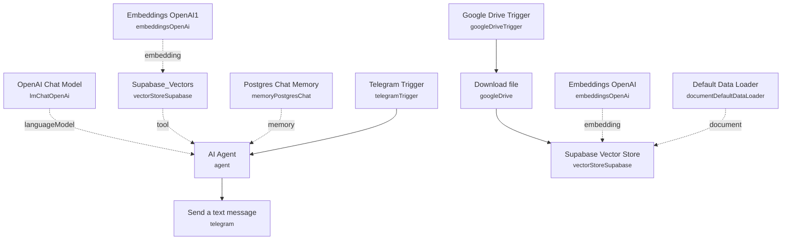

# Telegram RAG Assistant with Supabase & Postgres Memory

A Telegram bot that answers user questions by retrieving relevant chunks from a Supabase vector store, while keeping full conversational context in Postgres — combined with the same Google Drive auto-ingestion pipeline used to populate that knowledge base.

Built for teams that want a Telegram-based internal assistant grounded in their own documents, with persistent per-user conversation memory rather than a stateless chatbot.

## What it does

**Ingestion path**
1. **Google Drive Trigger** polls a specific Drive folder every minute for newly created files.
2. **Download file** pulls the new file's binary content.
3. **Supabase Vector Store** (insert mode) chunks and embeds the document, using **Default Data Loader** to parse the binary and **Embeddings OpenAI** to generate embeddings, writing vectors into the Supabase `documents` table.

**Chat path**
4. **Telegram Trigger** fires on new incoming Telegram messages.
5. **AI Agent** answers the user's message, instructed to search the knowledge base first for factual questions, maintain conversational continuity, keep replies Telegram-friendly, and explicitly say "I don't have enough information on that" rather than hallucinate. It uses **OpenAI Chat Model** (`gpt-5-mini`) for reasoning, **Postgres Chat Memory** (keyed by Telegram chat ID) for persistent conversation history, and the **Supabase_Vectors** tool (retrieve-as-tool mode, top 5 matches, backed by **Embeddings OpenAI1**) to search the same `documents` table.
6. **Send a text message** replies to the user in the originating Telegram chat with the agent's output.

## Setup (about 20 minutes)

1. **Google Drive** — connect your OAuth2 account in **Google Drive Trigger** and **Download file**. Replace the watched folder ID (`1FszwCRnJYjLqfVR5MIv5JQ_oEPH0GMlC`) with your own document drop folder.
2. **Supabase** — connect your Supabase API credentials in **Supabase Vector Store** and **Supabase_Vectors** (both use a `documents` table configured for vector search).
3. **Postgres** — connect your Postgres credentials in **Postgres Chat Memory** for persistent, per-chat conversation history.
4. **OpenAI** — add your API key in **Embeddings OpenAI**, **Embeddings OpenAI1**, and **OpenAI Chat Model** (chat model is `gpt-5-mini`).
5. **Telegram** — connect your Telegram bot API credentials in **Telegram Trigger** and **Send a text message**.

## Error handling

No dedicated error-handling nodes are present. A failed download, embedding call, database write, or Telegram send will fail the execution with no retry or alerting.

---

<!-- ARCHITECTURE:START -->
## Architecture

<!-- ARCHITECTURE:END -->
