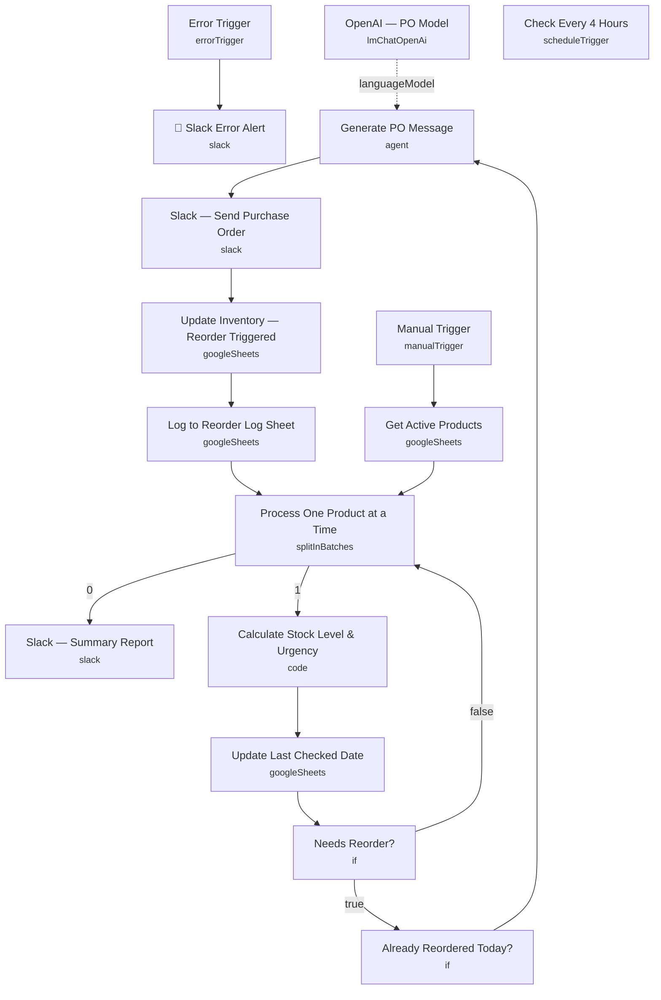

# Real-Time Inventory Auto-Reorder Pipeline

An inventory monitoring workflow that checks every active product against its reorder threshold, generates an AI-written purchase order for anything running low, posts it to Slack, and logs the reorder back to Google Sheets — skipping products that were already reordered that day.

Built for small operations or e-commerce teams managing inventory in a spreadsheet who want low-stock alerts and purchase-order drafting handled automatically instead of someone eyeballing stock levels.

## What it does

1. **Manual Trigger** (or **Check Every 4 Hours**, a schedule trigger currently disabled) starts a full inventory sweep.
2. **Get Active Products** reads every row from the Inventory sheet in Google Sheets.
3. **Process One Product at a Time** (Split In Batches) iterates the product list one row per cycle. Its "done" output feeds **Slack — Summary Report**; its "loop" output feeds the per-product check.
4. **Calculate Stock Level & Urgency** (Code node) computes stock percentage against max stock, flags whether a reorder is needed against the product's reorder threshold, assigns an urgency level (CRITICAL ≤5%, HIGH ≤10%, LOW ≤ threshold, otherwise OK), and calculates a reorder quantity and estimated cost.
5. **Update Last Checked Date** writes the computed stock check results back to the Inventory sheet, matched by Product_ID.
6. **Needs Reorder?** (IF) branches on the `Needs_Reorder` flag from step 4.
   - **False** → loops back to **Process One Product at a Time** to move to the next product.
   - **True** → continues to **Already Reordered Today?**
7. **Already Reordered Today?** (IF) checks whether `Last_Reorder_Date` already equals today's date, preventing duplicate purchase orders for the same product on the same day.
8. **Generate PO Message** (AI Agent) drafts a concise Slack purchase-order message in Slack mrkdwn format, referencing the product's stock level, urgency, reorder quantity, unit price, estimated cost, and supplier contact. Runs on **OpenAI — PO Model** (`gpt-4o-mini`).
9. **Slack — Send Purchase Order** posts the generated message to a dedicated Slack channel.
10. **Update Inventory — Reorder Triggered** writes the reorder date, increments the reorder count, and adds a note back to the Inventory sheet, matched by Product_ID.
11. **Log to Reorder Log Sheet** appends a full audit row (timestamp, product, stock levels, reorder quantity, supplier, cost, status) to a separate Reorder_Log sheet tab.
12. Control returns to **Process One Product at a Time** to continue the loop until every product has been checked, at which point **Slack — Summary Report** posts a completion summary to a Slack channel.

## Setup (about 15 minutes)

1. **Google Sheets** — connect your OAuth2 account in **Get Active Products**, **Update Last Checked Date**, **Update Inventory — Reorder Triggered**, and **Log to Reorder Log Sheet**. All four point at the same hardcoded spreadsheet (`1XXNtTm8_To0chMbZGiyNQ3A0lIWMLHQBruLch1_MpSQ`) with an `Inventory` tab and a `Reorder_Log` tab — replace with your own sheet ID and matching column headers (`Product_ID`, `Current_Stock`, `Max_Stock`, `Reorder_Threshold_Pct`, `Supplier_Name`, `Supplier_Contact`, `Unit_Price`, etc.).
2. **OpenAI** — add your API key in **OpenAI — PO Model** (model `gpt-4o-mini`), used by **Generate PO Message**.
3. **Slack** — connect your OAuth2 account in **Slack — Send Purchase Order**, **Slack — Summary Report**, and **Slack Error Alert**. Replace the hardcoded channel IDs (`C0AR87WSC4A` for purchase orders, `C0AS2PE4Q6L` for summaries) with your own channels.
4. **Trigger** — the workflow ships with **Manual Trigger** active for on-demand runs. A **Check Every 4 Hours** schedule trigger (cron `0 */4 * * *`) is included but disabled — enable it for continuous monitoring instead of running by hand.

## Error handling

An **Error Trigger** node captures any failure in the workflow and routes it to **🚨 Slack Error Alert**, which posts the failing node name, error message, and a link to the execution to a Slack channel. Both nodes are currently disabled in this export — enable them before relying on this workflow unattended. The **Already Reordered Today?** check also acts as a business-logic safeguard, preventing duplicate purchase orders from firing multiple times against the same product on the same day.

---

<!-- ARCHITECTURE:START -->
## Architecture

<!-- ARCHITECTURE:END -->
