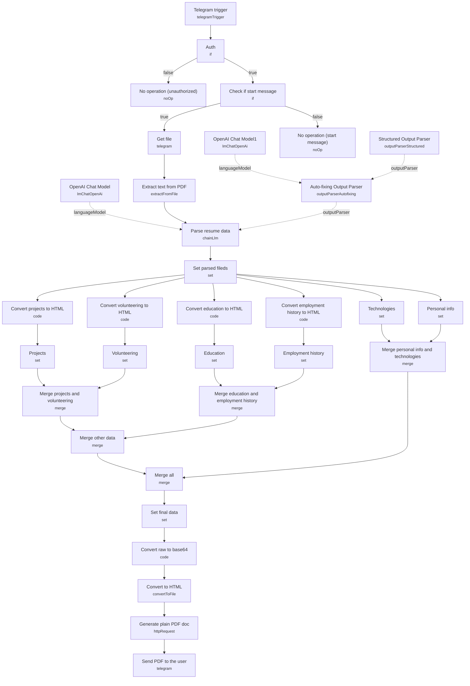

# Resume Data Extraction & PDF Generation (Gotenberg)

A Telegram bot that accepts an uploaded resume (PDF), extracts structured data from it with an LLM, reformats each section into HTML, renders it back into a clean PDF via Gotenberg, and sends the regenerated document back to the same Telegram chat.

Built as a reference implementation for turning unstructured resume text into a normalized, structured JSON record — and, as a bonus, demonstrating a self-hosted HTML-to-PDF pipeline that avoids paid PDF-generation APIs.

## What it does

1. **Telegram trigger** listens for incoming `message` updates on a Telegram bot.
2. **Auth** (if) checks the sender's `message.chat.id` against a hardcoded allow-listed chat ID; anything else is dropped at **No operation (unauthorized)**.
3. **Check if start message** (if) ignores the bot's initial `/start` command (routing it to **No operation (start message)**) and only proceeds for real uploads.
4. **Get file** (Telegram, `resource: file`) downloads the uploaded document using its `file_id`, and **Extract text from PDF** pulls the raw text out of the binary.
5. **Parse resume data** (LangChain LLM chain) sends that text to **OpenAI Chat Model** with the instruction to extract name, experience, technologies, etc. into "well-unified JSON," validated against **Structured Output Parser**'s JSON schema (personal_info, employment_history, education, projects, volunteering, programming_languages, foreign_languages) — with **Auto-fixing Output Parser** (backed by **OpenAI Chat Model1**) retrying/correcting the output if it doesn't conform to schema.
6. **Set parsed fields** passes the parsed JSON forward, fanning out in parallel to six section-specific nodes: **Personal info**, **Technologies**, **Employment history**, **Education**, **Projects**, **Volunteering** — plus four code nodes (**Convert employment history to HTML**, **Convert education to HTML**, **Convert projects to HTML**, **Convert volunteering to HTML**) that render each array section into an HTML fragment.
7. The set/convert outputs are progressively joined: **Merge education and employment history** and **Merge projects and volunteering** combine sibling sections, both feeding **Merge other data**; separately **Merge personal info and technologies** joins those two; both branches converge at **Merge all**.
8. **Set final data** concatenates every section's HTML fragment (personal info, employment history, education, projects, volunteering, technologies) into one `output` string separated by `<br/><br/>`.
9. **Convert raw to base64** base64-encodes that HTML string, and **Convert to HTML** (Convert to File) turns it into a binary `index.html` file.
10. **Generate plain PDF doc** posts that HTML file as multipart form data to a self-hosted **Gotenberg** instance's Chromium HTML-to-PDF endpoint (`http://gotenberg:3000/forms/chromium/convert/html`), getting a PDF binary back.
11. **Send PDF to the user** (Telegram, `sendDocument`) delivers the resulting PDF back to the original chat, named after the candidate (lowercased, spaces replaced with hyphens).

## Sample input

There's no webhook payload to construct — the "request" is a document uploaded to the Telegram bot. The Telegram trigger payload looks like:

```json
{
  "message": {
    "chat": { "id": 123456789 },
    "document": {
      "file_id": "BQACAgQAAxkBAAI...",
      "file_name": "jane_doe_resume.pdf",
      "mime_type": "application/pdf"
    }
  }
}
```

The intermediate structured extraction (validated against the JSON schema in **Structured Output Parser**) looks like:

```json
{
  "personal_info": { "name": "Jane Doe", "email": "jane@example.com", "linkedin": "linkedin.com/in/janedoe" },
  "employment_history": [
    { "position": "Senior Engineer", "company": "Acme Corp", "duration": "2021-2024", "responsibilities": ["Led platform migration", "Mentored junior engineers"] }
  ],
  "education": [ { "institution": "State University", "start_year": 2015, "degree": "B.Sc. Computer Science" } ],
  "programming_languages": { "languages": ["Python", "TypeScript"], "tools": ["Docker", "n8n"], "methodologies": ["Agile"] }
}
```

## Setup (~30 minutes)

1. **Telegram bot** — create a bot via BotFather, add a `telegramApi` credential to **Telegram trigger**, **Get file**, and **Send PDF to the user**.
2. **Hardcoded chat ID (required change)** — **Auth** compares `message.chat.id` against `0` as a placeholder; replace `0` with your own Telegram chat ID (or rework the condition entirely) or every message will be routed to **No operation (unauthorized)**.
3. **OpenAI** — add an `openAiApi` credential to **OpenAI Chat Model** (drives **Parse resume data**) and **OpenAI Chat Model1** (drives the **Auto-fixing Output Parser**). The original build used `gpt-4-turbo-preview` with JSON response mode.
4. **Gotenberg** — this workflow requires a running Gotenberg instance reachable at `http://gotenberg:3000` (the hostname implies a Docker Compose/same-network setup) for **Generate plain PDF doc** to work. Self-host it (see gotenberg.dev) or swap this HTTP call for another HTML-to-PDF provider (e.g. PDFMonkey, ApiTemplate) if you don't want to run Gotenberg yourself.
5. **Output schema customization** — the JSON schema in **Structured Output Parser** defines every field the LLM is asked to extract (personal info, employment history, education, projects, volunteering, languages/tools/methodologies, foreign languages); adjust it to match the resume fields you actually care about.
6. **HTML formatting** — the four "Convert ... to HTML" code nodes control how each section is rendered before the final PDF is generated; customize them if you want a different resume layout/styling than plain concatenated `<br/>`-separated blocks.

---

<!-- ARCHITECTURE:START -->
## Architecture


<!-- ARCHITECTURE:END -->
