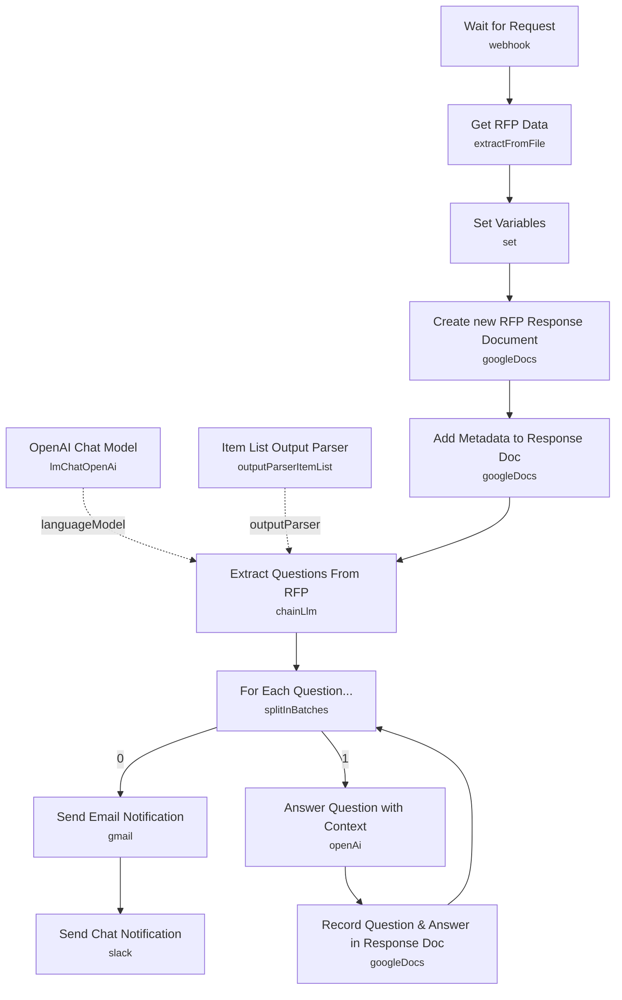

# RFP Process Automation (OpenAI Assistants)

An automation that takes a raw RFP (Request for Proposal) PDF submitted via webhook, extracts the supplier questionnaire with an LLM, answers each question individually using an OpenAI Assistant grounded in your company's own sales material, and writes the finished Q&A pairs into a shareable Google Doc — closing the loop with an email and Slack notification when it's done.

Built for sales/bid teams who need to turn around RFP responses faster than manually reading a 20-page questionnaire and drafting answers one at a time.

## What it does

1. **Wait for Request** is a webhook trigger that accepts a POST with form-data fields `id`, `title`, `reply_to`, and a `data` file (the RFP PDF).
2. **Get RFP Data** (Extract From File, `pdf` operation) pulls the raw text out of the uploaded PDF.
3. **Set Variables** builds `doc_title`, `doc_filename` (combining the request ID, title, and a timestamp), and `reply_to` for reuse by later nodes.
4. **Create new RFP Response Document** (Google Docs) creates a fresh Google Doc in a specific Drive folder to hold the draft response.
5. **Add Metadata to Response Doc** (Google Docs, insert action) writes a header into the new doc: title, generation date, requester, and a link back to the n8n execution.
6. **Extract Questions From RFP** (`@n8n/n8n-nodes-langchain.chainLlm`) is prompted to pull every supplier-facing question out of the RFP text verbatim, backed by **OpenAI Chat Model** as its language model and **Item List Output Parser** to return the questions as a clean list.
7. **For Each Question...** (Split In Batches) iterates the extracted question list one at a time. Its "done" output feeds **Send Email Notification**; its loop-body output feeds **Answer Question with Context**.
8. **Answer Question with Context** (`@n8n/n8n-nodes-langchain.openAi`, assistant resource) sends each question to a pre-built OpenAI Assistant (`Nexus Digital Solutions Bot`) that has your company's marketing/sales documents uploaded, so it answers using real product context.
9. **Record Question & Answer in Response Doc** (Google Docs, insert action) appends the numbered question and its answer to the response document, then loops back into **For Each Question...** for the next item.
10. Once all questions are processed, **Send Email Notification** (Gmail) emails the original requester (`reply_to`) that their RFP response is ready.
11. **Send Chat Notification** (Slack) posts a completion message to a shared channel.

## Sample request

This workflow is triggered by a raw webhook expecting multipart form-data, not JSON:

```bash
curl --location 'https://<n8n_webhook_url>' \
  --form 'id="RFP001"' \
  --form 'title="BlueChip Travel and StarBus Web Services"' \
  --form 'reply_to="jim@example.com"' \
  --form 'data=@"RFP Questionnaire.pdf"'
```

`id` and `title` are combined into the response document's filename; `reply_to` is where the completion email is sent; `data` must be a PDF binary.

## Setup (about 25 minutes)

1. **OpenAI** — add API credentials to **OpenAI Chat Model** (question extraction) and **Answer Question with Context**. The latter requires an existing **OpenAI Assistant**: create one at platform.openai.com/playground/assistants and upload your company/sales documents so it can answer from real context, then set its ID in the node's `assistantId` field (currently pinned to `asst_QBI5lLKOsjktr3DRB4MwrgZd`, "Nexus Digital Solutions Bot" — this will not exist in a new account and must be replaced).
2. **Google Docs** — add OAuth2 credentials to **Create new RFP Response Document**, **Add Metadata to Response Doc**, and **Record Question & Answer in Response Doc**. Update the hardcoded `folderId` (`1y0I8MH32maIWCJh767mRE_NMHC6A3bUu`) in **Create new RFP Response Document** to a Drive folder you own.
3. **Gmail** — add OAuth2 credentials to **Send Email Notification**; the recipient comes from the webhook's `reply_to` field, so no hardcoding needed there.
4. **Slack** — add API credentials to **Send Chat Notification**, and update the hardcoded channel name (`RFP-channel`) to match your workspace.
5. **Webhook security** — **Wait for Request** is a public POST endpoint with no authentication configured. Add header auth, a shared secret check, or restrict access at the network level before using this in production.
6. **PDF-only extraction** — **Get RFP Data** assumes the uploaded RFP is a text-based PDF; scanned/image-only PDFs will yield poor or empty extraction results from **Extract Questions From RFP**.
7. **Execution link exposure** — **Add Metadata to Response Doc** writes an execution URL using `http://localhost:5678/...`; update this to your actual n8n instance URL (via `$execution` and instance environment variables) if you want that link to resolve for reviewers.

---

<!-- ARCHITECTURE:START -->
## Architecture


<!-- ARCHITECTURE:END -->
