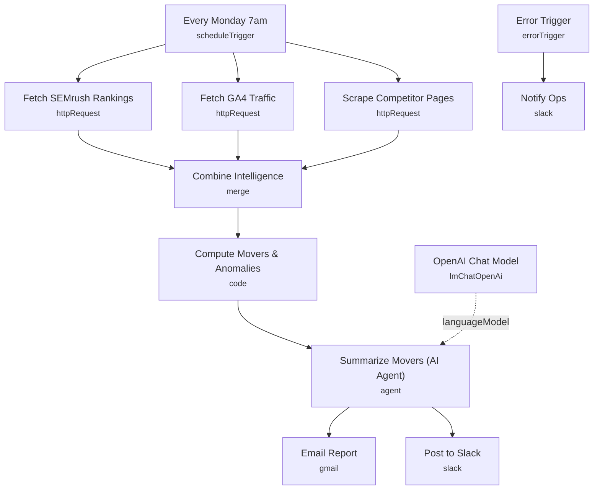

# SEO & Competitor Intelligence Reporting Pipeline

A weekly automated report that pulls keyword ranking data from SEMrush, organic traffic from GA4, and a snapshot of a tracked competitor page, then has an LLM summarize the biggest movers, traffic anomalies, and competitor changes in plain language. The finished report lands in both email and Slack every Monday morning.

Built for SEO agencies and in-house marketing teams who need a recurring client- or stakeholder-facing report without manually pulling three different dashboards every week.

## What it does

1. **Every Monday 7am** triggers the pipeline on a weekly schedule.
2. Three data pulls run in parallel:
   - **Fetch SEMrush Rankings** queries the SEMrush API for organic keyword position data on a configured domain.
   - **Fetch GA4 Traffic** posts a GA4 Data API report request for the last 7 days of sessions and organic search clicks by landing page.
   - **Scrape Competitor Pages** fetches the raw HTML of a configured competitor URL as plain text (continues on failure so one dead competitor URL doesn't stop the pipeline).
3. **Combine Intelligence** merges all three results into a single item.
4. **Compute Movers & Anomalies** (Code node) hashes the scraped competitor HTML with MD5 and compares it against the hash saved in workflow static data from the previous run, flagging `competitorChanged: true` if the page's content changed since last week.
5. **Summarize Movers (AI Agent)**, powered by **OpenAI Chat Model** (`gpt-5-mini`, temperature 0.4), turns the combined SEMrush, GA4, and competitor-change data into a 4-5 sentence plain-language summary that calls out the single most important thing to act on.
6. The summary fans out to two destinations in parallel:
   - **Email Report** sends an HTML email via Gmail.
   - **Post to Slack** posts the same summary to a Slack channel.

**Error handling:** a separate **Error Trigger** catches any workflow failure and **Notify Ops** posts the error message to a Slack ops-alerts channel.

## Setup (about 15 minutes)

1. **SEMrush** — add your API key as header auth in **Fetch SEMrush Rankings**, and replace `REPLACE_WITH_DOMAIN` with the domain you're tracking.
2. **Google Analytics 4** — add your API credentials as header auth in **Fetch GA4 Traffic**, and replace `YOUR_GA4_PROPERTY_ID` in the URL with your actual GA4 property ID.
3. **Competitor URL** — replace `REPLACE_WITH_COMPETITOR_URL` in **Scrape Competitor Pages** with the page you want to monitor for changes.
4. **OpenAI** — add your key in **OpenAI Chat Model**.
5. **Gmail** — connect your account in **Email Report**, and replace the placeholder recipient (`client@REPLACE_WITH_CLIENT_DOMAIN.com`) with the real client or stakeholder address.
6. **Slack** — connect your account in **Post to Slack** and **Notify Ops**, and set the real channel IDs (replace both `REPLACE_WITH_CHANNEL_ID` placeholders) for the report channel and the ops-alerts channel.

## Error handling

All three data-fetch nodes retry on failure (SEMrush and GA4 up to three times, the competitor scrape up to twice), and the competitor scrape is configured to continue on failure rather than block the whole report. A dedicated **Error Trigger** catches any other failure in the pipeline and **Notify Ops** posts the failing error message to Slack.

---

<!-- ARCHITECTURE:START -->
## Architecture

<!-- ARCHITECTURE:END -->
