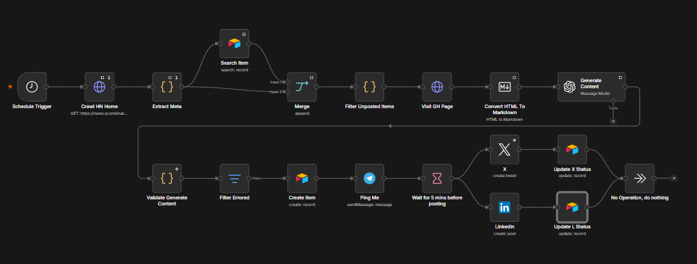
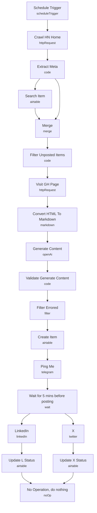

# AI-Powered Social Media Amplifier

<!-- CANVAS:START -->

<!-- CANVAS:END -->

A scheduled agent that scans Hacker News for trending posts linking to GitHub projects, writes a tailored Twitter/X post and LinkedIn post for each one, and — after a human-in-the-loop pause — publishes both. An Airtable base acts as the dedupe log and content queue so the same project never gets posted twice.

Built for developer-tool marketers, DevRel teams, or solo builders who want a steady stream of on-brand social content about relevant open-source projects without manually trawling Hacker News every day.

## What it does

1. **Schedule Trigger** runs every 6 hours.
2. **Crawl HN Home** fetches the Hacker News front page HTML.
3. **Extract Meta** (Python code node using BeautifulSoup) parses the HTML, finds submissions, and keeps only the ones linking to `github.com`.
4. **Search Item** checks Airtable for an existing record matching the post; **Merge** combines the HN items with the Airtable lookup results.
5. **Filter Unposted Items** (code node) diffs the two inputs and keeps only posts that don't already have an Airtable record — this is the dedupe step.
6. **Visit GH Page** fetches the actual GitHub repo page for each new item; **Convert HTML To Markdown** turns it into readable markdown for the LLM.
7. **Generate Content** (an OpenAI node on `gpt-4o-mini`) is prompted to write a Twitter post and a LinkedIn post in JSON format, avoiding emojis and marketing buzzwords, from the repo's title and markdown content.
8. **Validate Generate Content** (code node) checks the model actually returned both `twitter` and `linkedin` fields, re-parsing the string if needed, and drops malformed output.
9. **Filter Errored** discards any item with an error field set.
10. **Create Item** writes the new post pair into Airtable (Post/Title/Url/Tweet/LinkedIn columns).
11. **Ping Me** sends the drafted Tweet and LinkedIn post to a Telegram chat for review, then **Wait for 5 mins before posting** gives a window to intervene before it goes live.
12. **X** posts the tweet; **LinkedIn** posts the LinkedIn version.
13. **Update X Status** / **Update L Status** mark the Airtable record as posted on each platform (`TDone`/`LDone`), and both feed into **No Operation, do nothing** to close the branches.

## Sample input

No webhook — this workflow is fully scheduled. The pinned test data on **Schedule Trigger** shows the shape of the trigger payload used during development:

```json
{
  "Hour": "18",
  "Year": "2024",
  "Month": "December",
  "Day of week": "Friday",
  "Readable date": "December 27th 2024, 6:00:17 pm"
}
```

To test manually, execute the workflow from **Crawl HN Home** instead of waiting for the schedule.

## Setup (~20 minutes)

1. **Airtable** — add a Personal Access Token credential to **Search Item**, **Create Item**, **Update X Status**, and **Update L Status**. All four nodes point at a hardcoded base (`app7fh2kmMzPKS4RZ`, "Twitter Agent") and table (`tblf0cODJFdvDj7vU`, "My Tweets") — create your own base with `Post`, `Title`, `Url`, `Tweet`, `LinkedIn`, `TDone`, and `LDone` columns, and repoint all four nodes at it.
2. **OpenAI** — add your API key to **Generate Content**.
3. **Twitter/X** — add OAuth2 credentials to the **X** node.
4. **LinkedIn** — add OAuth2 credentials to the **LinkedIn** node. It posts as a hardcoded `person` URN (`afi4Hy9wlI`) — replace this with your own LinkedIn member URN.
5. **Telegram** — add a Bot API credential to **Ping Me**, and replace the hardcoded `chatId` (`1297549992`) with your own chat ID so the review ping actually reaches you.
6. **Review window** — **Wait for 5 mins before posting** is your only chance to stop a bad post; increase it if you want more time to react to the Telegram ping, or replace it with a manual-approval step for stricter control.
7. **Rate limits** — the code node in **Extract Meta** installs `beautifulsoup4` and `simplejson` at runtime via micropip (n8n's Python sandbox), so no separate package installation is needed, but expect slower cold starts on first run.

---

<!-- ARCHITECTURE:START -->
## Architecture


<!-- ARCHITECTURE:END -->
