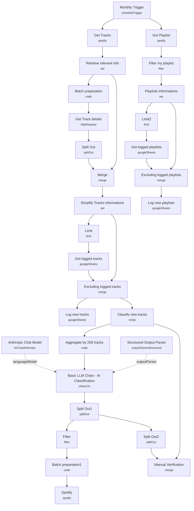

# Monthly Spotify Track Archiving & Classification

A monthly maintenance workflow that archives every track in your Spotify library to Google Sheets along with its audio features, then uses Claude to classify newly-added tracks into your existing playlists based on each playlist's name and description — and applies the classification directly via the Spotify API.

Built for people who accumulate liked tracks faster than they organize them, and want an AI-curated, hands-off playlist sorter that runs itself once a month.

## What it does

1. **Monthly Trigger** (schedule, monthly interval) fires two parallel branches: playlist archiving and track archiving.
2. **Playlist branch:** **Get Playlist** (Spotify node, `getUserPlaylists`) retrieves all playlists, **Filter my playlist** keeps only those owned by a specific display name (`Arnaud`, hardcoded), and **Playlists informations** extracts `playlist_name`, `playlist_description`, and `playlist_spotify_uri`. **Get logged playlists** (Google Sheets) pulls previously archived playlists, **Excluding logged playlists** (merge, keep-non-matches on `playlist_spotify_uri`) filters out ones already logged, and **Log new playlists** appends the new ones to a Google Sheet. **Limit2** caps the list before logging.
3. **Track branch:** **Get Tracks** (Spotify, `library` resource, `returnAll`) fetches the full liked-songs library, and **Retrieve relevant info** (Set, raw JSON mode) extracts track/artist/album/URI/popularity/release-year into a flat object per track.
4. **Batch preparation** (Code) chunks track Spotify IDs into groups of 100 (the Spotify Audio Features API limit), and **Get Track details** (HTTP Request to `/v1/audio-features`) fetches danceability, energy, tempo, valence, etc. for each chunk. **Split Out** flattens the `audio_features` array back to one item per track.
5. **Merge** (combine mode, `enrichInput2`, matched on `id` = `track_spotify_id`) joins the audio features back onto the track metadata, and **Simplify Tracks informations** adds a `date_added` timestamp while excluding redundant fields (`track_spotify_id`, `external_urls`, `id`, `uri`, `track_href`, `analysis_url`).
6. **Limit** caps the batch, **Get logged tracks** (Google Sheets) pulls the archive, and **Excluding logged tracks** (merge, keep-non-matches on `track_spotify_uri`) isolates genuinely new tracks. **Log new tracks** appends them to the archive sheet.
7. **Classify new tracks** (a No-Op passthrough acting as a named checkpoint) feeds into **Aggregate by 200 tracks** (Code, chunks tracks into groups of 200 to manage prompt size), then **Basic LLM Chain - AI Classification** (backed by **Anthropic Chat Model**, Claude 3.5 Sonnet, temperature 0.3) receives the track chunk plus all playlist names/descriptions and returns a structured array of `{playlistName, uri, trackUris}` objects, enforced by a **Structured Output Parser**.
8. **Split Out1** flattens that array, **Filter** drops any playlist entry with an empty `trackUris` array, and **Batch preparation1** (Code) re-splits any playlist assignment with more than 100 tracks into 100-track chunks (Spotify's add-to-playlist API limit).
9. **Spotify** (playlist resource, `onError: continueErrorOutput`, retry with 5s backoff) adds each chunk of track URIs to its assigned playlist.
10. A disabled **Manual Verification** merge branch (and disabled **Split Out2**) exists as an optional review step that enriches the AI's track URIs with their names before committing — useful if you want a human check before playlists get modified.

## Sample input

No webhook — the trigger is time-based. The only configuration surface is the playlist description text used by the classifier to understand each playlist's purpose, e.g.:

```
Playlist Name: Workout Motivation
Description: Push your limits and power through your exercise routine with this high-energy playlist. From warm-up to cool-down, these tracks will keep you motivated.
```

Richer, more specific playlist descriptions produce noticeably better classification since the LLM has nothing but track title/artist plus these descriptions to work from (no raw audio is passed to Claude).

## Setup (~20 minutes)

1. **Spotify** — add a Spotify OAuth2 credential to **Get Playlist**, **Get Tracks**, **Get Track details**, and **Spotify**. The playlist filter in **Filter my playlist** hardcodes owner display name `"Arnaud"` — change it to your own Spotify display name or the filter will exclude all your playlists.
2. **Google Sheets** — add a Google Sheets OAuth2 credential to **Get logged tracks**, **Log new tracks**, **Get logged playlists**, and **Log new playlists**. All four point at a specific spreadsheet ID (`19VwKRDbsh8uU6xitnTXUjk1u73XCGThzyE8nv1YsP24`) — replace with your own sheet, structured with a "tracks listing" tab and a "playlists listing" tab matching the column schemas in **Log new tracks** / **Log new playlists**.
3. **Anthropic** — add an Anthropic API credential to **Anthropic Chat Model** (Claude 3.5 Sonnet). Expect roughly 20 cents per 300 tracks classified.
4. **Playlist descriptions matter** — since classification relies entirely on playlist name/description plus track metadata (no audio analysis reaches the LLM), write specific, example-rich descriptions for each playlist; vague descriptions produce vague classifications.
5. **Manual verification (optional)** — the disabled **Manual Verification** / **Split Out2** nodes can be re-enabled if you want to review the AI's playlist assignments (with track names attached for readability) before they're written to Spotify.
6. **Batch limits are hardcoded** — 100 for audio-features and add-to-playlist calls (Spotify API limits) and 200 for the classification chunk size (token-budget tradeoff); adjust the chunk size in **Aggregate by 200 tracks** if you hit context limits with very long playlist description lists.

---

<!-- ARCHITECTURE:START -->
## Architecture


<!-- ARCHITECTURE:END -->
