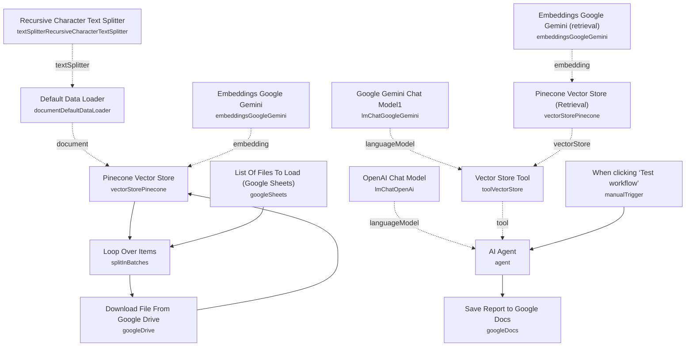

# Stock Earnings Report RAG Analysis

An analyst-style agent that ingests a company's quarterly earnings PDFs (10-Qs, earnings releases) from Google Drive, embeds them into a vector store, and generates a markdown financial report highlighting trends and outliers across the last several quarters — saving the output straight into a Google Doc.

Built for investors, analysts, or finance teams who want a repeatable way to turn a stack of quarterly filings into a structured "what changed and why" report, without manually re-reading each PDF every quarter.

## What it does

1. **When clicking 'Test workflow'** starts the run.
2. **List Of Files To Load (Google Sheets)** reads a watchlist sheet containing file URLs pointing at earnings PDFs saved in Google Drive (columns include `File URL` and `10Q`, per sheet name "GOOG" in this export).
3. **Loop Over Items** (Split In Batches) processes the file list one at a time.
4. **Download File From Google Drive** fetches each PDF binary.
5. **Pinecone Vector Store** (insert mode) embeds and stores each document, using **Embeddings Google Gemini**, **Recursive Character Text Splitter**, and **Default Data Loader** to chunk and load content into the `company-earnings` index. The loop continues until every file in the watchlist has been ingested.
6. Separately, **AI Agent** (triggered by the same manual trigger) receives a fixed prompt asking for a report on the company's last 3 quarters, formatted in markdown, focused on differences, trends, and outliers.
7. The agent uses **OpenAI Chat Model** for its own reasoning and calls **Vector Store Tool** ("company_financial_earnings_data_tool") to pull relevant passages from **Pinecone Vector Store (Retrieval)**, backed by **Embeddings Google Gemini (retrieval)** and **Google Gemini Chat Model1**.
8. **Save Report to Google Docs** inserts the agent's generated markdown report into a target Google Doc.

## Sample input

There's no webhook — this is a manual-trigger batch job. The pinned test output on **AI Agent** shows the kind of report it produces, e.g. for Google/Alphabet:

```
# Google (Alphabet Inc.) Financial Report: Last 3 Quarters
## Executive Summary
Google has demonstrated solid revenue growth across the last three quarters...
## Revenue Analysis
- Quarter 1: Revenue $80.5 billion, a 15% year-over-year increase...
```

To run it against a different company, populate the watchlist sheet with that company's earnings PDF links and adjust the agent's prompt (see Setup, item 6).

## Setup (~30 minutes)

1. **Google Cloud / Vertex AI** — enable the Vertex AI API on a Google Cloud project and get a Google AI Studio API key for **Embeddings Google Gemini**, **Embeddings Google Gemini (retrieval)**, and **Google Gemini Chat Model1** (all use `googlePalmApi` credentials).
2. **OpenAI** — add your API key to **OpenAI Chat Model** (used by the top-level **AI Agent** for reasoning).
3. **Pinecone** — create an index named `company-earnings` and add API credentials to **Pinecone Vector Store** and **Pinecone Vector Store (Retrieval)**.
4. **Google Sheets** — add OAuth2 credentials to **List Of Files To Load (Google Sheets)**. Build your own watchlist spreadsheet with a `File URL` column (Google Drive links to the PDFs) and a column identifying each filing — the export ships pointed at a specific hardcoded spreadsheet ID and a "GOOG" sheet tab; replace both with your own.
5. **Google Drive** — add OAuth2 credentials to **Download File From Google Drive**.
6. **Google Docs** — add OAuth2 credentials to **Save Report to Google Docs**, and replace the hardcoded `documentURL` with your own target document (or create a new one per company/run).
7. **Update the prompt per company** — **AI Agent**'s user prompt and system message are hardcoded to analyze "Google's last 3 quarter earnings"; rewrite both to reference whichever company's filings you've loaded into the watchlist and vector store.
8. **Re-run ingestion when adding filings** — every execution processes whatever is currently listed in the watchlist sheet; there's no incremental/dedupe logic, so remove already-ingested rows before re-running, or accept duplicate embeddings.

---

<!-- ARCHITECTURE:START -->
## Architecture


<!-- ARCHITECTURE:END -->
